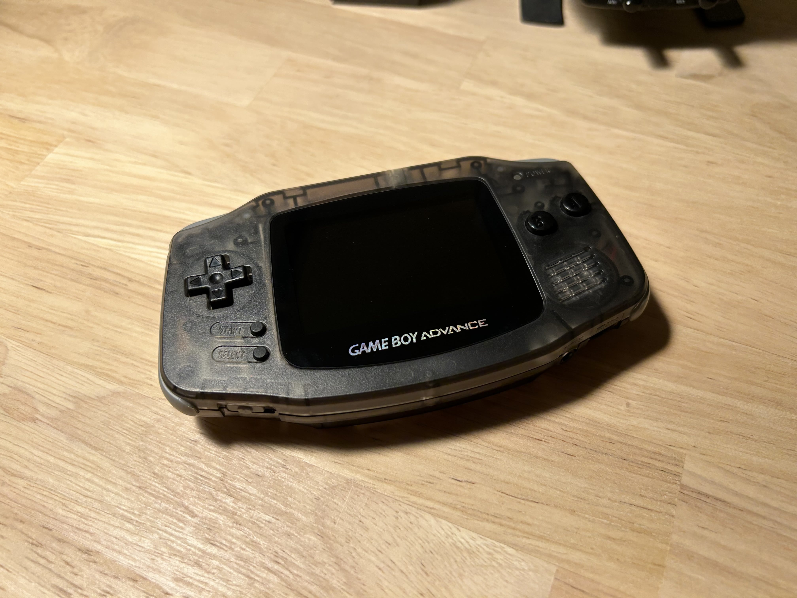

It's hard to believe it's been 8 months since my last entry, but it has. I have been a busy boy — I got married, among several other adult milestones. But those are topics for another time, because today, I wanted to write a short post about a recent project: another backlit Game Boy Advance!

This time, it's not for me though; it's for my nephew, for his upcoming birthday. He liked the one I made myself, and mentioned that he wanted one. He's been playing some of the older cartridge Pokémon games lately (via emulators and such) and now he can play them on actual hardware. He'll also get himself a flash cart — the EZ Flash Omega, to be specific.

I wanted to change it up a bit this time, too. If you recall, for my last GBA mod, I used the "Clean Screen" from RetroSix. It's been a fine screen, but it's not the go-to option in the modding community. People typically use the Funnyplaying IPS V2, or its "generic" counterpart, which is really identical (in fact, superior as far as I'm aware — it draws less power and drains batteries slower). So that's the one I got my hands on, the generic V2 screen.

The process went fairly smoothly overall, but there were some obstacles to overcome. The GBA I acquired for the build has a sound issue — its speaker sounded very tinny and the max output was low. I think it was blown. Luckily... I had a spare. I am not sure why, but I had it leftover from my last build. I ordered it but ended up not using it, since I opted not to install the amp upgrade in that one (maybe in a future build I will). So, I replaced the speaker first, tested it, and after I was sure that fixed the issue, I moved on.

After that, I had to do the usual screen removal and pop in the new one. Nothing crazy. I soldered the 3 wires necessary for brightness adjustment controls: one to SEL, one to L, and one to R.

Then, I put everything together crudely to do a power-on test to make sure everything was working.

*Click*

...

Huh? No boot chime, no display.

I spent some time cursing and getting frustrated that it wasn't working, looking for obvious mistakes, and finally decided to disconnect and reconnect the ribbon cable for the screen, which fixed the issue. I don't know if it wasn't fully seated initially, or if it just needed a nudge to loosen some dust, but now it's working swell.

I think it turned out pretty cool. I do think I prefer the IPS V2 screen to the one I have now, since it's slightly larger. I went with a black-on-black color scheme with dark grey bumpers and shoulder buttons. I also added Pokémon back decals, so now it's officially Pokémon-themed.

So, hope he likes it.
