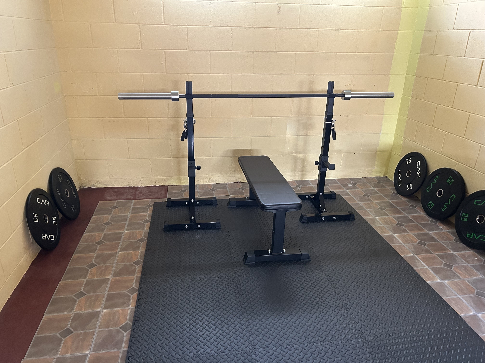
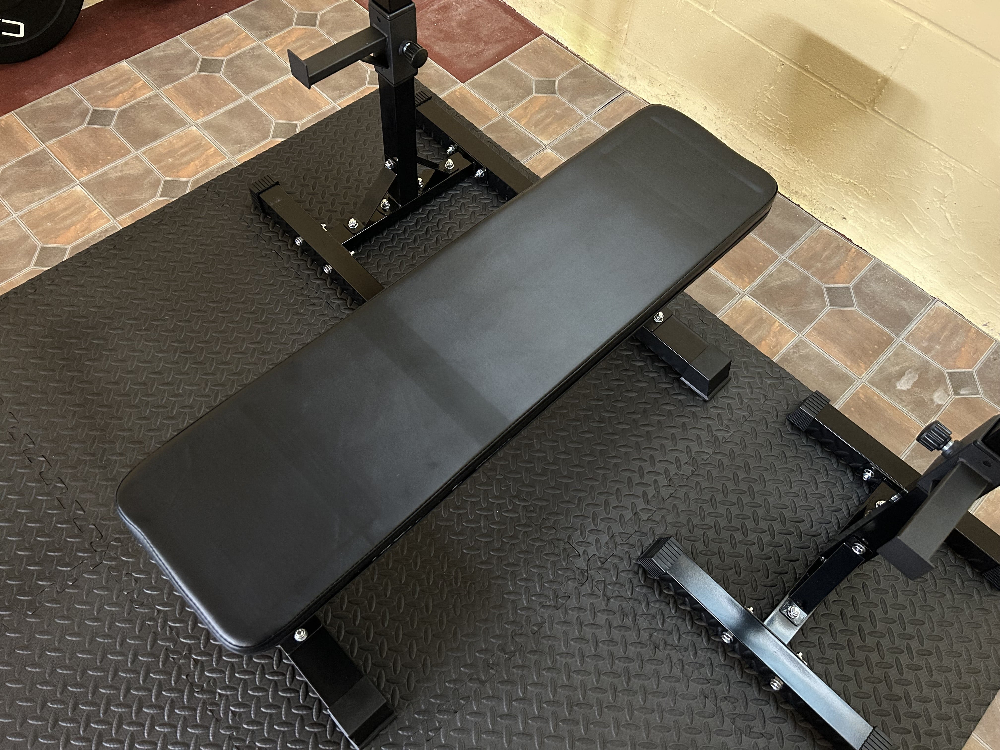
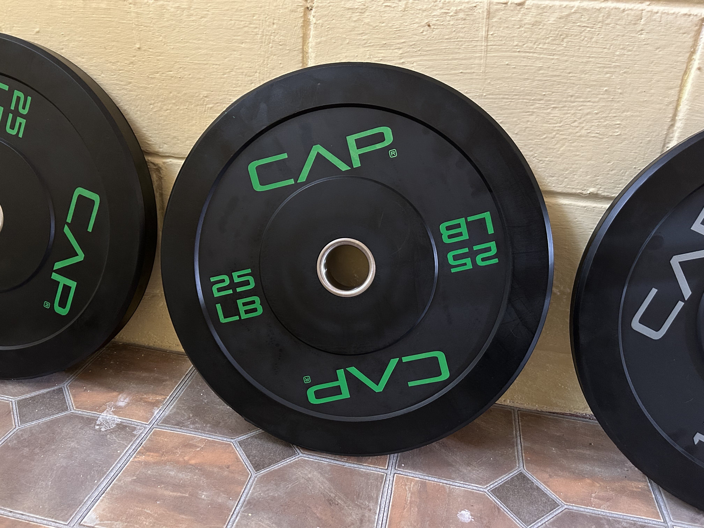
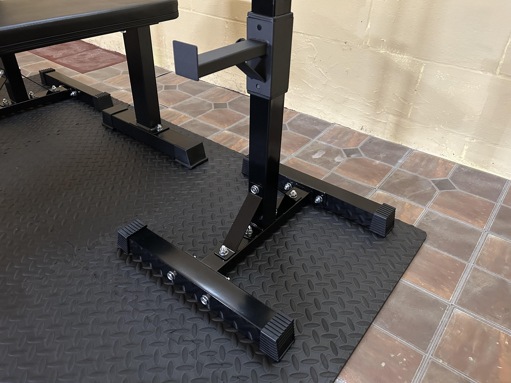
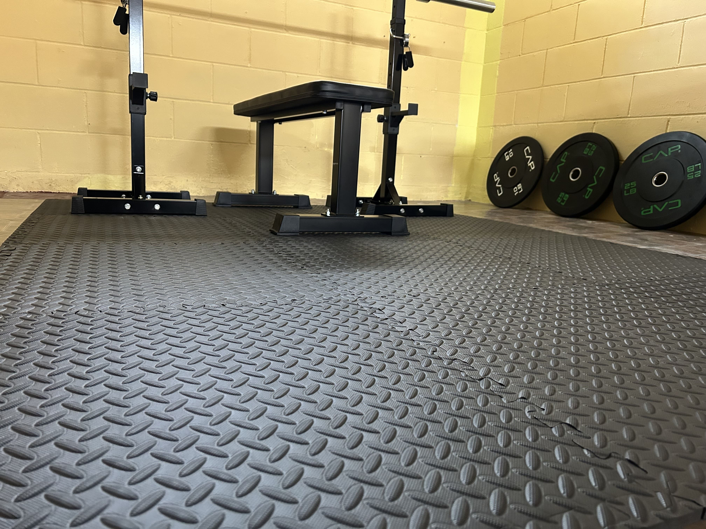

I recently moved to Wisconsin (yes, sadly I had to sell my [first house](/blog/house) in Indiana) and I'm renting a house here for the next year. This new house has a basement as well, and this time I decided that I'd build a small gym down there for weightlifting.

# Setup

I wanted to keep it simple. The purpose of this setup is two-fold:

1. I want to increase my strength (calisthenics can only take you so far for raw strength);
2. I don't want to pay for or travel to a gym.

For now, I'm focusing on bench press, squats, and dead lifts with this setup.

The actual barbell/weight part of the setup will last me a lifetime; the bench and rack perhaps not, but they are also not very featured, so they might be upgraded down the line anyway. I will need to transport this setup when we move again in a year, so minimal is preferable right now. The bench and the rack were also very affordable, so even if I decide I'd rather sell or donate them than transport them, I wouldn't be taking a huge hit.

Here's a quick rundown of the setup, with links included if you're interested in replicating it:

- [7' Olympic barbell](https://www.amazon.com/dp/B09Z1BXM53?ref=emc_p_m_5_i_atc)
- [100lb weight plate set (2x25lb, 2x15lb, 2x10lb)](https://www.amazon.com/dp/B0DHYN3X3Z)
- [Pair of free-standing steel squat/bench press stands](https://www.amazon.com/dp/B018XDH17K?ref=ppx_yo2ov_dt_b_fed_asin_title)
- [Bench](https://www.amazon.com/dp/B072Z1WN4S?ref=ppx_yo2ov_dt_b_fed_asin_title)
- [EVA foam floor tiles](https://www.amazon.com/dp/B00B4IHXRU)

The setup was purchased entirely from Amazon (the fact that this was possible surprised me, but I guess you can get anything from there). The total cost was around $450.

Thanks to my friend Nick for his weightlifting expertise and for helping me to curate this setup.

Here are some pics.

# Limitations

Currently, I don't have a way to do pull-ups, which is something I'd like to be able to do. There are more featured racks available that have a bar across the top which can be used for pull-ups, but I couldn't get one of those due to the height of the basement ceiling (too short).

I will try to find a solution to the pull-up issue eventually — maybe I can get a dedicated pull-up bar. For now, I'm focusing on bench press, squats, and dead lifts.

