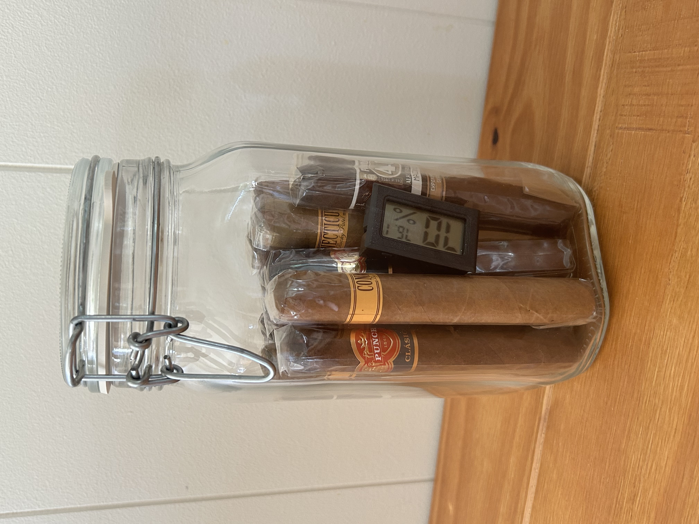
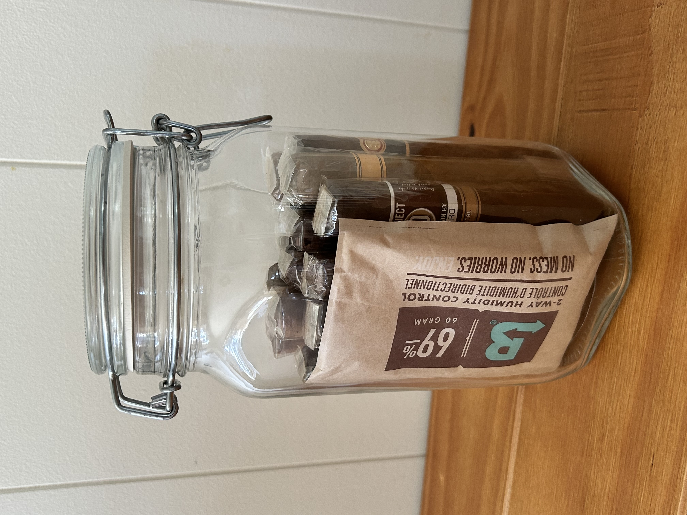

I built a cigar jar humidor and decided to write this quick tutorial + blog post combo about it. "Built" is a strong word, because it's actually very easy and straightforward; but if I can potentially help someone build one by writing this post, then I think framing this as a tutorial is appropriate.

# Why a jar?

Short answer: low cost, customizable capacity, and simplicity.

Jars are **low cost** (although you can opt to use a nice one like I did), and there's no seasoning involved since there's no cedar. **Jar capacities are very fine-grained** — for example, for someone like me who doesn't store more than ~10-15 cigars at once, a 1.5L jar is perfect. **Maintenance is simple**: replace your humidification system every few months and make sure your jar is properly sealed (I'll explain more below).

# What you'll need

- A glass jar with an airtight seal (rubber gasket recommended). I'm using a Bormioli Rocco Fido 1.5L.
- A digital hygrometer. These are cheap ($2 each for the small ones).
- A Boveda 2-way humidification pack. Use 69% RH for cigars (unless you're in a very dry climate, then use 72%). For my jar which can hold ~15 cigars, I use the 60-gram size. These are around $4 each, and you can store backups long-term.

# Steps to build

1. Clean the inside of your jar with soap and water and dry it. Then to sanitize, swish around some isopropyl alcohol inside it, pour it out, then let the rest evaporate.
2. Insert your Boveda pack and stand it against the inner wall of the jar. Make sure there's a small gap between it and the glass.
3. Add your cigars, cap side up. (For long-term storage, tobacco oils could technically pool in the caps if they're cap-down.)
4. Insert your hygrometer and close the lid.

# Maintenance

- Every couple of months, check your humidity level. If it's starting to drop below 69%, it's time to replace the Boveda pack.
- Replace the lid's rubber gasket after 5 years or so — it'll start to harden after a while and you'll lose your seal.

# Tips

- If your humidity level is not staying at around 69%, check whether you have a good seal on the lid and/or try a different hygrometer.
- Don't stuff the jar so full of cigars that they can't wiggle around at all — there needs to be a little airflow between them for the Boveda to work.
- If you're storing more or fewer cigars, you can increase or decrease the jar size — just make sure you use the appropriate Boveda pack size (in grams) for your jar volume and cigar count (you can refer to Boveda's guidelines).
- Don't call a cigar a "stick".