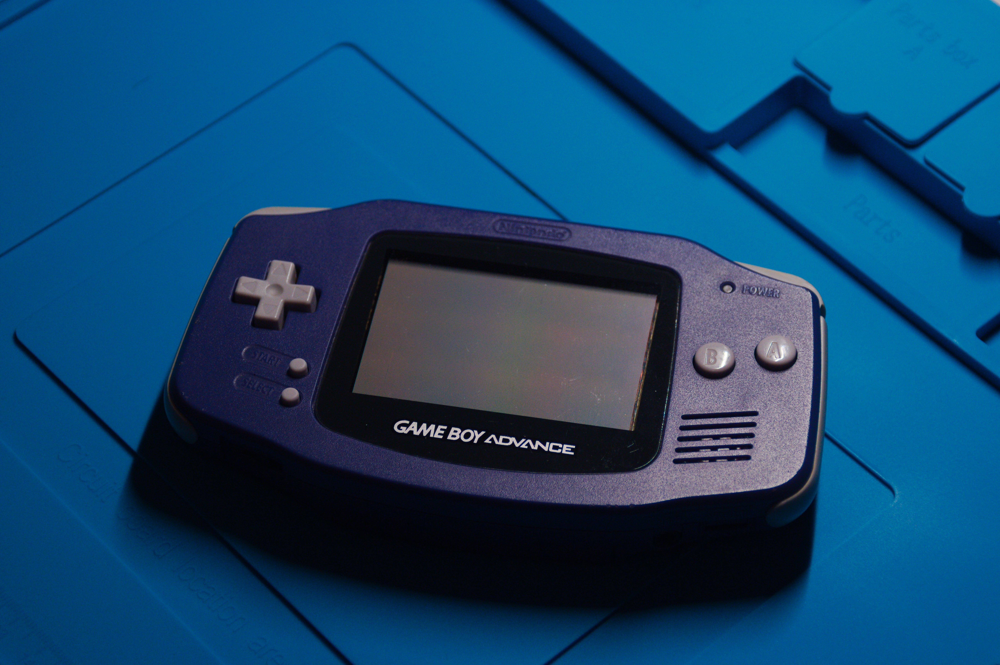
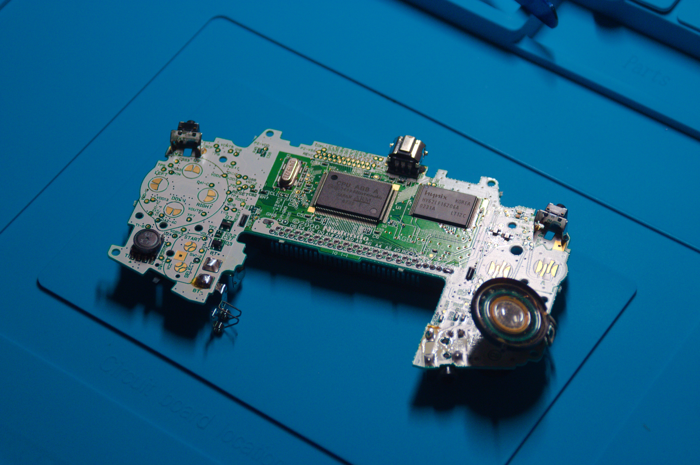
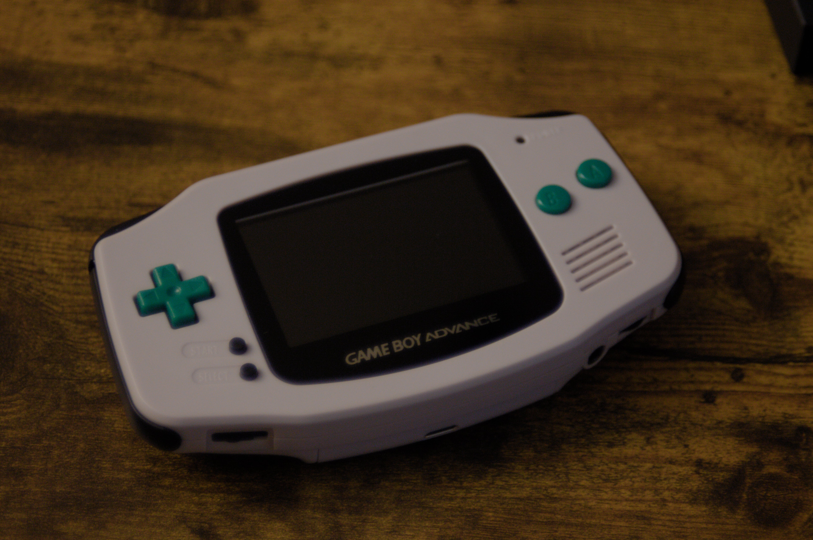

Above is a Game Boy Advance. Indigo. Arguably the best Game Boy ever produced. Well, I mean, that's subjective, and the GBA definitely isn't _perfect_. But it has a lot of things I like as far as Game Boys go, and that's why I decided to do some mods on this one in the photo.

Let's get one thing straight, right outta the gate: I love the Game Boy. Always have. It was one of my first experiences with gaming, and more importantly probably, it was also one of my first experiences gaming competently. What I mean by that is, I have some specific memories playing video games before I could understand what was going on in the games, before I could read, etcetera.

To be specific, my grandma got me a Game Boy Color when I was very young; probably 3 or 4 years old, since the GBC came out when I was 3, it probably wasn't much later than that. I remember her giving me a bundle from Toys "R" Us — it had an Atomic Purple Game Boy Color along with Pokémon Blue. I also remember struggling to play the game, because I was too young to read and comprehend what was going on. (My mom was trying to help me, but she didn't know what Pokémon was all about either.) So that was my first Game Boy. Only a few years later, after I'd started elementary school, my grandpa brought me home Pokémon Silver from the school where he worked as a custodian. I remember him telling me someone left it in their locker or something. It either wound up in lost & found, or he just took it for me. (Sorry, kid.)

And that's when it really started; I was old enough to read, had some more competence, and loved games. So naturally, I fell in love with that game, and the console I played it on. It's my favorite Pokémon game to this day. It was my first real introduction into the series, and it's how I made a lot of friends growing up — at least one of whom is still a good friend.

Enough history. The point is, I love the Game Boy, and the GBA has a good ergonomic design and a lot of great games. It's the ultimate Game Boy. So I decided I was going to make it even better. Even ultimate-er.

# The build

Here's the list of upgrades I planned to do:

- Replace the screen with a backlit one,
- Add a rechargeable LiPo battery,
- Swap the shell, buttons, and screen lens for new ones,
- Pair it with an EverDrive GBA flash cartridge to load games from an SD card.

The skills required to do the mods are very advanced. You need to pilot a very specialized tool called a "screwdriver", first and foremost. I almost got stuck right there, but thankfully I figured it out after exerting a bunch of mental energy.

I'm kidding. Seriously: it requires a screwdriver and a soldering iron. You need to solder some wires. I've done some soldering in my day, so I wasn't too worried, but I hadn't done it in a while.

The teardown process for this Game Boy and most others is quite simple. Remove some screws on the back, pull off the shell, remove some screws on the motherboard, unplug the ribbon cable from the screen, and finally remove the motherboard. That's the important component, because I'll be putting it into a new shell with new buttons and a new screen.

After that, the bulk of the project was soldering a ribbon cable from the backlit screen I purchased to the test points on the board which connect to L, R, and Select. This part is not strictly necessary, but I opted to do it so I could have access to the OSD (on-screen display) for the screen. It lets you tweak some settings like brightness, presence of the pixel grid, and colors.

A quick aside about the particular screen I went with: I wouldn't go with it again if I had the choice. By no means is the screen "bad" (in my opinion, at least). But after I made my purchase, I learned some things about its creator. I don't necessarily want to support the company going forward. I won't go into detail because this blog doesn't need to become a medium for drama and politics in the retro modding community. The screen I purchased is the Clean Screen from RetroSix. (If you're curious, you can research the company.) But to be clear, the screen itself is quite nice looking. It looks very similar to an original GBA screen, just with a backlight. Same dimensions, too.

Back to the project. After I soldered the ribbon to the motherboard, I connected it to the controller board for the screen, placed the screen in the shell, and the motherboard on top of it. Connected the controller board to the motherboard with another ribbon cable, screwed everything back together, boom. Done. All that was left was to insert the LiPo battery module into the battery compartment. There's a USB-C jack on the module for charging. Convenient! Modern!

It took me a long time to decide on a color scheme for the build. As you might know, I'm indecisive. I ended up ordering a few different options and experimenting with different combinations. Ultimately, I went with grey for the shell, black for the bumpers/shoulders/Start & Select, and green for A, B, and the D-pad. What do you think?

At the time of writing, I'm still waiting on my EverDrive to arrive in the mail. But I'm excited to play some games I never played before, on original hardware, as they were meant to be enjoyed.

Thanks for reading.
