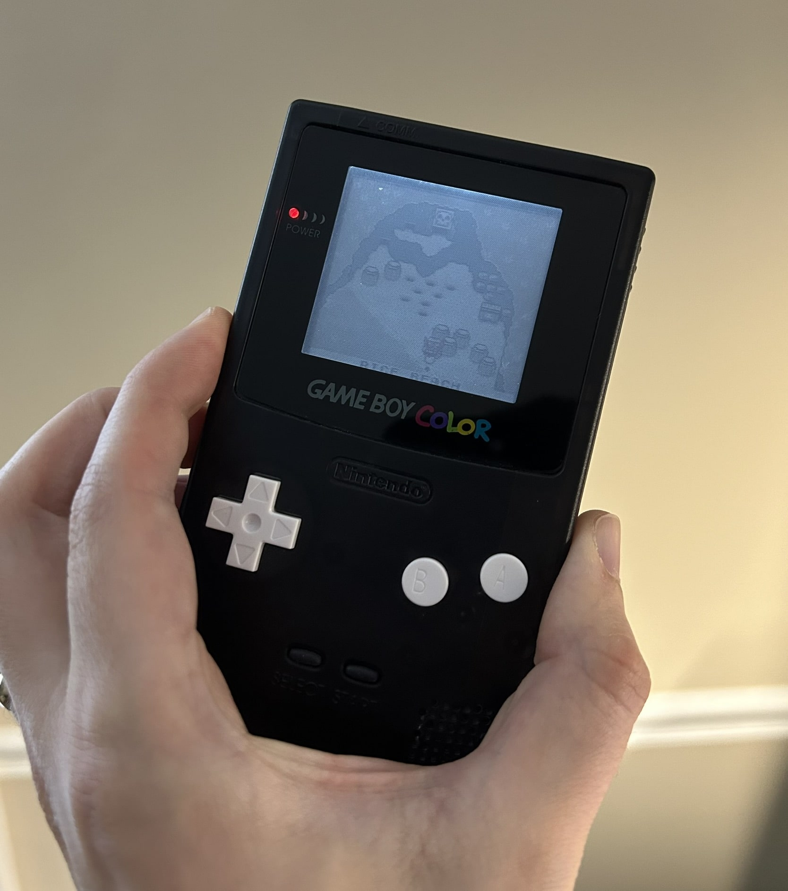
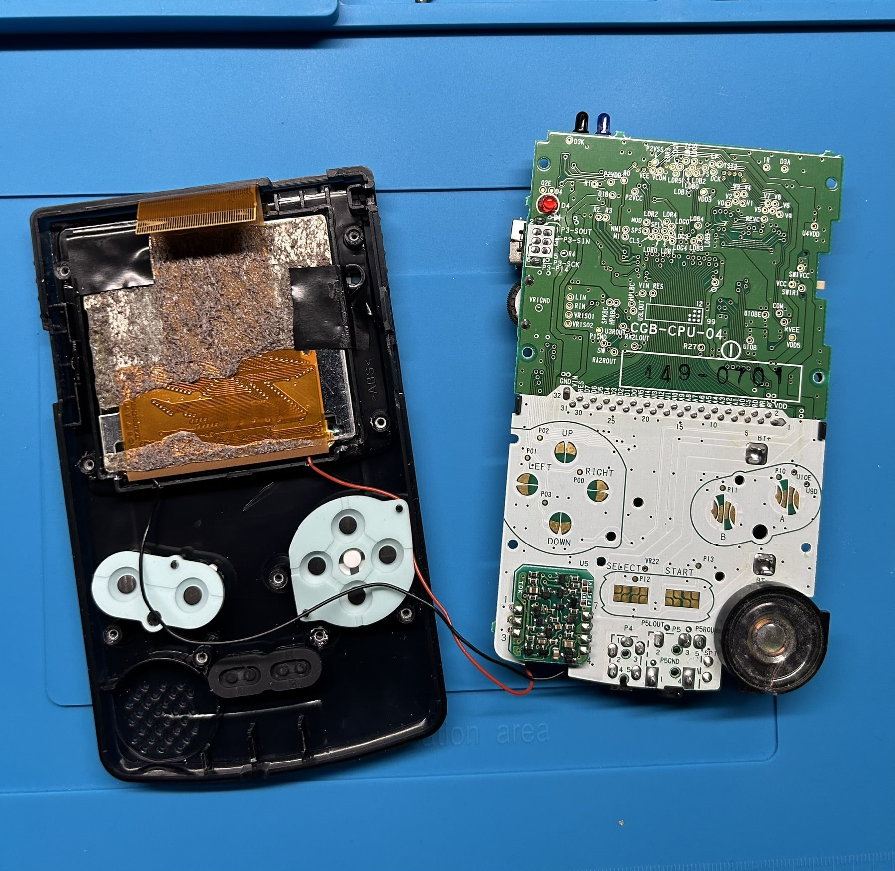
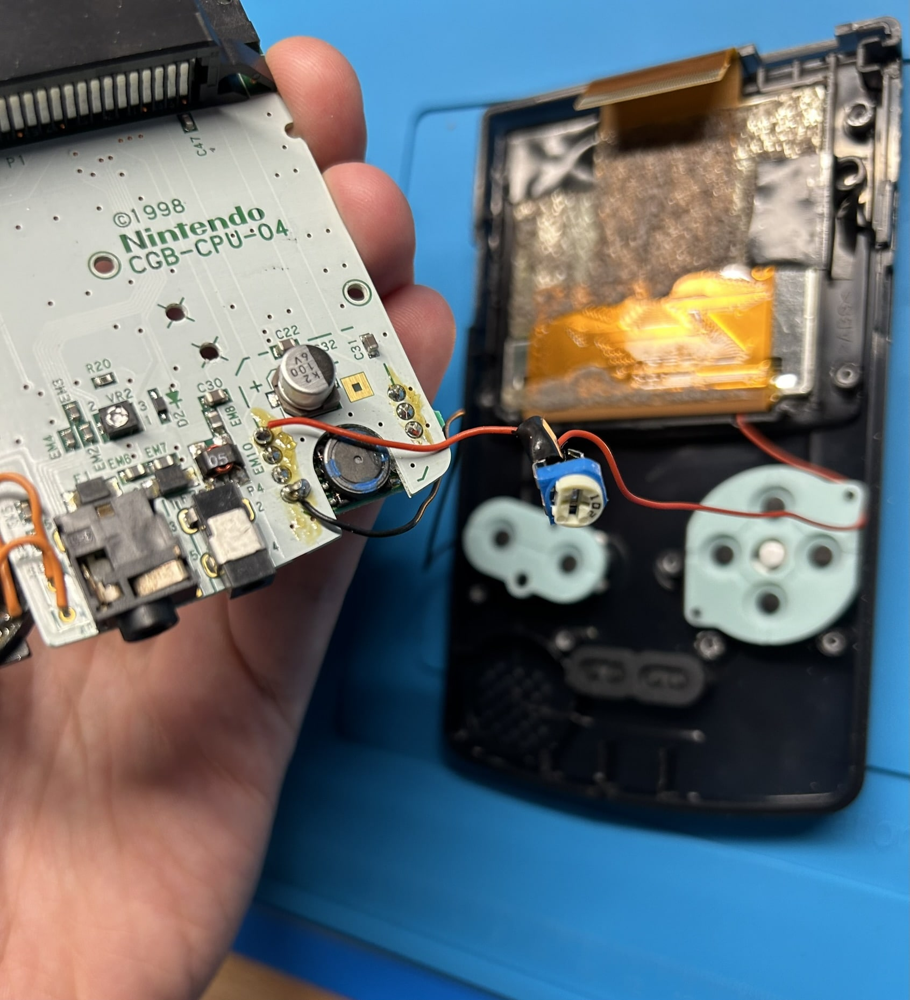
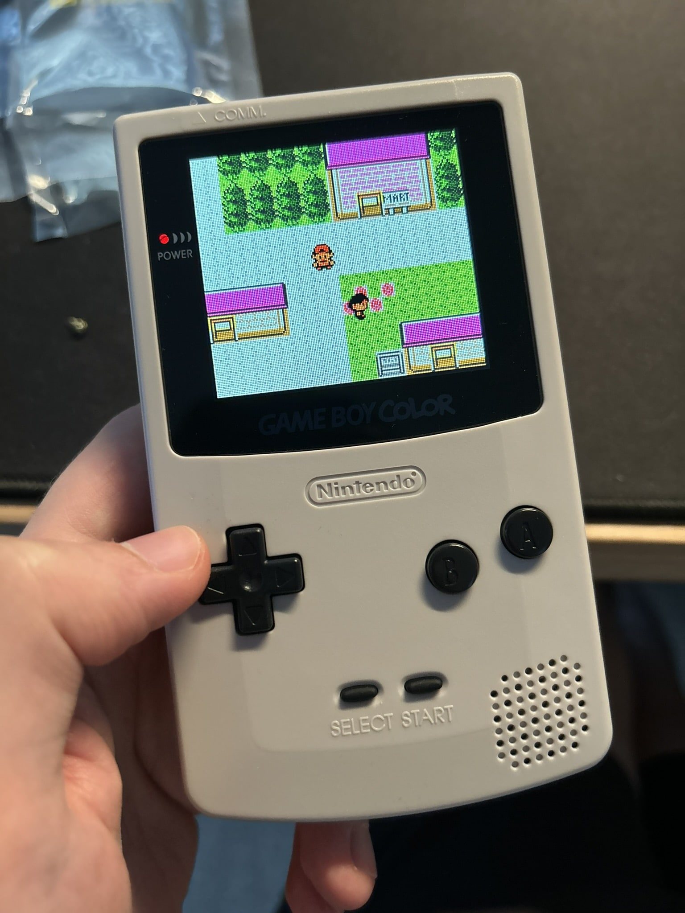
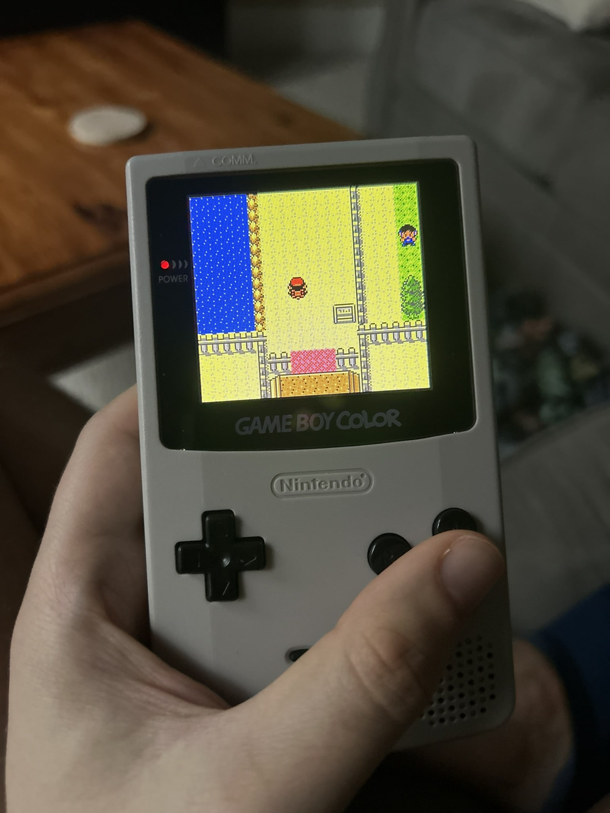
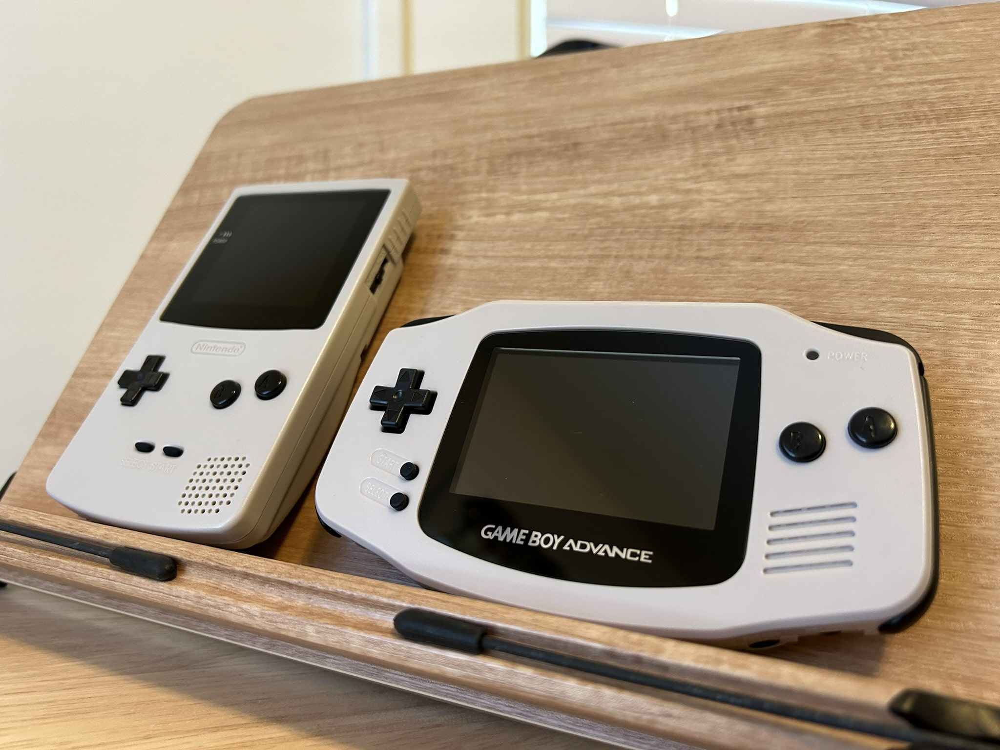
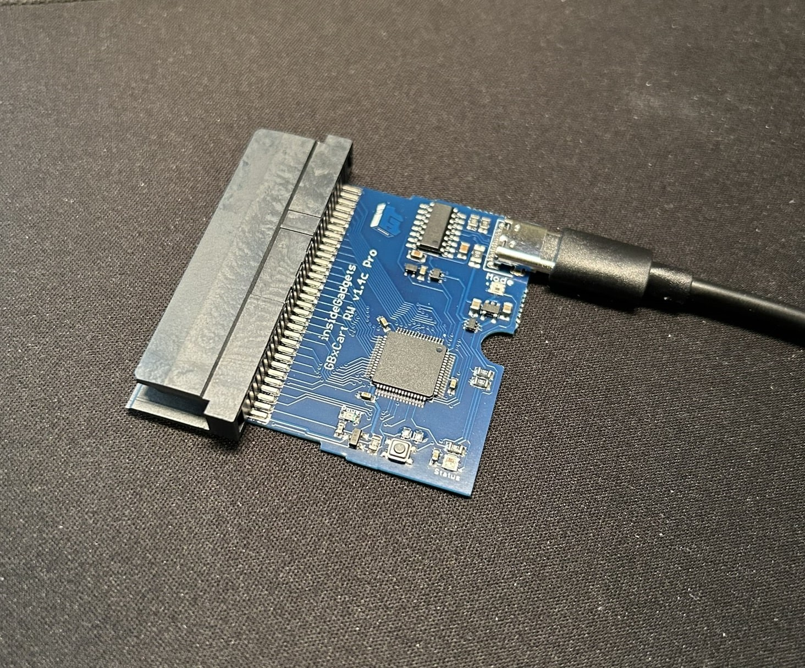
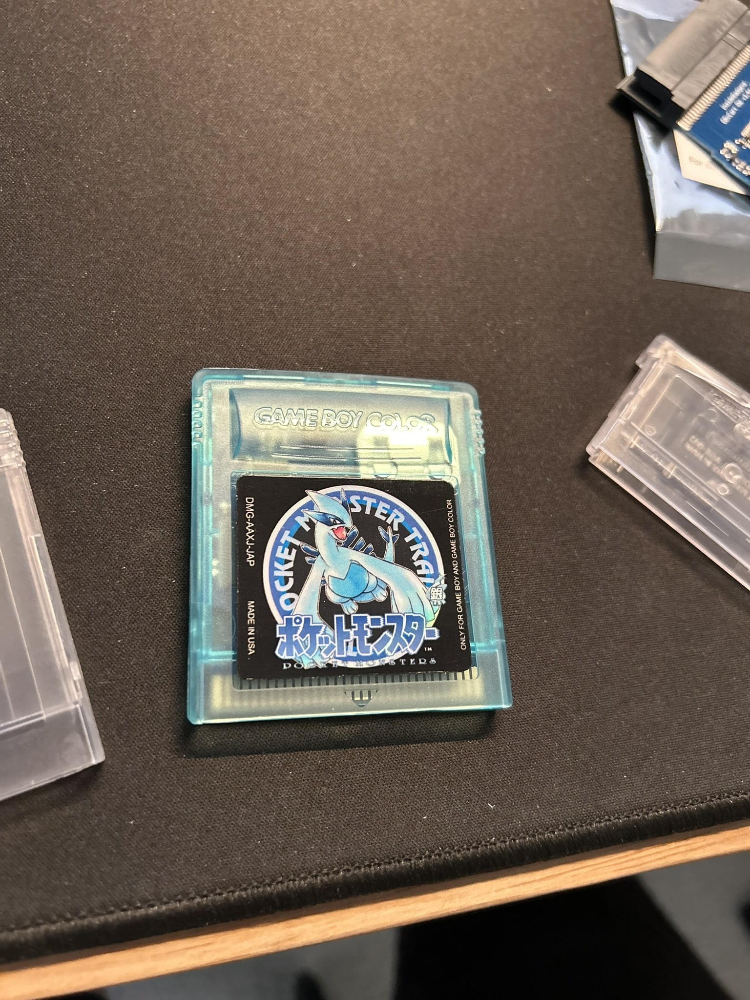
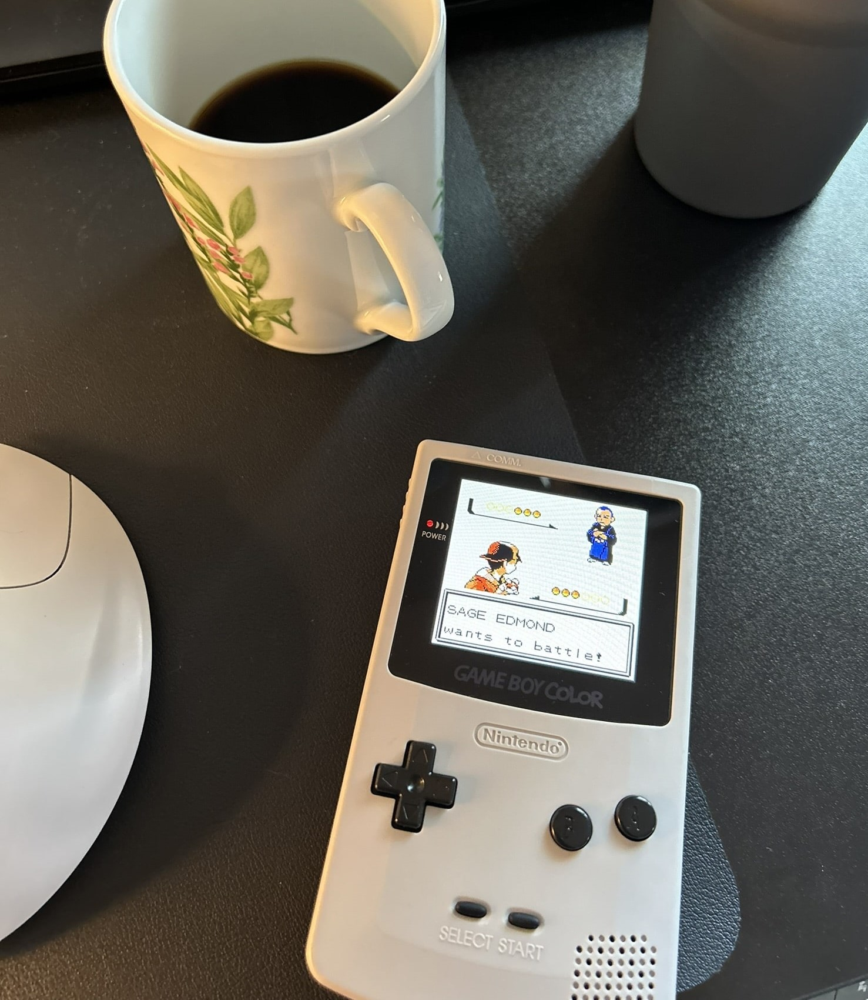
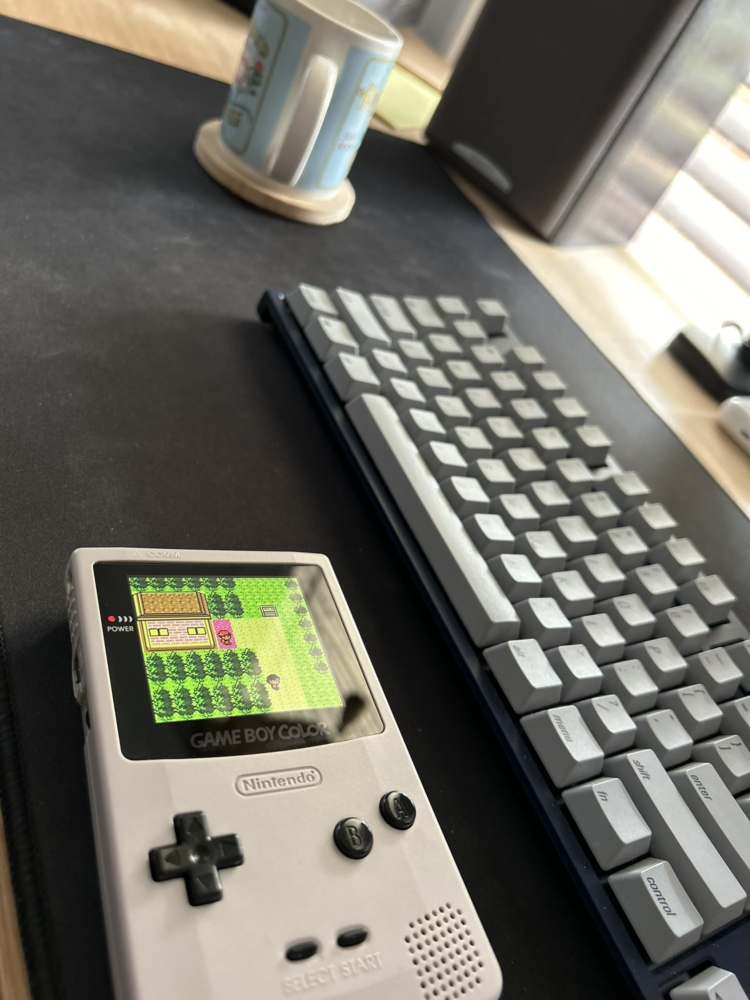

Above is my new backlit Game Boy Color. In grey. Nice and boring, like me. (In reality, there were just too many shell and button color options, so I couldn't decide.)

# The old, failed mod

The main board inside this Game Boy is actually from a very old mod I attempted many years ago (probably between 8 and 10 years ago). I say "attempted" because it ended up being a failure; in those times, we didn't have access to nearly as many convenient modding options as we do today, so the go-to backlight mod was rather interesting (and difficult). You needed to use a donor Game Boy SP (frontlit model) to transplant its front light panel on top of the stock GBC screen. But, in order for it to look halfway decent when powered on, you needed to bond the light panel to the screen with a special UV light-cured clear adhesive. I didn't have any special lights, so I had to used the sun. On top of that, I recall the light panel extraction being very tedious. Needless to say, this process was not a sure thing, and in my case the end result was pretty sub-par. I'll include a photo of it below.

As you can see, the screen is visible, but very blurry. If you're curious, here's what the inside of the GBC looked like. The mod required soldering some wires (presumably to reroute some voltage to power the light panel, but I can't fully remember) with a potentiometer set to a specific value (which I also can't remember much about).

I'm glad for having that experience, but I was more glad to have the old mod lying around to repurpose for my new (proper) mod.

# The new mod

The new GBC uses a Funnyplaying Q5 IPS, which is one of the more common options these days. It's a very nice screen, which is backlit (and laminated so there's no chance of dust getting under the lens during installation) and a bit larger. While you can do the mod solderless, I opted to solder the extra wires so I could get the OSD (on-screen display) functionality via holding Start + Select. Without the OSD, you can still change the brightness levels with the touch sensor mounted at the top of the screen, but having it allows you to change some extra settings, including the color of the "Game Boy Color" logo at the bottom of the screen. Although, I usually leave that off to save power.

As far as other changes I made, I just updated the shell and button colors again. The old color scheme was pretty cool, but the Q5 IPS display is larger and requires a compatible shell, so I just bought a new one instead of cutting (and probably mangling) the old one. Like I said in the intro, I am pretty boring, so I went with DMG grey and black buttons. My next one will be more colorful, I promise.

At the same time as this mod, I decided that I wanted to update the colors of the buttons on [my Game Boy Advance mod](https://www.derekandersen.net/blog/gba-mod), because I started to dislike it. Grey with green buttons made no sense. And so, uh, I went with black buttons for the sake of matching.

I call them Grey Boys.

# Some other Game Boy-related news

I also bought a Game Boy cartridge reader/writer, i.e. a flasher. In particular, it's the [InsideGadgets GBxCart RW](https://shop.insidegadgets.com/product/gbxcart-rw/). Here's mine:

I wanted this so that I could take advantage of flash cartridges for Game Boy (this one works for all types: GB, GBC, GBA). So far, I just have one flash cart, and it's one for GB/C that supports RTC (real time clock) for games that use it — Gen 2 Pokémon games (G/S/C) are the most notable, and the ones I wanted it for. Having RTC support adds some cost, so it's on the more expensive side of flash carts, but thankfully I'd only need to buy it once, as it can be re-flashed whenever I want.

I put mine in a fancy translucent shell with a custom darker Japanese Pokémon Silver label from someone on Etsy (even though Pokémon Gold is currently flashed on it). I just like Lugia.

An added benefit of this flash cart is that it uses FRAM, a type of saving technology which doesn't need a battery (like the SRAM of the original cartridges), so save files will last theoretically forever. A battery is still needed for RTC functionality, however.

I'm currently playing Pokémon Gold on this cartridge, and after I'm done, I plan to use the GBxCart to dump the save file and save it on my hard drive. I think I'll start doing that from now on — it'll be cool to have all my save files archived. If only I could go back in time and do that for all my save files since I was a kid.

Next, I plan to re-play a Gen 1 Pokémon game, so I will get myself a non-RTC flash cart for all my future Gen 1 playthroughs.

My next Game Boy-related post will probably be when I do another Game Boy mod — perhaps a Pocket or original DMG. Or maybe it'll be about Pokémon Gen 1 romhacks (I have some ideas for some QoL improvements for those games that I've been meaning to look into).

Before I end this post, I'll leave you with a couple more photos of the new GBC in action.

Livin' like it's the year 2000.