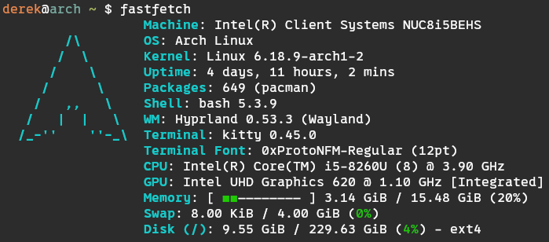

I've been in the middle of this effort for a couple weeks now (though the idea of organizing and simplifying my setup is always in the back of my mind, so you could say I've been quasi-planning this for a while). Anyway, I wanted to write about it, because I think it could be helpful to others who struggle with feeling bogged down by their tech/setup.

To give some more context, I've been generally overwhelmed and mentally overstimulated by my setup, but specifically by technology more broadly. "My setup" encompasses a lot of different systems and device types, so I'll break it down.

_Author's Note_: I realized while writing this that I might come across as a bit pessimistic and jaded at certain points, but I want to assure you that I'm actually an optimistic guy, and I remain optimistic about the issues I talked about. Just keep that in mind, lol.

# Windows

I've used Windows on my main machines forever, but over the past few years (really since Windows 11 was released), I've been coming to the realization that I don't like it. It's always had this "messy" feel to it, and maybe that's in part because I didn't understand what was going on _behind the scenes_ in my operating system. Sometimes things _just work_, and that's good, but when things don't work, I have no idea what's happening or how to investigate. Windows feels like it doesn't want me to understand it; it just wants me to use it. Maybe this is what Microsoft's goal is — I don't know, but, I'm not going to attempt to understand the corporate motivations. Instead, I'll stick to the experience of using Windows.

Like I said, it always felt messy — but I guess I didn't care that much because it was all I was used to. I knew how to navigate Windows, and it never really caused any friction in doing the things I do (more on this later — turns out I don't do all that much in terms of variety).

I've noticed that, over the past couple years, the OS has become less "tool" and more... something else. A vehicle for advertisement? A platform for their AI assistant? An unwanted pusher of vague "cloud stuff"? There was also some fiasco I recall from a few years ago where Windows 11 wouldn't install unless you had some special [security chip](https://en.wikipedia.org/wiki/Trusted_Platform_Module) on your motherboard. It didn't affect me, but it seems like it caused unnecessary hurdles for people who just wanted to use their computer. It seems to me that operating systems should remain hardware-agnostic. I don't want to be _required_ to purchase new/better/more advanced hardware just so I can access a particular operating system.

# Linux

I've used Linux since college, some time around 2016, I think — but mostly the Linux command-line, only briefly experimenting with desktop environments and any graphical / traditional computing in a Linux environment. Mastering and understanding Linux is still difficult, but the incentive to do so is obviously greater than it is for Windows (at least in my opinion). Learning the ins and outs of Linux feels more _fundamental_ (that's the best word I could think of). It feels like Linux and its underlying [Unix philosophy](https://en.wikipedia.org/wiki/Unix_philosophy) are more universally applicable to technology and even life generally. The philosophy is one of minimalism and modularity, i.e. be intentional about the design, implement tools that do one thing and do them well, ultimately so they can act as building blocks for a bigger piece of software where they can all work synergistically. But aside from that, understanding Linux (and how to use the command-line) is way more widely applicable than can be said for "understanding Windows" (unless, maybe, you work in IT and service/diagnose Windows machines on a daily basis).

On a few occassions since that time in 2016, I have attempted to switch to a Linux desktop setup, distro-hopping from Manjaro, to Ubuntu, to Arch, to Endeavour, to Debian, ultimately to move back to Windows (more than once) for one of a few different reasons: blocking issues that I didn't know how or want to solve, not being able to decide on a distro or configuration, or maybe simply not feeling comfortable.

However, I've recently decided to make the jump fully. I don't know exactly all the things that led to that decision, but it was partly inspired by the realization that the philosophy of Linux truly does align with my life and personal philosophy; and Arch Linux in particular is the perfect embodiment of that philosophy (imo), and the best way to get a "clean slate" from which you can intentionally build the system you want or need.

## My machines

For a couple weeks, I have been using my wife's out-of-commission Intel NUC as my main machine running Arch Linux. The plan was to progressively transition all software / tools / tasks that I use or do on my Windows machine to the NUC, until the point when "gaming" broadly was the only thing that remained on the Windows machine. Gaming, too, I have less worries about on Linux lately (it's been getting a lot better I hear), but I still wanted to leave that task for last.

The idea is not to rely on specific hardware. The hardware I do have is reliable and in good shape, but I want my install to be portable if necessary. So I'm working on my [dotfiles](https://github.com/Dechrissen/dotfiles) on this NUC, regularly pushing them to GitHub so they're safe online.

If you're wanting to switch and curious about my setup, I'm currently running Wayland with Hyprland window manager, kitty terminal emulator, wofi application launcher, and some other stuff. But it doesn't actually matter what those applications are; it can all be configured endlessly, so it's important to just pick something that works and use it. Your preferences will develop later.

I also have a couple laptops (both ThinkPads). Only one is in the rotation currently, and I don't use it all that often — it's currently running Debian. The reason I don't use it is similar to the reason I wasn't using Linux as my main OS on desktop till now: I just didn't have a go-to configuration and, since I had a Windows machine at the ready at home anyway, I never needed to reach for the laptop or force myself to adapt to Linux as a daily OS.

This, too, I plan to change though. Once I finalize this Arch setup, I'll wipe the ThinkPads and make my dotfiles work there too. The role of laptops in my life is not as clear right now, but at the very least, I _would_ like to have a machine I can grab and sit on the couch with if I want to — whether it's to browse or write or code (even though I don't do this currently, and I seldom find myself wanting to).

And then, there's my phone. I use an iPhone, and for the most part I like it. And while I maintain I am not an app-addicted or social media-addicted person, I still feel that I resort to picking up my phone a bit more often than I'd like (just for no reason, mostly as an indicator that I'm distracted by the possiblities of whatever wonder might lie in my phone). I want to stress (to myself) that my phone should be a tool, mainly for communication, and it should stay that way. It's not special or magical.

Something I've done recently to my phone is set the screen to greyscale, max out the warmth, make everything dark mode, tint the app icons toward some dark color, and dim the screen as much as I can. Paired with removing unnecessary apps, this really helps to reinforce that the phone is not special. Disabling pretty colors makes it less of a distraction.

## Coming back to the 'Why?'

Just so the motivation for this cleanup doesn't get lost, I want to reiterate a bit about how I'm thinking about technology lately. I think computers are very obviously misused in society right now, and possibly have been for a while. Since the advent of smartphones perhaps? Since social media became the major form of communication? I don't know, and I'm really not interested in theorizing and pinpointing the exact turning point. I just know it started at some point after the internet became accessible to everyone, and I don't blame the internet itself.

So back to the point: computers are misused. I think it's hard for the younger generations to know that this is the case, since they don't have the context of "life before smartphones". I was never one to use social media, so in addition to my being the appropriate age to have the context, I also have the added "bonus" of not ever being addicted to social media or smartphone apps (computers generally though? — maybe I find too much comfort in them, but that's a topic for another time).

So I guess my motivation for wanting to streamline and clean up my setup is at the center of the vortex of a few things spiraling together:

1. my awareness of the general computer misuse in society,
2. the increasing [enshittification](https://en.wikipedia.org/wiki/Enshittification) of Windows,
3. the misalignment my personal philosophy/ethics with the idea of chasing smartphone upgrades and "new tech", and
4. my constant need to minimalize and simplify.

I realize I just introduced a new idea in #3, but it probably isn't a surprise. I think it goes hand in hand with the idea of using computers irresponsibly; naturally, if you use computers irresponsibly, you also might not see the value in the resources that go into producing them, and thus you might be more prone to treating them as disposable (and they really aren't).

As a quick minimalism/consumerism-related aside, corporations are partially to blame in that their relentless marketing for "new new new" _does work_, and people are not satiated by what they already have in this consumption-heavy (and Godless) society. They're always going to seek happiness in new things, and in the process, dispose of old things, maybe prematurely. There's also the sad reality of [planned obsolescence](https://en.wikipedia.org/wiki/Planned_obsolescence) in tech, which perpetuates this cycle.

I'm prone to being mentally overstimulated, I think, so to sum this all up: I'm exhausted and I need to exercise some control by cleaning up my setup and actively keeping it under control and intentionally crafted. In some ways, I really enjoy the process, but it's a shame that it's easiest for me to get to this point through aggravation and dissatisfaction with the way things are going.

## What I value

At the risk of coming across as super materialist and maximalist, I'm going to say, first of all: I value things. Things do have value, but it's funny, because now that I think about it, there are two extremes on the spectrum of "valuing things". At one end, _not valuing things enough_ leads to an irresponsibility with how you treat the limited resources we have access to. At the other end, _worshipping things_ is obviously not the goal either; things enable us to do other things, but they're not an end in themselves. And there are greater things that transcend physical objects.

So I think the sweet spot is somewhere in the middle. In the case of computers, I value them for what they can enable me to do, and I try not to replace a computer or buy a new one unless it solves some real problem for me.

I also value simplicity and reducing friction. Having less things is mentally freeing. There's just less to think about and deal with. Reducing friction also helps with reducing mental load. Having a simple keybind for regular tasks is an easy method for outsourcing repetitive, tedious tasks to your computer — it's a tool after all.

For instance, here's an idea for blog-writing. Press Super + B to...
1. Automatically switch to a new workspace,
2. open your favorite text editor on one half of the screen,
3. open your terminal on the other half,
4. open the blog's git repository in the terminal,
5. prompt you to enter a blog title and topic tags,
6. create a new file in the appropriate location for your blog posts.

And you're ready to start writing, all in one keybind!

Things like this (including even the learning process of setting them up) are what I think computers should be used for. Not necessarily blog-writing specifically, but intentionally crafting your setup and tools so you can do the things you like to do — easily and without friction.

## Security and authentication stuff

I don't want to go too deep with this idea in this particular blog post, because I think I might make a dedicated one about it soon. But it deserves an overview here.

A key part of my setup, whether I like it or not, is passwords and authentication. And as I mentioned in the last section, I really value simplicity and friction reduction. So, while I had a fairly simple password setup already, I wanted to make sure that the simplicity was still front and center in the new setup, but perhaps further optimized (and maybe even more secure).

I have used [KeePass XC](https://keepassxc.org/) as my password manager for a few years now (after moving away from LastPass after realizing that security breaches are possible, and even though in theory my credentials should be encrypted, I didn't want to put all my trust in one company). I fully recommend KeePass XC, btw — it's great software.

In the old setup though, my password database was only _really_ accessible from my home file server (i.e., only while I was at home). I was able to access it on my mobile device while out of the house, but not in a frictionless and reliable way. I won't go into unnecessary detail though. The point is, I wanted to make sure that this issue did not persist in the new setup. I did my best to balance simplicity, security, and user experience when designing the new flow, and tbh I'm quite happy with the current iteration of my password setup. It's not completely finished, and still needs some polishing, but I plan to write a tutorial so people can replicate my system if they so desire. For my own sake but also the sake of potential readers of the future tutorial, I really tried to make sure the system is **simple** while still being **secure** and maintaining extendability to several devices (if desired).

Here's a small teaser for the password setup: it utilizes [YubiKeys](https://www.yubico.com/) as one of its security layers, and I _really_ like them. If you're not familiar, they are dedicated [hardware security modules (HSMs)](https://en.wikipedia.org/wiki/Hardware_security_module) or security keys used for authentication. They have many uses, and acting as a layer of authentication for password database access is one.

## What do I even do?

When you're assessing the way you use technology and attempting to overhaul your setup and/or system, it's important to consider what technology should be doing for you. What do you, personally, need it for? This brings me to an important question to address in this blog post: What do I use computers for? 

Frankly, aside from games, nothing I do is hardware-intensive. I have occassionally edited video, but nothing too crazy.

Most of the time, I'm working on a project (programming or writing), using a web browser, or watching videos or streams. These are regular tasks. One thing I anticipate spending more time on eventually is game development, where perhaps I could take advantage of more powerful hardware for convenience (maybe necessity depending on the project, idk). But I think it's important to realize that my current Windows machine's specs are already probably more than I'd need. (You can always check my current setup [here](/md/setup) btw.) So there is incentive for me to port this Arch Linux configuration to that machine, and call _that_ one my "main" computer eventually.

But I do play games. My Windows machine was always my gaming computer, but I think I'm going to install Linux on it eventually as part of this effort. Like I mentioned earlier, I think Linux gaming is a lot more realistic than it was a couple years ago. But even so, the games I play are not bleeding edge and my hardware is always a few years old anyway; driver support shouldn't be a concern, at least. 

## Conclusion

Without being too obnoxious about minimalism, I want to bring it back to that idea because I think it's important. It doesn't even need to be called "minimalism" — another good word that gets the point across is "essentialism". The point is that we should be making an effort to be intentional about the decisions we make, the things we acquire and accumulate, and the way we use technology and tools. The result is a calmer and more focused mind, because not having things we don't need (physically, figuratively, mentally, digitally) means our mind doesn't have to waste energy on... thinking about them? It almost seems too simple when you think of it that way, but maybe that's the point. It _is_ simple.

Cut out the clutter and be mindful about things you do. Beep boop (technology sounds).
