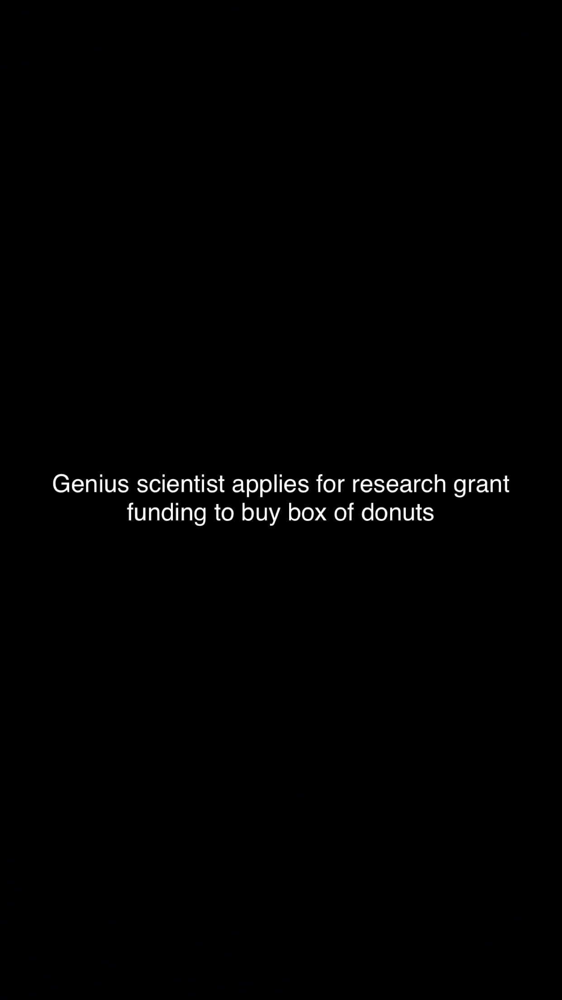

Recently I [completed a project](https://github.com/Dechrissen/hstk) that has been ongoing for a couple years now (not that it took a couple years of work, but I kept starting and stopping). I've dubbed it "Headline Snap Toolkit". Since you're probably asking "What's a Headline Snap?" right now, I'll explain the necessary background before I get into the project itself.

# Background

In a nutshell, Headline Snaps are fabricated news headlines that have been created via Snapchat. Specifically, they consist of a black background with overlayed text acting as the news headline. Here's an example:



A friend and I spontaneously started sending these back and forth several years ago, starting around 2017, and it became a habit. As you can see from the example, they're typically goofy. That's the point, though: comedic effect.

It became such a habit, that they even developed a name (hence the title of this blog post), and we've ammassed a few thousand of them. At the time of writing: three thousand two hundred and fifty eight, to be exact. 

# Motivation

Having accumulated so many Headline Snaps led us to want to _do something_ with them. It wasn't long before we decided on a database of some sort. The idea was that a database of all the Headline Snaps ever created would provide a convenient way to search through them and pull up old ones (which we were doing often enough anyway).

And the realization of the project as it exists today is really not far off from this initial conception — albeit with a few modifications and additions.

# The obvious problem

If you followed so far, you might be wondering how the source data we're working with (images) and the planned end result (a database) are compatible entities. Because really, a database of images? That's nothing more than a folder of pictures with searchable metadata on a PC. And while the metadata (creation dates, author, geolocation) _is_ very interesting to maintain for the sake of perhaps working with in the future, the focus is clearly the content in the photo: the news headline.

So, the main obstacle was figuring out how to convert all those headlines contained in the images to text data. Spoiler: OCR ([optical character recognition](https://en.wikipedia.org/wiki/Optical_character_recognition)) is the answer, but it was something I'd never worked with before.

The first thing I tried was a piece of software called [a9t9](https://github.com/A9T9/Free-OCR-Software) for Windows, which is free and open source. It actually worked pretty well, with some quirks. But its main issue is that there was no obvious way to automate the OCR process. This software is GUI-based, so you need to upload images, navigate, click buttons, etcetera. It doesn't lend itself well to the type of automated solution we wanted.

So anyway, I landed on the [Tesseract](https://en.wikipedia.org/wiki/Tesseract_(software)) OCR engine, also free and open source, originally developed by Hewlett-Packard, and very cool. It's a lot more capable than a9t9, and there are wrappers to use it in multiple languages — I used one for Python called [pytesseract](https://github.com/madmaze/pytesseract).

# The rest of the project

Now that the basis is established, we can get to the rest of the project, and why "toolkit" is in the name. Another spoiler: it's because it contains multiple tools. :)

I wanted the project to first and foremost address the initial motivation for the project: wanting to search through all of the Headline Snaps easily, via search queries or something. But quickly it became apparent that once the OCR pipeline and database code was established (I used sqlite), the potential for doing more than simply 'searching the database' was huge.

So naturally, I began to think of more potential functionality. Here are some:

- printing a random headline
- fetching the total number of headlines
- tokenizing the entire database of headlines and keeping counts for unique tokens
- training language models with which to generate novel headlines
- performing data analysis, including mapping category trends and generating data visualizations

And at the time of writing, the majority of these are implemented and working!

# Highlighted features

The highlights of the features at this point are 

1. the visualization, and
2. the language modeling/headline generation.

These two things are examples of using the data to accomplish something, rather than simply processing and storing the data.

## Visualization code

The visualization code generates a word cloud of the (currently 150) most commonly occurring words/phrases in the dataset.

It first uses the `nltk` Python library to filter out some stop words ('a', 'the', 'and', etc.). Then, it uses `nltk`'s lemmatizer to ensure words used in the word cloud are [lemmatized](https://en.wikipedia.org/wiki/Lemmatization) — i.e. reduced to the root form of a word (its lexeme). For example, "walk", "walking", and "walked" would all lemmatize to "walk", which would be the word we use in our data visualization.

Then, the `wordcloud` Python library creates a word cloud of our processed data, which is then passed to `matplotlib` which does the actual displaying of the word cloud object.

## Language modeling and headline generation code

The headline generation code can train a language model and use that model to generate a completely new headline.

The portion of the code which trains the language model is based upon previous work I've done for a project in grad school, in which I made a [comparison of two language modeling techniques](https://dechrissen.github.io/assets/academic-output/Language_Models.pdf). For `hstk`, I drew upon my previous trigram language model code, but made some adaptations. The portion of the code which handled the dataset it was built for (the Wall Street Journal corpus) needed to be modified to handle my new dataset of Headline Snaps. Then, the portion which handled generation needed to be modified to ensure that _only novel generations_ were output. The existing code could potentially synthesize data which was already explicitly in the training data (non-novel); my new modifications account for that and check each generation against the original set to ensure novelty.

The additional step which checks against the training corpus is here, in this simple function:

```python
def checkAgainstCorpus(sentence,corpus_path):
    '''Checks if a given sentence is present in a given corpus file.
    
    args
        sentence : the sentence to check
        corpus_path : the path to the corpus file to be compared to

    returns
        bool
    '''
    with open(corpus_path, 'r', encoding='utf-8') as corpus_file:
        sents = corpus_file.read().splitlines()
        if sentence in sents:
            return True
        else:
            return False
```

After each generation, before the sentence can be returned to the calling function, it needs to pass this check (i.e. return `False`). If the generation function fails 10 times, it will give up and return its final attempt, which is a non-novel generation. (Given our dataset size though, novel generation failures never occur more than 2 or 3 times per call.)

As far as the trigram language model training itself, what's happening is quite interesting, though not the highest on the "human-like" learning scale.

The dataset is iterated over and _n_-grams of length 3 (i.e. trigrams) are being saved and counted. For example, in the sentence "the boy caught the ball", its list of 7 trigrams consists of:

1. `NULL NULL the`
2. `NULL the boy`
3. `the boy caught`
4. `boy caught the`
5. `caught the ball`
6. `the ball NULL`
7. `ball NULL NULL`

where `NULL` represents sentence-initial or sentence-final padding.

The code is also keeping track of the history for each trigram, i.e. words which precede them in the data.

From this collection of trigrams and their possible history, the model is able to synthesize new sentences which match the trends in the data. Sometimes, you can get garbage, but oftentimes the generations are quite good.

## Command line arguments

An honorable mention for the "highlighted features" is also the overall format of the toolkit itself, which is a command line "front end" that takes advantage of flags & arguments to separate the functionality. Running `python hstk.py --help` displays a list of all the individual tools:

```
usage: hstk [-h] [-a] [-t] [-r [NUM]] [-c] [-x] [-s STR] [-d] {tokenizer,trigrams,visualizer} ...

hstk - headline snap toolkit

options:
  -h, --help            show this help message and exit
  -a, --add             add the current contents of the files in /data/src/text to the database
  -t, --total           display the total number of headline snaps in the databse
  -r [NUM], --random [NUM]
                        display a random headline snap from the database
  -c, --convert         convert headline snap image files in /data/src/raw then add them to the database
  -x, --export          dump all headline snaps from the database to a text file at /data/dump.txt
  -s STR, --search STR  query the headline snap database for entries containing STR (in quotes)
  -d, --delete          delete all data from the headline snap and token databases

subcommands:
  {tokenizer,trigrams,visualizer}
    tokenizer           headline snap tokenizer commands
    trigrams            trigram language model commands
    visualizer          data visualization commands

```

# Future possibilities

Of course, like most projects I've showcased on this website, there is always potential for expansion when the first rendition is finished. This case is no exception. Some ideas I have for future implementations are:

- thematic categorization of news headlines
- better language modeling techniques and improved generation (perhaps using Tensorflow to gain experience with that)
- other types of data analysis/visualization, including bar graphs for word frequency counts

But for now, the toolkit is functional. I encourage you to try it for yourself, or at least check out the [repository](https://github.com/Dechrissen/hstk) on GitHub and give it a star. :)