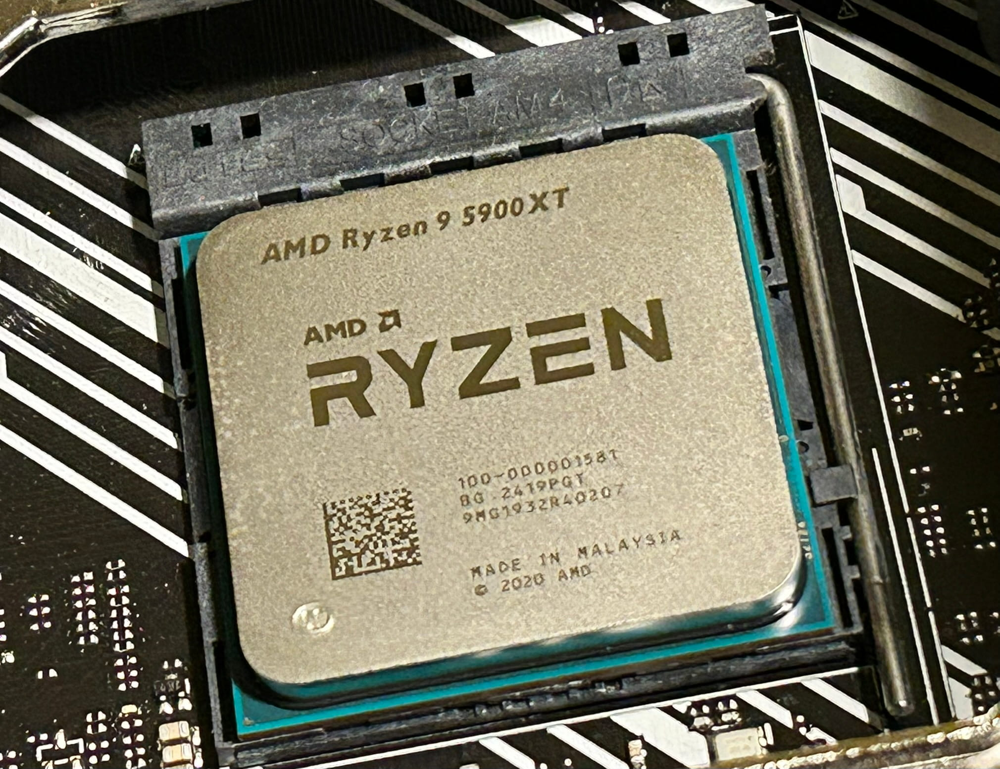
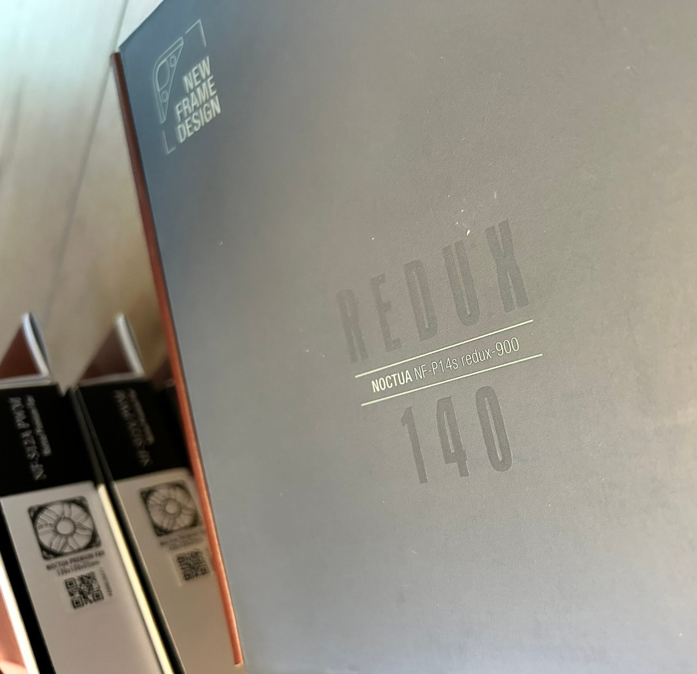
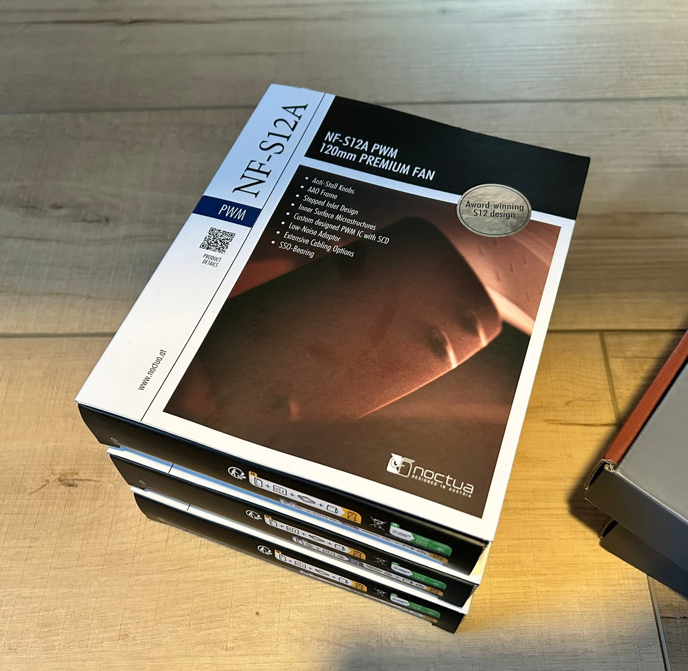
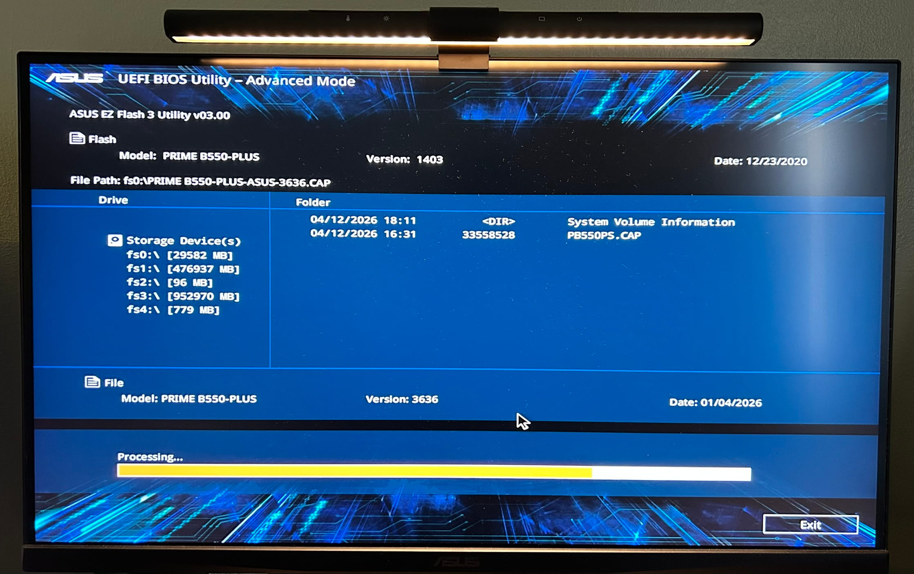
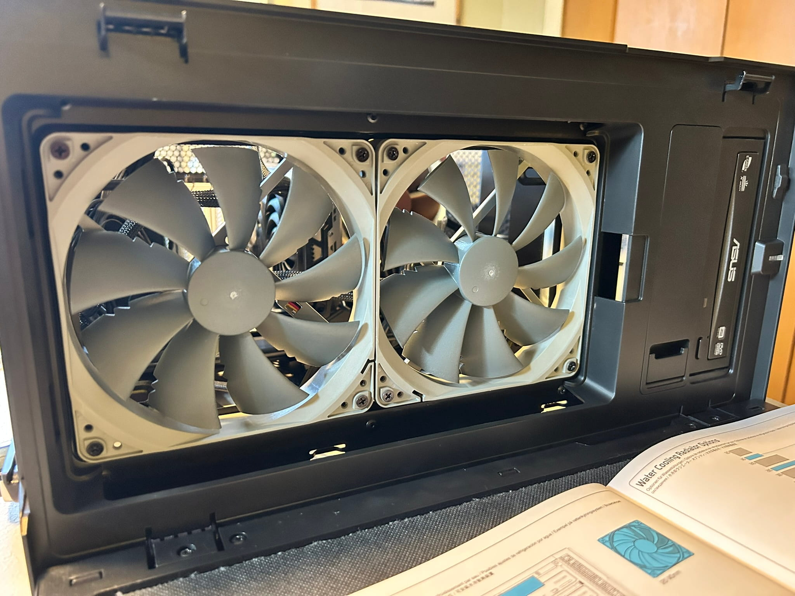
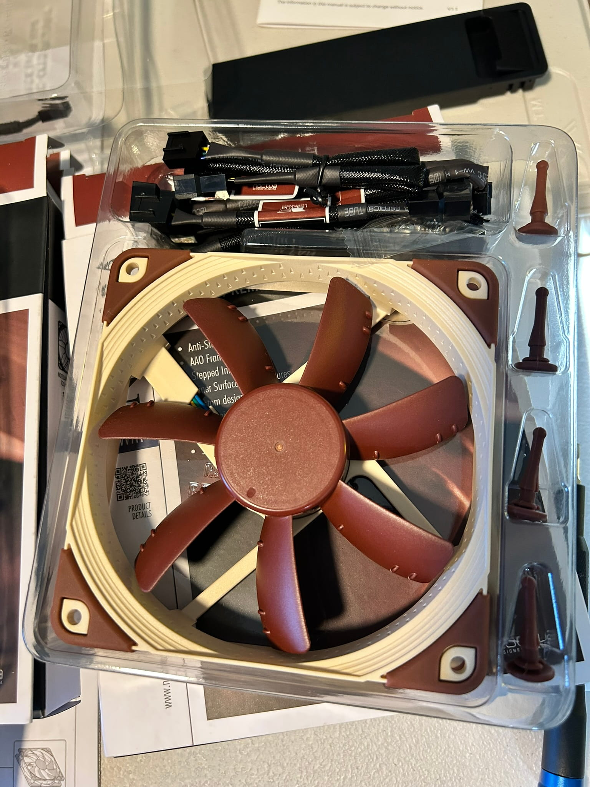
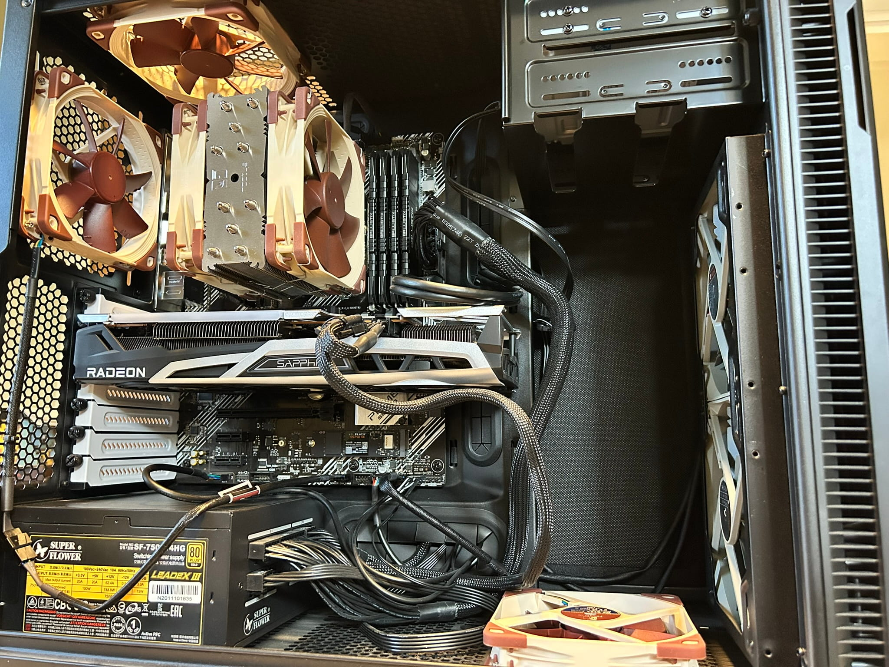
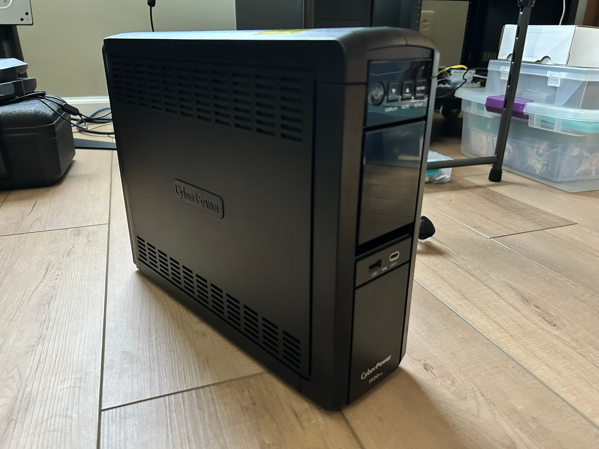
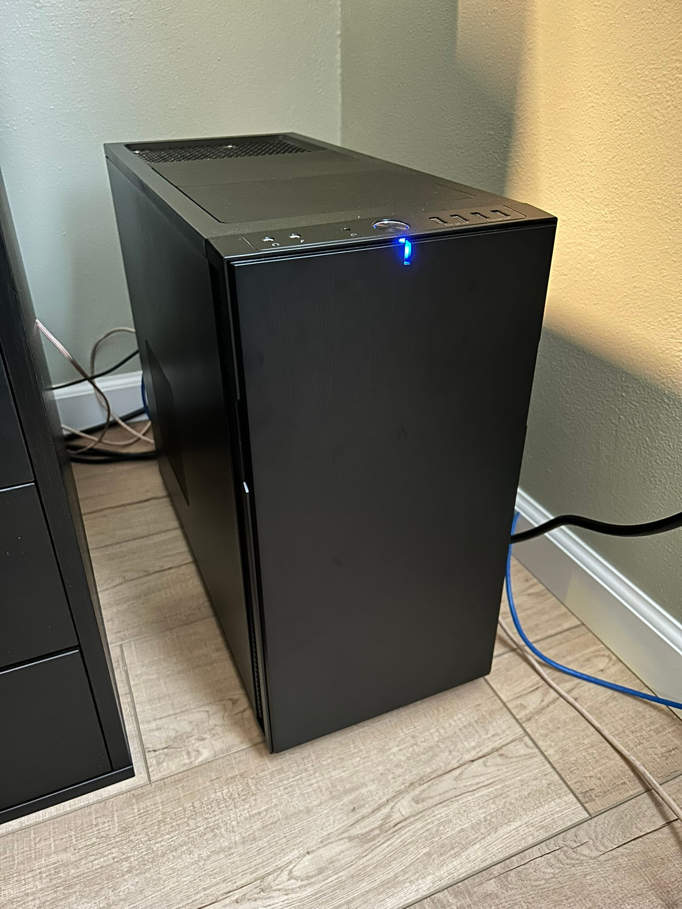

In my [last post](/blog/great-tech-cleanup-2026), I discussed my growing disillusionment with Windows and my plans to switch to Linux as a daily driver. Over the past few weeks, I've been using an old Intel NUC to develop my Arch Linux setup and dotfiles, and I had slowly been transitioning my Windows (gaming) machine's software over to it. The goal was vaguely to separate everything non-gaming from that machine, and accomplish all my daily tasks on the NUC.

I wasn't 100% sure that I'd ever (want to) try gaming on Linux on my gaming machine — I was kind of thinking I might just keep Windows 11 on it and call it my "Windows gaming machine". But I quickly came to the decision that I should not treat my most powerful machine as a _ehh whatever, that's my Windows gaming machine_-machine, and then not be able to do anything else with it (at least in this new paradigm of separating computers into broad task category accomplishers).

# The new plan

So the plan became: upgrade the gaming machine (the original build blog post is [here](/blog/pc-build-2021)), ditch Windows, and rebrand it as my **workstation** computer. The issue of games will be addressed afterward. Here was the task list.

- Upgrade motherboard BIOS which hadn't been upgraded in 6 years
- Upgrade the CPU from an AMD Ryzen 5 5600G to a Ryzen 9 5900XT
- Double the RAM from 16GB of 3600MHz DDR4 to 32GB
- Install my old optical drive because I want to be able to work with disks for certain media archival
- Upgrade all of the chassis fans and add a couple more (maxing out on Noctuas)
- Install Arch Linux

## Workstation designation

Why am I calling it a workstation? Well, "workstation" has two meanings depending on context:

1. The manufacturer's marketing "workstation" designation (full-featured motherboards and very powerful CPUs)
2. The regular guy's "workstation" designation (a computer that helps you accomplish "work"-related tasks)

Mine is #2, in case that wasn't obvious. In the regular guy's case, a workstation computer still obviously benefits from powerful hardware, even though it is not strictly necessary; my little Intel NUC could have been my workstation forever, even if it might have struggled with certain development or computing tasks.

So for this workstation build, the plan is for it to be my "productivity" machine, where I do most of my non-web-browsy, non-game computer usage. I want this computer to signal "development" and "programming" and "creation" and "learning" to my brain when I sit down to use it (and maybe also "power" — it's the most powerful computer _I've_ owned, at least).

## Components, new and old

The CPU is by far the biggest upgrade. I went from a Ryzen 5 5600G to a Ryzen 9 5900XT. For context, that's 6C/12T with 16MB L3 cache → 16C/32T with 64MB L3 cache. That's a lot more cores, threads and cache (with a increase in TDP from 65W to 105W to go along with it). This is on the high end of the AM4 / Zen 3 CPUs. I wanted to take advantage of last-gen hardware prices while still getting a big power boost. The increase in core count specifically will allow me to compile code fairly fast (I'm planning on experimenting with C eventually) and will help with multi-threaded workflows like video editing. The L3 cache is nice for games, even though that's secondary for this machine.

The RAM doubling I have less explicit reasoning for, but 16GB felt a bit low, and I'd had that amount for many years. I think 32GB is a good sweet spot where I don't need to worry about how many programs I have open (like probably ever). An added bonus here is that the listing I purchased on eBay came with 32GB (4 DIMMs), and I already had 16GB (2 DIMMs) in my machine. This means I only need to use 2 of the additional DIMMs, and I can use the leftover 2 for a future build — one that I'm actually already thinking about.

The fans in the machine were a mix of Noctua (on the CPU cooler) and Fractal (my case manufacturer). I like and trust Noctua, so I wanted to fully kit the workstation out with Noctuas. So that's what I did — more on that in the 'Upgrade process' section below.

And some things remained unchanged.

The GPU is a Radeon RX 6700 XT that I paid way too much for when GPU prices were inflated around Covid times. But it's a decent GPU and I don't need more than that, unless I wanted a workstation class GPU in the future (but at that point, I would definitely splurge on a better motherboard as well).

The motherboard is an ASUS PRIME B550 Plus, and it still works. The I/O could be better, but that's for another build.

# Upgrade process

I actually performed the upgrade in 2 phases. I purchased the RAM first (yes, during the [AI-fueled "RAMpocalypse"](https://en.wikipedia.org/wiki/2024%E2%80%93present_global_memory_supply_shortage), but I got a pretty good deal on eBay) and the 5900XT shortly after that. I upgraded the BIOS before ditching Windows to ensure the new CPU wouldn't have any issues with my motherboard (just to be safe, since the 5900XT released in 2024 which was 4 years after my BIOS had last been upgraded).

(_Cute and funny note_: After upgrading the BIOS, Windows decided this was a new computer and refused to reactivate my _paid-for_ digital Windows key. So it was effectively lost and I'd need to purchase a Windows license again. This kind of pushed me over the edge in terms of ditching Windows on this machine and making it my workstation.)

Then, I installed the additional RAM and swapped out the CPU. Interesting thing here. I had a tube of Noctua NT-H1 thermal paste lying around from when I installed the old CPU, so probably from 5 years ago. There was just enough left to apply to the new CPU, so I used it. I _guess_ in retrospect it was flowing out of the tube a bit slow and thick, but I didn't think too much of it at the time (more on this in a moment...).

I installed Arch Linux after ensuring all the hardware was recgonized properly and there were no issues (aside from the fact that Windows refused to acknowledge my D.O.C.P. overclocking profile for the RAM speed, so I was not getting the advertised 3600MT/s until the switch to Linux).

Phase 2 of the upgrade involved replacing the fans and installing the optical drive. But while I was back inside the case, I wanted to re-paste the CPU with a _new_ tube of Noctua NT-H2 I purchased (their newer compound). This was just out of curiosity to see if it might help my thermals, because I was getting some fan ramps for not-so-heavy tasks.

Long story short — you should probably _not_ keep thermal paste for 5 years. Removing the heat sink to re-paste the CPU resulted in the CPU coming out of the socket with the heat sink... which shouldn't happen. The thermal paste became glue-like and stuck to the heat sink, then I need to carefully pry it off with a screwdriver. Nerve-wracking and not fun!

The new thermal paste came out of the tube a lot easier, and as far as I can tell, is _probably_ better than the 5-year-old paste. I'll talk more about this in the 'Fans' section below.

## Fans

The fan overhaul was pretty interesting overall, because I think it contributed pretty significantly to improved thermals. I trust Noctua pretty strongly, and I already had an NH-U12S CPU cooler (with dual NF-F12 fans) in this machine. Those fans are high RPM (1500) and more than double the static pressure of the NF-S12A, so they're ideal for push/pull CPU cooler heat sink configurations. But one issue I hadn't realized until opening the PC recently is that, on one of those fans, I had the thicker anti-vibration pads on the corners which created a small gap between the heat sink and the fan. I think this had been impacting its performance its whole life, because of [insert some intellectual-sounding fluid dynamics reason here].

So first of all, I swapped those pads for the thinner size. Then I removed all the other fans from the chassis — one front intake, and two rear/top exhaust.

I like to create a front-to-back / low-to-high airflow situation when I build PCs. I don't know why, it just makes sense to me. So maintaining that configuration, I installed my new Noctua fans:

- Dual front 140mm intake fans (NF-P14s redux-900) which are lower RPM models but this seems OK to me because they're big front fresh air intakes
- One bottom 120mm intake fan (NF-S12A)
- One back 120mm exhaust fan (NF-S12A)
- One top 120mm exhaust fan (NF-S12A)

Five new fans! Plus the 2 already on the CPU cooler — seven Noctuas!

Curiously, before phase 2 of this upgrade, I was getting some weird fan ramps for not-so-heavy tasks, _and_ my CPU was idling at around 50C, and spiking up to 60-70C for moderate tasks. After the fan overhaul, I was shocked and delighted to see that my CPU is idling in the mid-30s! This was actually really surprising to me because I read that this particular CPU runs hot. Glad to be able to keep it a bit cooler.

I can't say for sure whether the improvement was the re-paste with NT-H2, the removal of the thicker anti-vibration pads, or the Noctua fan overhaul — but I'm happy with the results.

Here's the completed upgrade.

## An uninterruptible power supply, too

A secondary part of this workstation upgrade is a CyberPower CP1500PFCLCD uninterruptible power supply (UPS). I've never had a UPS before (but it's been on my list for years), and I thought now was a good time to add one — I'm adding relatively expensive components to an important machine, my NAS is running 24/7, and there have been some storms in my area lately.

This one got good reviews, and from my research seems to be higher quality than the APC models in a similar price range. I think it has what you want for a small home setup like this — sine wave output, 1000W of coverage, and network monitoring and control capability (which I'll experiment with in the future). It's also apparently silent; the same couldn't be said of other models.

The plan is to connect the workstation and the NAS to the surge + battery ports, and some networking devices to the surge-only ports.

# End result and next steps

Now I have a go-to proper development machine. The plan is to continue _creating stuff_ — most importantly, games. [Godot](https://godotengine.org/) is high on my list of new pursuits.

It's not the most powerful computer in the world, but it's definitely the most powerful computer I've owned. Plus, it's fun to build and tinker and upgrade, making it my own. It's a project in itself.

I mentioned in this post that the issue of (playing) games would be addressed after this build was done. My idea is to finish an old half-done build I have and install Windows on it. I'm not the most excited about having a Windows machine anymore, but it might be the path of least resistance for compatability with certain games. An added bonus is that I'd have a physical Windows machine for testing Windows builds for my own projects (won't need to virtualize).

So, look out for a blog post about that gaming build. You can always check my [setup page](/md/setup) for an overview of my current machines.

