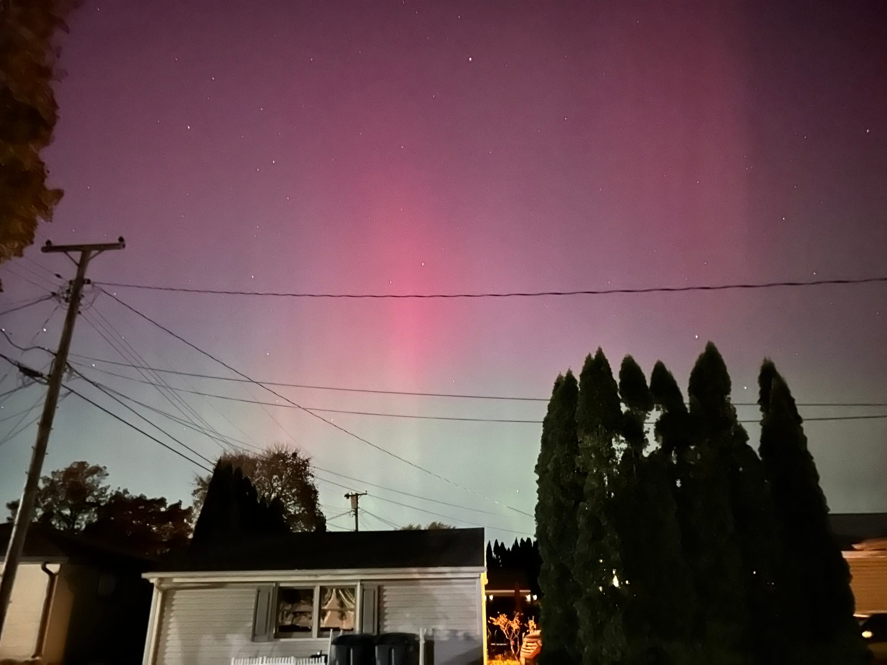
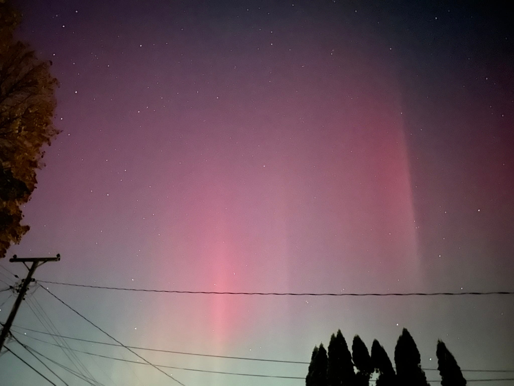
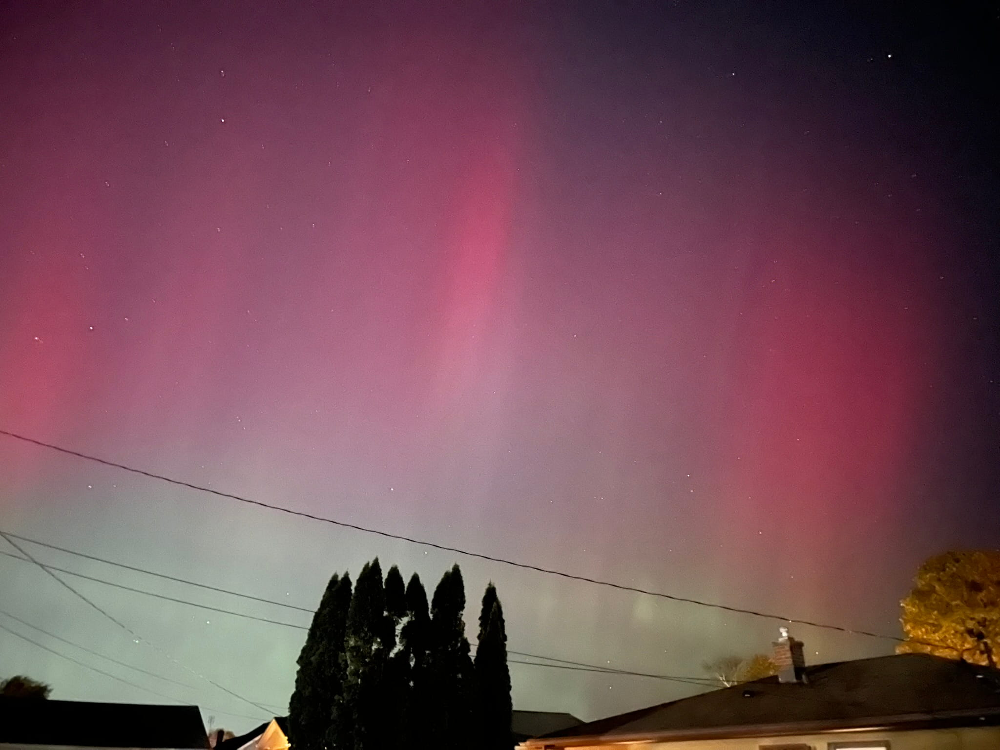

This entry has been on the back burner for a bit. The Northern Lights were visible in my area in Wisconsin a couple months ago — back in November actually. But I wanted to follow through and make this quick (photo-focused) entry and not procrastinate any longer.

This was my first time seeing the Northern Lights in person. I don't know much about why they were visible or if it was an anomaly in this area or anything. I just knew they'd potentially be visible on the night of November 12 because my mom told me.

I couldn't see them very well with the naked eye, but I was able to capture them with my iPhone camera by reducing the exposure time.

Here's some of the photos. They came out pretty nice.

