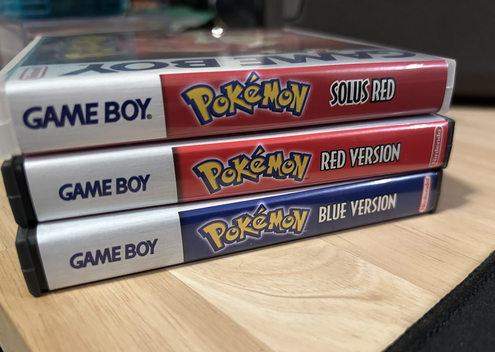
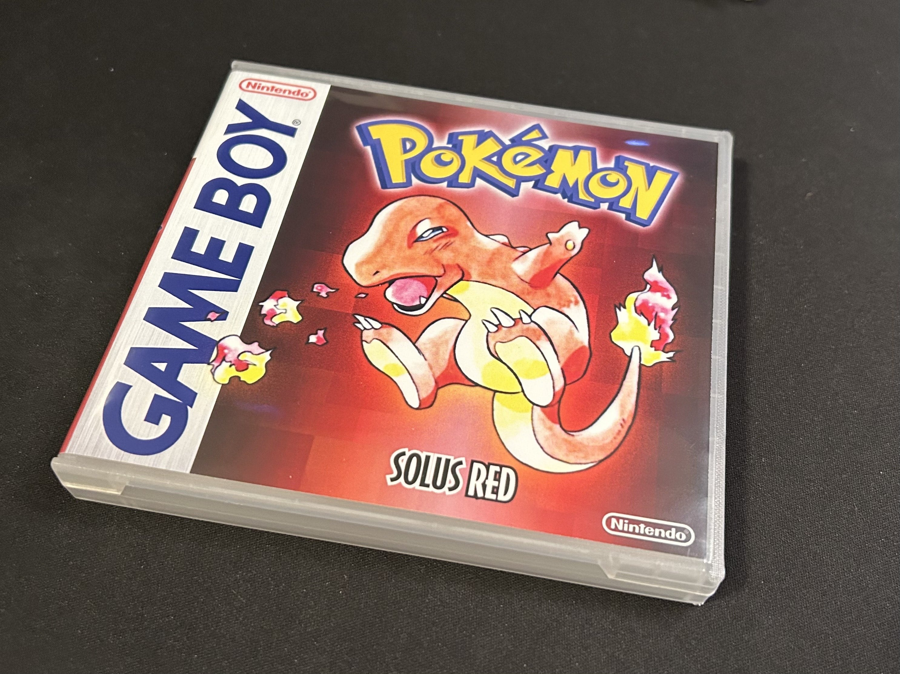
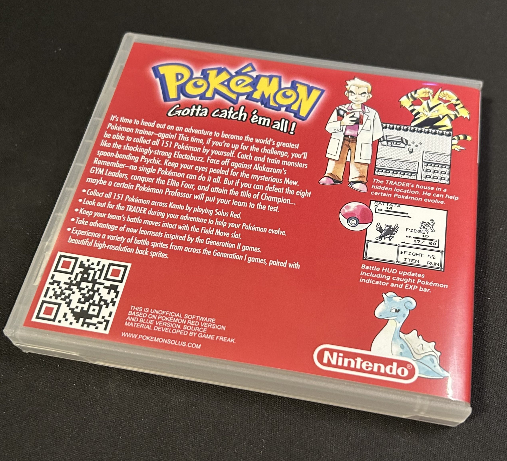
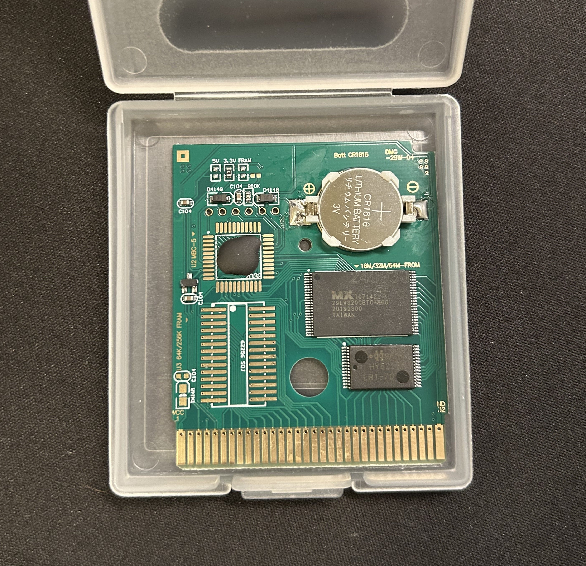
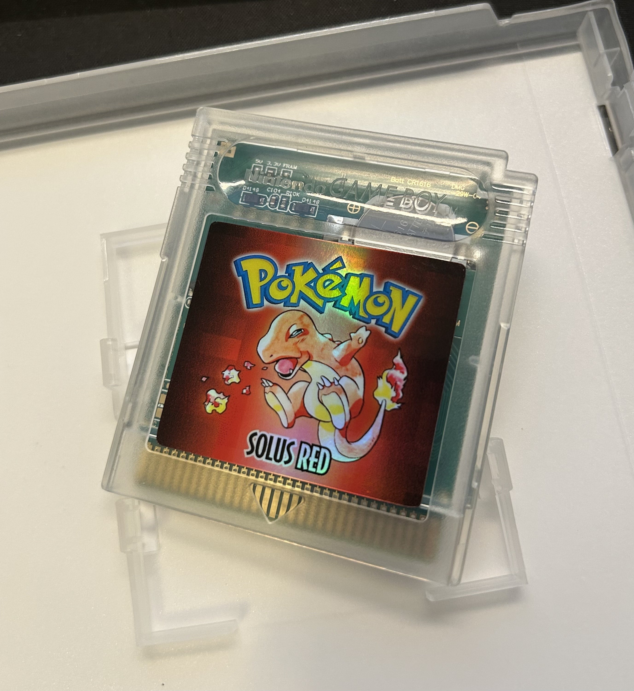

I always thought it would be cool to develop a video game and then be able to make physical copies of it. So naturally when I finished my Gen 1 romhack project, it became apparent to me that I'd be able to do that. Granted, it's not as cool as making physical copies of a game I developed from scratch (this is a modification of a pre-existing game after all) but it's still something that excites me.

# Custom box

If you've been following the project, you might've seen my amateur attempts at custom box fronts for each of the three games (Solus Red, Green, and Blue) which I created using some templates I found on DeviantArt by an artist named [Jade Lune](https://systemrift.com/) (who no longer uses DeviantArt, so I've linked to her website). The templates were essentially minimalized versions of the original North American box fronts, with some of the text removed (like "Gotta Catch 'Em All"), the ESRB rating removed, and the artwork redrawn from scratch so it looks a lot more clean. If you wanna check those out, they're [here](https://github.com/Dechrissen/poke-solus-rgb/tree/master/physical/old).

But I wasn't really thrilled about those. They came out pretty good in the sense that they're minimal and still like the originals, but I wanted something more custom in order to give the project its own identity.

I reached out to the artist of those templates to see if I could get custom box art commissioned, and she agreed. After a few weeks, I received the finished product, and they came out awesome. I was (and still am) very impressed with the quality. In addition to originally-sized Game Boy box fronts, I also requested artwork for cartridge labels and DS-style inserts with custom backs.

I _do_ like the idea of possibly working on creating OEM-style cardboard Game Boy boxes one day, but I decided that initially I preferred the more "modern" DS-style boxes. They make more sense for something that will sit on a shelf, and can actually be used reliably (since they're made of durable plastic).

I've liked this company [customgamecases.com](https://www.customgamecases.com/) for a few years now, and so I knew I wanted to use their Game Boy boxes — they are exactly like DS boxes, except they hold Game Boy carts inside. They're good quality, I recommend them. And it turns out that they will print a custom insert for those boxes if you provide the file.

## Cover and back design philosophy

I should talk a bit about the design and layout of the box. The illustrations on the covers are from the not-too-well-known Japan-only [Bandai Carddass trading cards](https://m.bulbapedia.bulbagarden.net/wiki/Pocket_Monsters_Carddass_Trading_Cards) from 1996/1997. All of the artwork is done by Ken Sugimori, and I love his style. I thought they would be appropriate to use for the Solus covers, since they vaguely align with the "vanilla, but a little different" philosophy (Ken Sugimori did all the original art, and he did these illustrations as well, they're just a little different — because not many people have seen them).

The background also features a pixel effect, which is inspired by the Carddass trading cards. The keen-eyed artists among you might notice the gradient in the background as well — this is something that the artist I was working with came up with which I thought looked good. But she also gave me the idea that it could represent that "beam of light" thing that happens when Pokémon are traded (in the anime I think, and in some of the games too). So that's cool.

The back of the box is heavily inspired by the original box back, but with some substitutions and other small changes. The blurb on the left is basically like the orignal, but some of the mentioned Pokémon are changed and there are some Solus-specific differences. Same goes for the bulleted list below it — similar to the original list with some changes for Solus. Can you spot all the changes? :-)

The screenshots on the side are also replaced with new ones that showcase some Solus features: the Trader's house, EXP bar, already-caught indicator, and high-resolution back sprites.

Of course, the QR code wasn't something featured on the original box from the 90s, because those didn't exist. I didn't like the idea of including some of those retail-specific details on the box for a romhack: barcode, ESRB rating, copyright text and trademark symbols, etc. So a lot of those things have been removed or substituted with things I thought made more sense, like the barcode → QR code swap for example. That QR code leads to the Solus romhack "homepage" btw. Try scanning it. :-)

# Cartridge PCB, shell, and label

For the cartridge, I first thought that I'd just use the PCBs from insideGadgets, since I've used them two other times for my [Pokémon forever cartridges](https://www.derekandersen.net/blog/pokemon-forever-cartridges) and they're super high quality (and FRAM, which is more convenient).

I ended up choosing not to, though, for two reasons:
1. They're expensive, and I didn't think FRAM was particularly necessary for these cartridges
2. I wanted to scout out some other cartridge vendors just for my information for future projects

So I found a seller on Etsy who sells SRAM Game Boy cart PCBs, and they ended up being _really nice_ (and a bit cheaper) so I ordered some. They use a soldered-on battery clip for the save battery, so it'll be easy to replace it down the line.

For the cartridge shell, I knew I wanted original DMG-style carts. But I couldn't decide whether I wanted something OEM-looking (grey or black) or non-OEM-looking (clear, colored translucent, etc.). If you've read any of my other blog posts, you might have come across my philosophy for reproduction/unofficial cartridges, which says "they should somehow indicate obviously that they are unofficial by using a differently-colored shell or custom label or something". There was going to be a custom label anyway, but I decided to make it doubly-custom; I went with a clear shell.

That brings me to the label — in my [last post](https://www.derekandersen.net/blog/mother-3-cartridge) I talked about a custom Mother 3 GBA cartridge I made. For its label, I bought from a seller on Etsy (because I wanted to vet the quality of his labels since I knew I might use them for this project). Turns out, they're really high quality, so I used him again for this Solus label. It's holographic too because I thought that was cool, and adds another layer of custom-ness to my crazy cartridge philosophy.

# A potential addition

The only thing missing, really, is some sort of manual/booklet/pamphlet insert. Obviously it's not necessary, but it would be cool. I have some working ideas for what this might look like — it would probably only be 4-6 "pages" (or 2-3 front and back) in bifold or trifold form. It wouldn't be exactly like the original manual for Red/Blue; it would be more like an overview of all the changes in the romhack, a list of new features, etcetera. But it would take design and style inspiration from the original manual.

I'm not 100% sure that I'll follow through on this, but it's on the table as a possibility.

# Cost, and What's the point?

You might ask why I'm doing this at all. Honestly, the answer is "Just for fun." It's cool to have tangible versions of a romhack I've created. Even if all they do is sit on the shelf for most of their life, it's worth it to me.

I have no plans of selling these. I'm always a little shocked at how many Pokémon romhacks are sold so plainly on Etsy. Aren't people scared of selling something they don't own the rights to? There probably isn't enough profit in it to warrant any action against them. Maybe I'm just paranoid.

Which brings me to another point: I've spent a fair amount of money on this project (art commissions, components for the physical copies). This could also be framed as "I've lost money on this project", but that's not how I feel. The goal was never to make money, so I've really just invested time and money into this project because it's been fun to work on. And I'm happy with all the results so far.

I started out making a physical copy solely (pun intended) of Solus Red. Now that I know that all the vendors I've chosen for parts have passed my quality standards, I've also ordered the parts for Solus Green and Solus Blue — I might post photos of them on here (or Reddit more likely) as a follow-up when they're done.

By the way, if this is something you'd like to do yourself, you can find all of the necessary assets [here](https://github.com/Dechrissen/poke-solus-rgb/blob/master/physical). Use them as you see fit. Just don't sell this romhack, please and thank you.

I hope you found this topic as cool and interesting as I do. Now that a physical copy of Solus has become realized, I get to look at it and hold it and smell it and harness its energy whenever I want.

Until next time.