Back in April, I published a blog post talking about the [physical copy of Solus Red](/blog/physical-pokemon-solus-red) that I made. Since I was just testing vendor quality for a couple of the components (cartridge label, PCB, etc.) I held off on creating copies for all three until I knew I was satisfied with the quality of all the parts.

Shortly after that blog post, I acquired the parts to make the remaining two versions, and I just got around to doing a photo shoot with all three. I'm not a photographer, but I think some of them came out pretty nice.

Without further ado, here's the entire collection!

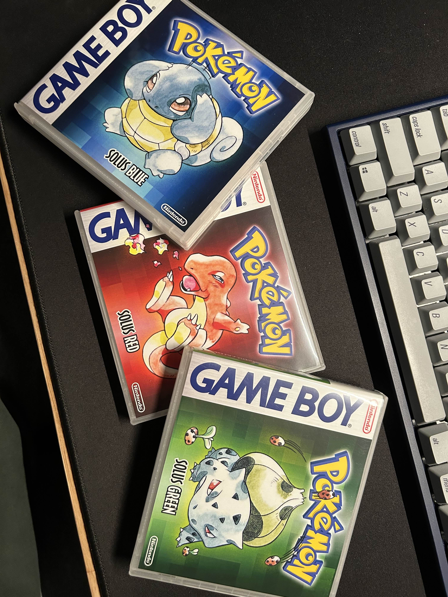
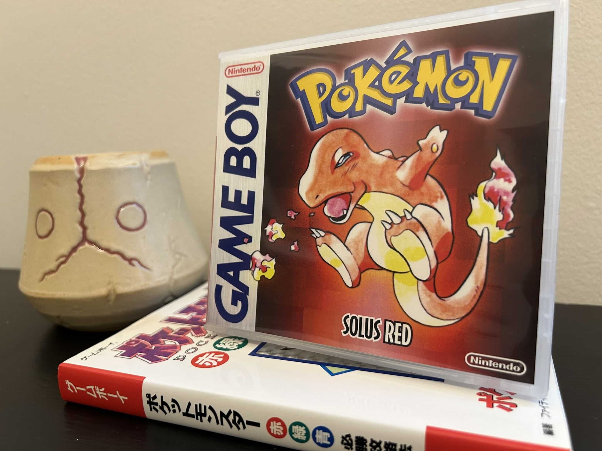
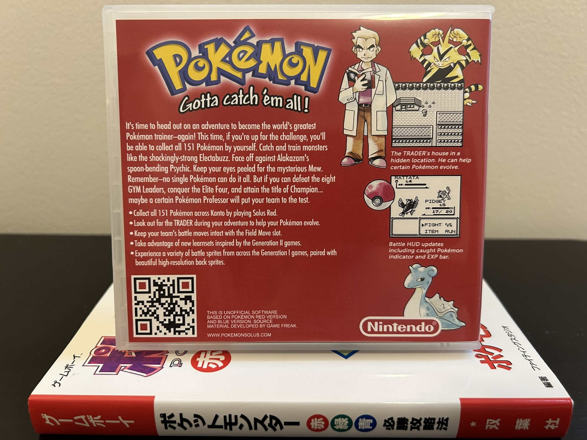
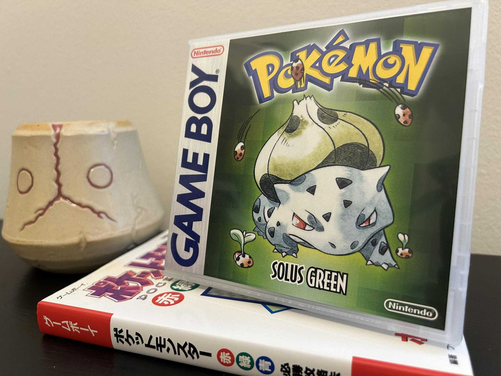
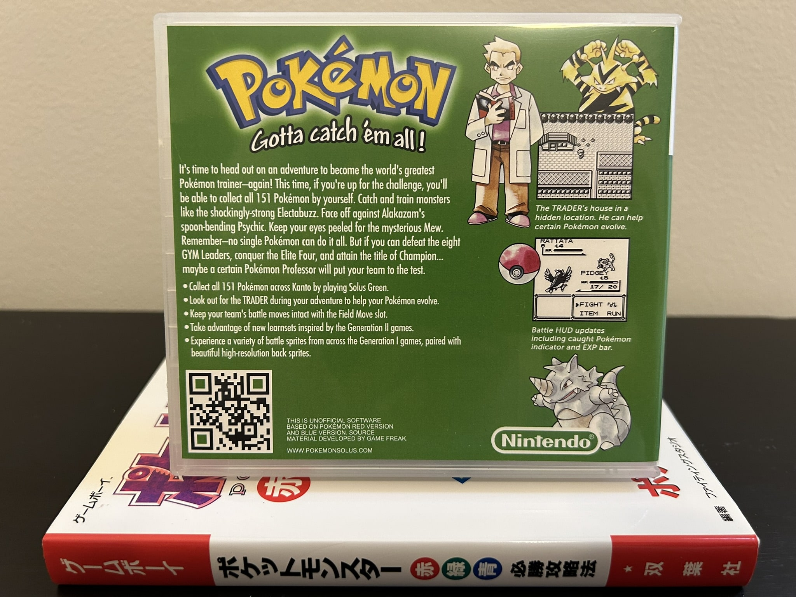
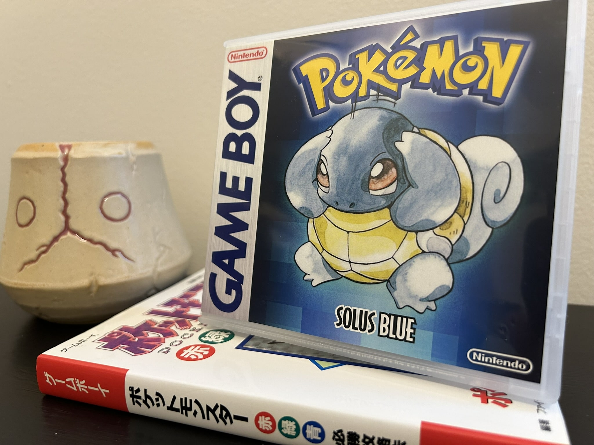
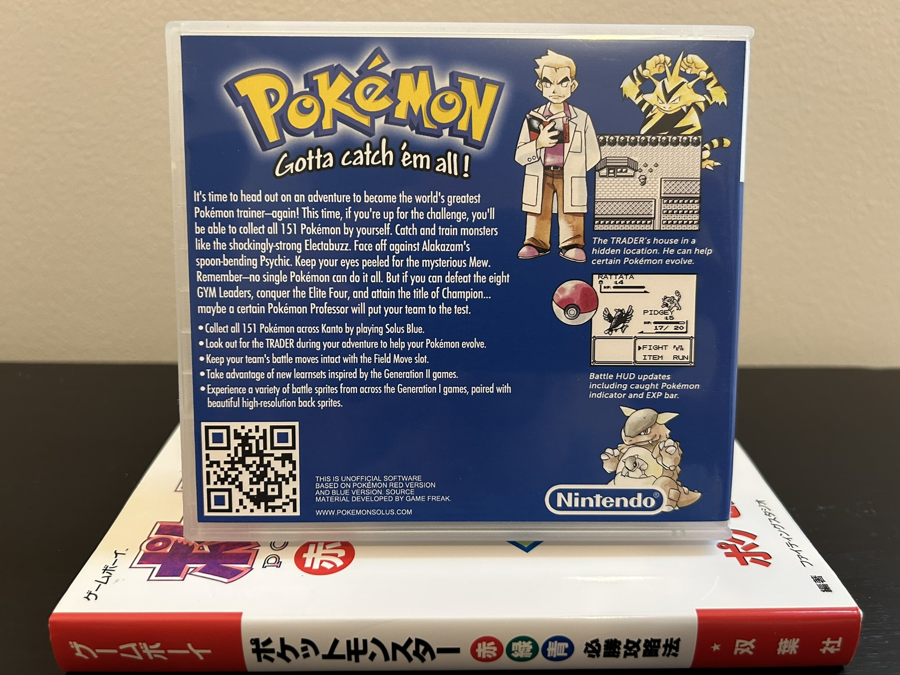
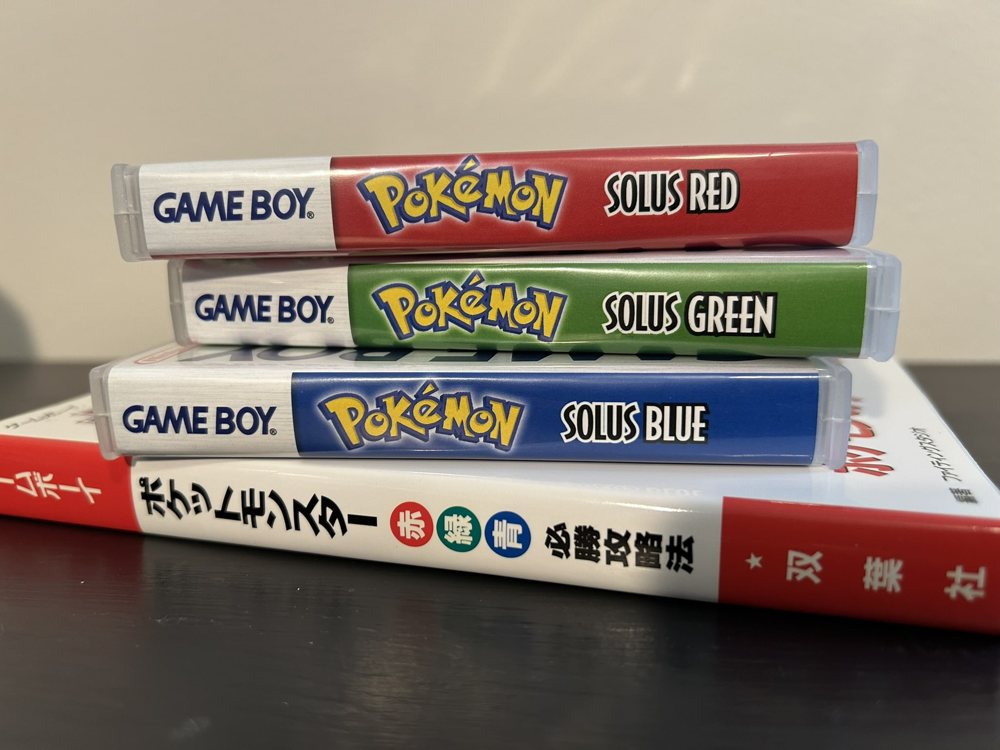
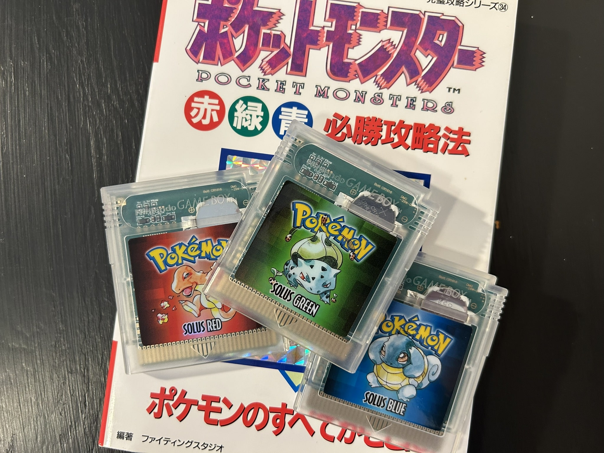
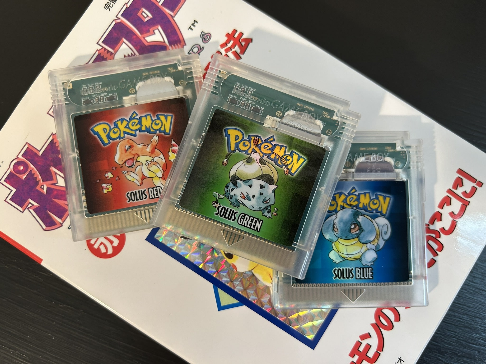
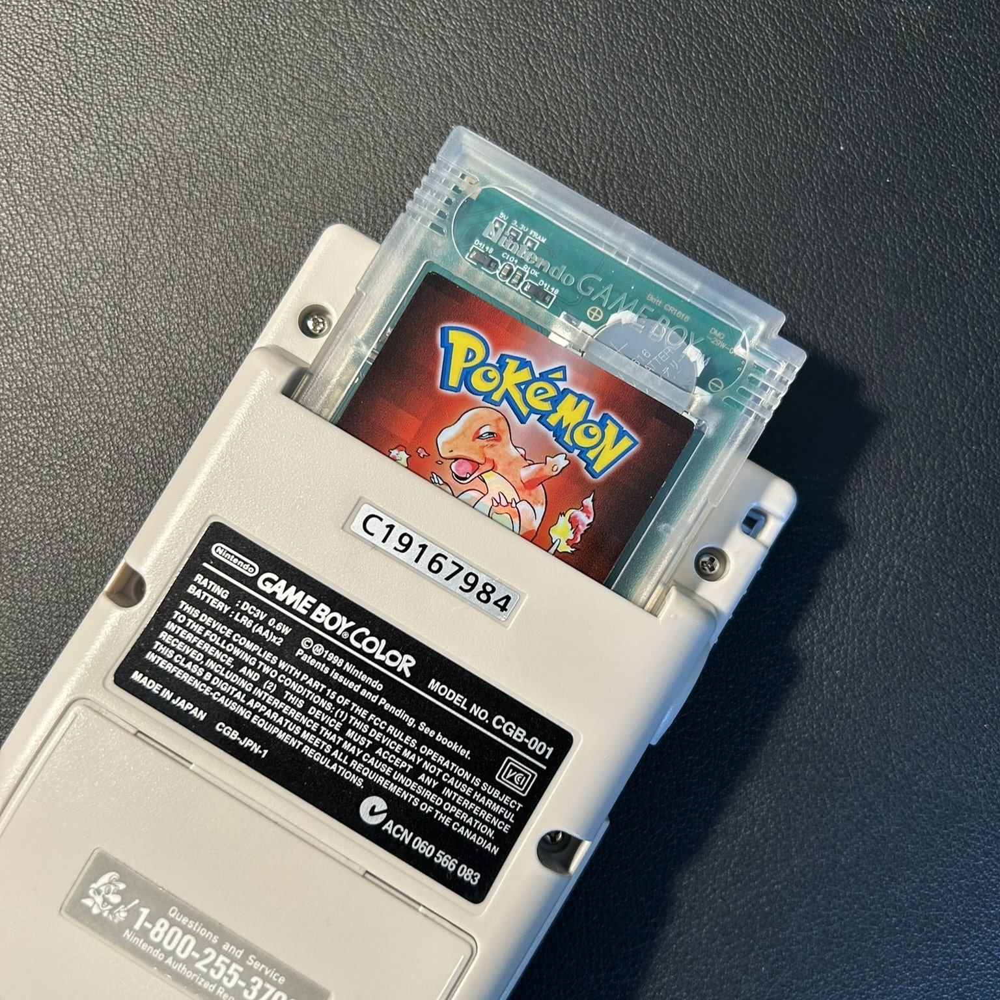

The first photo is actually not from the recent photo shoot I did; I took that right after I constructed all three copies, but I liked it enough to include it here.

I particularly like the photos of the three cartridges laying on top of my Japanese guide book for the Gen 1 games — _aesthetic_ or whatever the kids say. Right?

Let me know what you think (if you want)! There is a [Discord server for the Solus project](https://discord.gg/YTxu5uM7r6) — stop in and critique these physical copies, or the romhack itself, or just say hi.