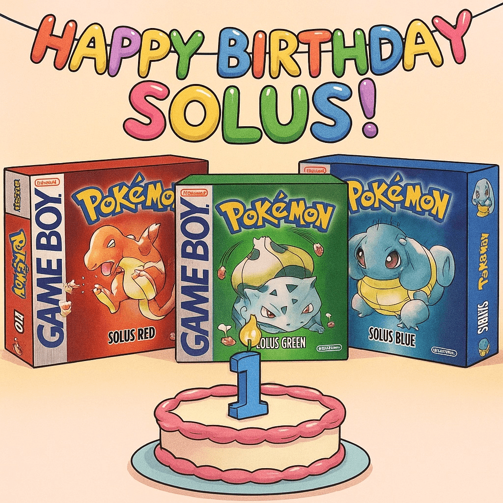

Today marks the first birthday of [Pokémon Solus RGB](/solus), my romhack of Pokémon Red and Blue. On 11 September 2024, I released the first version of the romhack; one year later, the current release is up to version 1.5 and it's _officially complete_ (aside from a few tweaks I'd like to make to the repository to allow for some custom build options).

# Happy birthday, Solus

This is a commemorative blog post — an opportunity for me to reflect on the past year's Solus-related feats and happenings.

Here are some things that happened...

- Most notably, I finished an important passion project (Solus RGB is my love letter to Gen 1);
- I learned a bit more about how assembly programming works (though I'm far from skilled in this area);
- I published a few [videos](https://www.youtube.com/playlist?list=PL-k9sS5iGL6s5MF3GIJqLIPA4662JPsxz) about the project and gained a decent YouTube subscriber base (this ultimately allowed me to make YouTube partner);
- I got a lot of [nice feedback](https://github.com/Dechrissen/poke-solus-rgb/blob/master/docs/TESTIMONIALS.md) from people who appreciated the project's direction;
- Someone published a [positive video review](https://www.youtube.com/watch?v=q9GN91qOWnY) showcasing the romhack;
- A French speaker [translated the romhack into French](https://github.com/persuaded9041/poke-solus-fr) and completed the Pokédex;
- The romhack received **over 5,000 downloads** across all trackable download sources;
- I got to chat with some cool people who joined the [Solus Discord server](https://discord.gg/YTxu5uM7r6);
- I worked with an artist to have [custom box and cartridge label artwork](https://github.com/Dechrissen/poke-solus-rgb/blob/master/physical) commissioned, and I made [three physical copies](/blog/physical-pokemon-solus-rgb);
- I was able to play and enjoy my own romhack on more than one occassion — the parties I used are logged in my [Pokémon Team Archive](/md/pokemon-teams).

One of the benefits of writing is that it can force you to reflect. If I hadn't chosen to write this post, I really wouldn't have had an opportunity to see all of these things collected in one place. Glad I did! I've said it before, but I'm very happy with this project's outcome.

For clarity, here's how I'm getting to "over 5,000 downloads" in my list above:

- GitHub downloads: 4,444
    - v1.0: 524
    - v1.1: 442
    - v1.2: 139
    - v1.3: 381
    - v1.4: 2,500
    - v1.5: 458
- romhacking.net downloads: 126
- RomhackPlaza downloads: 866

This doesn't include downloads from other websites which host their own romhack downloads, such as [visualboyadvance.org](https://visualboyadvance.org/?post_type=post&s=solus) for example. This seems to be a fairly popular site for downloading romhacks, since it allows users to download pre-patched ROMs. Assuming (for the sake of estimating) that it's more popular than RomhackPlaza, let's say it's at roughly 1,000 downloads across all three versions. If that's the case, that puts our total at over 6,000 downloads! But that's just an estimate — I'll stick with what I can be sure of, and that's over 5,000. :)

Notably, the download totals for v1.4 on GitHub were the highest at 2.5K! This is likely a result of the 1.4 patch being released around the same time as the [trailer](https://www.youtube.com/watch?v=SMto-WaTL4s).

# Plans for the Solus project

Some of the comments I get semi-consistently are things like "Will you do Solus Yellow?" or "Will you do Solus Gen 2?". I'll reiterate my plans regarding those two questions here, and I'll also discuss some broad plans I have for the Solus project.

> Q: "Will you do Solus Yellow?"

A: Yes, I want to and I plan to. It's the natural next step. I've set up the repository and I've begun thinking about how I will go about it. There are just a few differences to consider for Yellow versus RGB, and I haven't fully figured them out (but that's mostly because I haven't fully dedicated myself to starting yet). Rest assured — I will definitely start on Solus Yellow more officially in the coming weeks, but whether I will run into unforeseen roadblocks is another issue.

> Q: "Will you do Solus Gen 2?"

A: I'm reluctant to give a definitive "Yes" because frankly, I'm doubtful in my ability to succeed. I would absolutely love to manfiest a Solus Gen 2 into existence, but I'm imagining I'll have a hard time with it. Why? I'm not sure, I just know I'll need to learn how the `pokegold` disassembly is set up, and it'll take effort. But I'm going to try! Gen 2 is my favorite generation, so having a Solus variant under my belt would be something to be particularly proud of.

## A different direction

Here, I want to present an idea I've been toying with.

Currently, "Solus project" (as I've been calling it) is really only how I refer to it lately. But in the wild, it's known as "Pokémon Solus" or "Solus RGB" (i.e., it refers to the only currently-existing Solus romhack, the one for the non-Yellow Gen 1 lineup).

But the more I think about it, the more I realize that the "Solus project" _could_ really just be a term for the representation of the philosophy I defined and implemented when working on Solus RGB — namely, this one, as it's currently written on the [Solus homepage](/solus):

> "a minimal, near-vanilla enhancement of the original game with an added focus on the solo gameplay experience"

The part I want to highlight is "solo gameplay experience", and perhaps I'd even rearrange this sentence a bit to end up with "a minimalistic enhancement to the solo gameplay experience, while keeping things as close to vanilla as possible". A natural question might be "OK, well what 'things' are being kept close to vanilla? All things? Surely not, because then a romhack wouldn't make sense at all.", or maybe, "What's worth changing?"

Then the question becomes, "What's the purpose of the romhack at all, if it's being anchored so strongly to the vanilla games?" Well, my answer to this is "In order to allow the player to enjoy the games as they existed when they released, but more _fully_, in an era when nobody plays these games as they were meant to be played."

By that last part, I mean that nobody plays these games on a Game Boy, in the wild, with childhood friends they meet, with a link cable, or with the same mindset even. Most players are looking to emulate these games and play them on their PC. Most players aren't concerned with trading, and in fact, might seek out alternative methods to acquire the trade evolutions (cheats, romhacks). But I guess the essence of my motivation to create this romhack lies in the fact that I didn't really align with the style of play for these games that exists in the modern era. I just prefer the vanilla experience (bugs, quirks, legacy stats, and all). For me, like many, it comes with a lot of nostalgia, and I just want to preserve (but enhance) it as best I can.

What do I mean by "enhance"? Well, if you've followed the romhack, you'll know the few enhancements it makes already. But at this point, I should introduce the "broad plans" for the project that I mentioned earlier, and discuss what else might fall under the "enhancement" umbrella.

Instead of reserving the "Solus" name for current and future iterations of the romhack, I've been thinking I might want to expand its definition — or "brand" if you will — so it includes some other non-romhack sub-projects under its umbrella. I find myself thinking of ways I can play the same games I've loved, just with some twists (importantly for me, those twists shouldn't overhaul the game too much, and especially not its original mechanics). In the context of Pokémon, something you might do is randomize all of the encounters in the game — don't get me wrong, I think the idea of randomizers is interesting, but I still desire something closer to the vanilla experience in terms of the "natural" availablity of the Pokémon in a given region.

### Solus umbrella: idea 1
There's a fairly old project idea of mine that I've been thinking about working on in relation to the Solus project: an external random team generator tool which takes into account the natural availability of Pokémon in a given region. Specifically, it would allow you to generate a random set of 6 Pokémon to use as a final party, but it would construct the team in such a way that progression, HM blockages, and natural availability are taken into account. This way, you'd be able to use a random team you might never devise on your own, and the tool would "intelligently" craft one that is possible to construct based on the game/region.

### Solus umbrella: idea 2
Earlier, I touched on the fact that I have plans to add some custom build options to the romhack's repository. One of those options (which I could theoretically include in all future iterations of the romhack in keeping with the "brand"/philosophy), is starter Pokémon customization. To me, it's interesting to be able to play through Gen 1, for example, but use a Pokémon like Electabuzz from the start. In my view, it's the perfect level of imaginitive alteration to the base game, so that you're still experiencing canonical Gen 1 Kanto, just through the lens of a Trainer Red with a different starting Pokémon.

### Solus umbrella: idea 3
There's also the possibility of developing some Solus-specific (or, really, Dechrissen-specific) optional challenge rulesets for completing the games with. Writing up "hard mode" rulesets for the Pokémon games is something I've done for a long time, and I think I could probably release the ones I've written under the Solus umbrella, as supplementary material for playing the romhacks with a slight twist. The one I've written for Gen 1 just needs some tweaks before I release it.

Anyway, this alternative approach to the Solus project is just an idea I've been workshopping; who knows if it will become a reality?

# Wrapping up

Thanks for reading if you made it this far. If you're someone who appreciates the Solus project (and perhaps by extension, my obsession with trying to perfect this vision/philosophy), then I appreciate you!

If you want to show support for the project, I'd really appreciate if you did any of these things:
- Give the [GitHub repository](https://github.com/Dechrissen/poke-solus-rgb) a Star
- Join the [Solus Discord](https://discord.gg/YTxu5uM7r6)
- [Write a review](https://www.romhacking.net/?page=reviews&action=addentrypage&section=Hacks&subid=8809)
- Share the project with someone who might be interested

Happy first birthday to Solus. Hopefully, by the end of year two, Gen 2 will have gotten the Solus treatment as well.