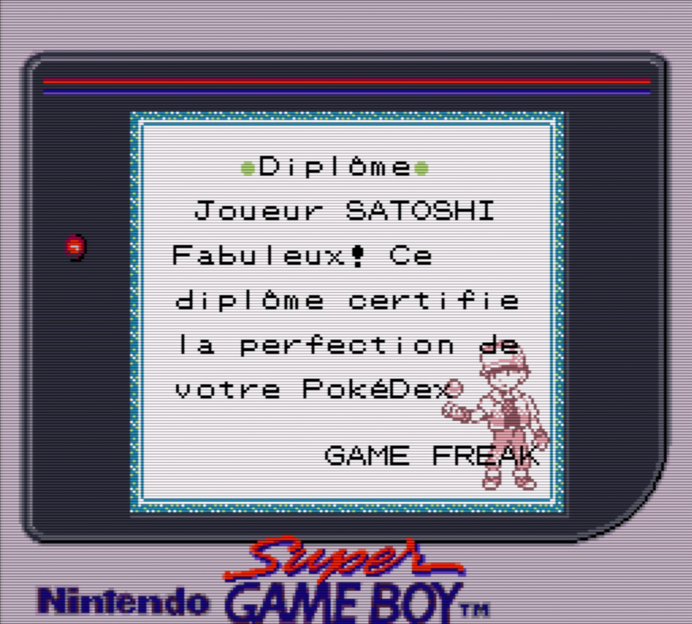

It's been a little more than three months since I released the first version of Pokémon Solus, my near-vanilla Gen 1 romhack (for reference, the Git repository is [here](https://github.com/Dechrissen/poke-solus-rgb)). In that time, I also published a few accompanying works: a blog post, some romhacking forum posts, and [some videos](https://youtube.com/playlist?list=PL-k9sS5iGL6s5MF3GIJqLIPA4662JPsxz&feature=shared). While I don't consider the project finished (as I do have a few more features I plan to add, and a couple other sub-projects to work on), I feel now is a good time to take a look back at how the romhack has been received.

# Reception
I'm happy to share that the reception has been quite positive! Using YouTube's like-to-dislike ratio as a metric, the two videos I released (a [video essay](https://youtu.be/ANRiLuondLE) and a [trailer](https://youtu.be/SMto-WaTL4s)) have a ratio of 97% and 98% respectively, which is an average of a 97.5% positive rating. I'm happy with that!

But the like-to-dislike ratio on its own isn't completely accurate, of course. There are also factors like video view count, video comments, testimonials, GitHub stats, downloads, etc. So let's take a quick look at some of those (if they are quantifiable).

## Some stats

At the time of writing...

View count on the video essay: 33,183  
View count on the trailer: 17,221  
Comments on the video essay: 300  
Comments on the trailer: 91  
Like count on the video essay: 1,208  
Like count on the trailer: 599  
Stars on the GitHub repository: 50  
Views on the GitHub repository: 755  
Downloads on the Romhackplaza page: 486

The amount of YouTube views is much higher than I would have expected. It seems like Pokémon romhack content gets quite a bit of attention. I'm also surprised that the video essay got more (roughly double) the amount of views than the trailer did; I thought a trailer would attract more attention because it's easier to consume. But maybe people tend to like talking-based videos more.

I'm particularly happy with the amount of stars on the GitHub repository; as of right now, that's the highest of any of my repos, with second place coming in at 16 stars. 

## Comments and testimonials

The video comments have been very positive, for the most part. There were a lot of people who seemed to agree almost entirely with the choices I made for the romhack, which tells me that I did something right. There were people who agreed with maybe 80-90% of my choices, and offered constructive criticism for the parts they disagreed with. And of course, there were some haters! Some people (maybe 1%) really hated it, and I think that's just something I have to get used to if I'm putting any of my creative work out there.

But let's focus on those positive comments. I've put together a [testimonials document](https://github.com/Dechrissen/poke-solus-rgb/blob/master/docs/TESTIMONIALS.md) as part of the GitHub repo that you can peruse if you're so inclined. But for brevity's sake, I'll include only a few stand-outs here:

> I was thinking about a pure Gen 1 rom hack with the issues you described fixed and here we are! Can't wait to try this out!
> 
> _— TheAaronetic_

> This is the kind of romhack I was looking for. Enjoying it so far!
>
> _— royedwards2366_

> thank you for making the purist hack everyone else keeps failing to make
>
> _— primiera1484_

> After reading through the updates you’ve made, this is basically exactly what I’m looking for in a romhack of the original first Gen games. The addition of the field move slot for HMs and the trade back NPC being located in Celadon are great quality of life features. [...] You crushed it - this one is getting added to my list
>
> _— Fugh\_Mungus_

The most common sentiment seems to be something like "I was looking for something exactly like this!", which makes me quite happy. As you might know from reading other things I've written about this project, my motivation was to create something that solved some small issues while still keeping the game very close to vanilla. So, if I was able to create something that other people were also wishing for, I feel I've done something good/productive.

## A French translation?

There was something else _very cool_ that happened in these past few months: a fan of the romhack who speaks French took it upon himself to create a [French patch of Solus](https://github.com/persuaded9041/poke-solus-fr). That news was amazing to me when I learned of it. If you're interested, you should check out the repository — the developer did it right (using Makefile flags to apply custom patches to my base repo), so I can learn a thing or two if I ever choose to do something similar for other optional patches. Thanks, Conrad! Your work is appreciated!

If that wasn't enough, he also played through the romhack (using his French patch) and completed the Pokédex! Here's the screenshot of the  completion diploma he sent in my Discord server, after 53 hours in-game.

Magnifique!

## Other requests from viewers

In addition to those positive comments, I also received quite a lot of requests for additional features, config options, and even separate romhacks. The additional features and config options I'll discuss in the next section, but I wanted to mention at least briefly the requests I've gotten for additional romhacks.

Without a doubt the most common inquiry was "Will you do a Solus Yellow?" — and to be honest, I was surprised by the amount of people who were interested in such a thing. For me, my preference was always Red & Blue over Yellow, and I thought it would make most sense as the base for a "purist's enhancement" rendition of the game. But it turns out that a lot of people prefer Yellow. And I guess I should have known, in retrospect!

Second to this was the request to work on a Solus-ified Gen 2 romhack. This is what I expected would be most common, as it was already my target for the next project (if I was going to do one).

So I think in light of the overwhelming requests, at the very least I will _consider_ doing a Solus Yellow. A lot of the code could be reused from the commit history in my repository, so it wouldn't be _that_ bad. It would just take a while. But heck, maybe I'll do it!

Solus Gen 2 would definitely be the more challenging project. The Gen 1 code base was hard enough to learn how to work with, and I'm not particularly adept at assembly programming, so it would definitely take some effort. But personally, a Solus Gen 2 is something I'd much prefer having over a Solus Yellow — Gen 2 is my favorite after all.

# Misconceptions, and new Solus features since version 1

A subset of the comments were requests for features that I wasn't going to add under any circumstance, or criticisms of decisions I made for the romhack's features. There's nothing wrong with criticism, but sometimes I felt that there were some misconceptions about what the purpose of the romhack was — namely, it was to stay very faithful to vanilla while addressing some small/specific issues. 

There were a few requests for "enhancing a Pokémon's moveset or base stats or typing" in order to "balance" the game better. While sometimes these suggestions were very reasonable from a general gameplay standpoint, they conflicted with my philosophy to keep the game mostly as-is. I didn't want to add new moves from later generations, or bolster a certain species of Pokémon because it sucks in Gen 1, or other similar things. 

But it's worth mentioning that, since the first version of the romhack and since the first video was released, I have made a few changes to the game. And one of those changes was the implementation of "Gen 2 tradeback movesets". If you're unfamiliar, Gen 2 tradeback moves are moves which exist in Gen 1, but can only be acquired by a Pokémon in Gen 1 by trading it to Gen 2 (then learning the move there) and then trading it back to Gen 1.

At the outset of this project, I would have considered that particular change to be unfaithful to vanilla. But in fact, I changed my mind for the sole reason that it's technically possible to accomplish in Gen 1 with physical cartridges (after the release of Gen 2, of course). If you recall, one of the main points of my philosophy was that the player should be able to do things in-game by himself without trading with another cartridge, etc. Since Gen 2 tradeback movesets fit this philosophy, I chose to implement them. How exactly did I do it? Well, the practical implementation took a few different forms: updated learnsets, some new TMs, and a new NPC or two to distribute those TMs. For more detail, check out the [feature log section about learnsets](https://github.com/Dechrissen/poke-solus-rgb/blob/master/docs/FEATURES.md#learnsets).

A couple other features which fit into the philosophy (imo) have also been implemented since the first version. I'll list them all here:

- Four new TMs (for Gen 1 moves that did not have TMs but are required for the new learnsets)
- Partially forward-patched learnsets via Gen 2
- New NPC (Bill's father) in Fuchsia who sells the TM for Flamethrower
- In-battle EXP bar
- In-battle 'already caught' indicator
- Updated type effectiveness (Ghost is now super effective against Psychic, as was intended)
- Updated move typings for Karate Chop, Gust, and Sand-Attack (to match Gen 2)
- New sprite for Blaine (the Silph President sprite, like in Yellow Version)

Again, for more detail, check out the [feature log](https://github.com/Dechrissen/poke-solus-rgb/blob/master/docs/FEATURES.md).

# My thoughts

I'm very happy with how the project went and with the feedback I've received. Sometimes, I had some very nice interactions with people in the comments section, and sometimes this helped me to further develop some ideas for future features.

I think working on this project gave me a nice taste of how it might feel to work on a proper game development project long-term. I was constantly fine-tuning my work (as I like to do) and adding new things. And when it was finished, I was able to write about it and even make some videos to share.

The positive feedback (and even the negative feedback) is a good thing for me. It makes me happy to share my projects with other people, especially those who are interested in the topic. Their input is valuable, and I enjoy hearing stories from people who have had a positive experience with a project I've made (or even simply getting nice comments about the actual video I made about that project).

I'm excited to continue working on Solus, and to work on other game development projects in the near future. Making and editing videos can be very tedious, but it's also something that ends up being very rewarding — hearing others' thoughts and compliments about something I've made can really create some more motivation to keep on keepin' on, as they say.

Until next time.