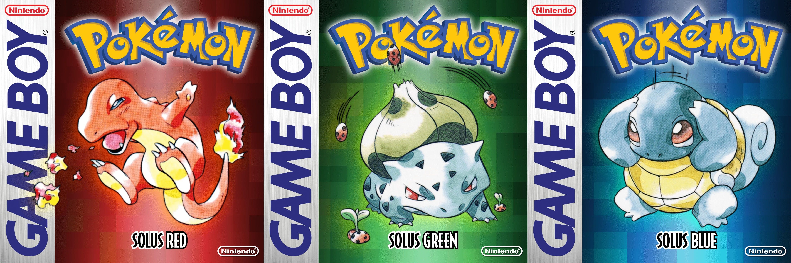
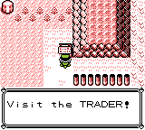
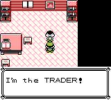
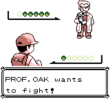

(The accompanying git repository for this blog post is [here](https://github.com/Dechrissen/poke-solus-rgb).)

This past July, I mentioned my interest in making a Pokémon Gen 1 romhack in a blog post. I'd been toying with the idea for a while before I mentioned it in that post. The original idea was motivated by a few key issues I've always had with Gen 1. And that's not to say I disliked Gen 1 at all; in fact it's one of my favorites, along with Gen 2.

But there is a common sentiment among Pokémon fans, and it's something like: "Because Gen 1 doesn't represent what I know the modern games to be like, and because it has a lot of bugs, it's a bad game." And I never agreed with this. I fully recognize its flaws, but being that I grew up playing Gen 1, I can appreciate it for what it is. And it's Pokémon! A lot of the aspects which are commonly considered flaws are things that I instead like to frame as simply challenges which apply in that particular iteration of the game. Things like TM disposability, some broken moves like Bind, the lack of "full" movesets for certain Pokémon. These are all things which I like to think of (while I'm doing a playthrough of Gen 1) simply as constraints.

When it comes to the solutions that later games implemented to address those problems, I'm glad for those too. I like to think of each generation of Pokémon as its own thing, and when I'm playing a particular generation, my brain adjusts to the applicable set of constraints for that generation. It's a good thing, imo, as it allows for different approaches depending on the generation you're playing. But alas, there are people who regard Gen 1 as fundamentally flawed and therefore bad, and that's fine I suppose. To each their own.

# The gripes I've always had with Gen 1

All that being said, I did make a statement in my first paragraph hinting that there are issues that _I've_ had with Gen 1. So what am I, a hypocrite? I thought I just said Gen 1 should be respected for what it is!

Well, I'll be honest: I do think there are some problems that exist in Gen 1 that could be addressed to create a slightly-enhanced experience. But, _for the most part_, the solutions I propose aren't ones which really address any bugs in the game engine or flaws in the developers' design choices. There are some exceptions to this, but anyway, I should be more explicit, so here's a list of the **issues I believe are worth addressing**:

1. All 151 Pokémon are not obtainable in either version, so trading with another cartridge is necessary.
    - Certain Pokémon are only obtainable via in-game trades, which means they will suffer from boosted EXP / lack of obedience based on level (imo, both of these things are negatives). 
2. Certain Pokémon only evolve via trading (Machoke, Graveler, Haunter, Kadabra) — this cannot be achieved with only one cartridge.
3. HMs are frequently used, which leads to either the necessity of an HM slave, or the sacrificing of some of your party Pokémon's move slots. In either case, your party's full potential is reduced.

Whenever I was doing a Gen 1 playthrough, these were the things which consistently made me long for a _slightly_ different reality. I wanted to be able to get any Pokémon for my party, first of all. I didn't want to choose the version I played based on Pokémon availability. I also wanted to be able to use any of the four trade evolutions without needing to actually trade a friend (or even just another cartridge that I owned) via Link Cable. And I wanted the option to use the in-game-trade-exclusive Pokémon without being afflicted with the boosted EXP / disobedience curse.

The HM situation was also always a bit of an inconvenience for me. I always felt kinda bummed that I needed to limit certain Pokémon in my party to only having three moves, for example. It felt like a waste of that Pokémon's potential. If I _really_ wanted to, I could keep specific HM slaves in the PC and then withdraw them only in instances that I need them... in fact, maybe this has always been what was intended. But this seems a little crazy. The fact that it _can_ be done that way (even if that would be incredibly tedious) sort of makes me feel that I have "creative license" to mitigate that issue in a romhack, for whatever that's worth.

So, all that being said, I came up with the following general solutions to my issues:

1. All 151 Pokémon should be obtainable in one game.
2. Trades should be performable in-game via a "trade-back NPC".
3. HMs should not occupy a Pokémon's regular move slots.

# Philosophy

This is probably a good time to interject with my clarifications of the philosophy behind the romhack. It might already be apparent, but I just want to be clear about the general motivations.

The philosophy is captured pretty well in the name I chose for the romhack: "Solus". It's a word which is used as a stage direction for a male character. I think it's Latin. But the point is, it highlights the "solo" aspect of the philosophy; the main motivation for this romhack was to create a version of Gen 1 which was an enhanced "solo" experience. That is to say, everything should be able to be done in-game by yourself, without relying on other people (or cartridges, more realistically) to trade with. Beyond that, it should also address some annoyances if it doesn't affect the overall feel of the game. In my eyes, the previously-mentioned HM issue was the most important annoyance to address.

Related to that last statement, this romhack also shouldn't alter the vanilla game too much, if possible. I don't want to creep into "correcting all of the developers' mistakes for the good of the game" territory. As I said in the intro, I appreciate Gen 1 for what it is; I would like my romhack to highlight Gen 1's characteristics, not overshadow them.

# Methodology

Before I get into the specifics of the choices I made to satisfy those solutions, I should talk a bit about the methodology; more specifically, how I'm going about doing all of this in the first place.

Well, if it weren't for the existence of the [pokered disassembly](https://github.com/pret/pokered), I wouldn't have been able to do this project at all. The disassembly is the work of the Pokémon Reverse Engineering Team and it's available to fork on GitHub. Actually, they've done disassemblies for various other Pokémon games. Check out [their GitHub page](https://github.com/pret) if you're interested.

So, what is it? Essentially it's a recreation of the original Z80 assembly code which is then compiled into the ROMs for Red/Blue. The details of the reverse engineering process are beyond the scope of my knowledge, but all I can say is that it's impressive. I didn't have prior experience with Z80 assembly (it helps to have a baseline understanding when working with the codebase), but my general takeaway is that it's pretty difficult, imo. But it's an interesting challenge nonetheless. Without having a comprehensive understanding of the code, it's still possible to make generalizations about what certain parts of the code are doing, and make adjustments accordingly for your purposes.

The whole project took me about a month and a half from start to completion. Granted, this romhack is quite small in scope, but I'm still satisfied with that amount of time (I thought it would take longer).

# Application of my ideas

So, the next step was to actually address those three major issues I sought out to solve.

## Wild Pokémon

Regarding the non-availability of all 151 Pokémon in vanilla, the most glaring example of this lies in the version exclusives. For example, Oddish vs. Bellsprout, Growlithe vs. Vulpix, and Electabuzz vs. Magmar among several others. So, for the Kanto routes which differ in their wild Pokémon, I modified the encounter slots so that both version exclusives would appear in my romhack (i.e., I merged the wild encounters). Take Route 4 as an example. The snippet below is taken from the file containing Route 4's wild encounters.

```
Route4WildMons:
	def_grass_wildmons 20
	db 10, RATTATA
	db 10, SPEAROW
	db  8, RATTATA
IF DEF(_RED)
	db  6, EKANS
	db  8, SPEAROW
	db 10, EKANS
	db 12, RATTATA
	db 12, SPEAROW
	db  8, EKANS
	db 12, EKANS
ENDC
IF DEF(_BLUE)
	db  6, SANDSHREW
	db  8, SPEAROW
	db 10, SANDSHREW
	db 12, RATTATA
	db 12, SPEAROW
	db  8, SANDSHREW
	db 12, SANDSHREW
ENDC
	end_grass_wildmons
```

The total number of slots, if you take into account the conditional statements which vary depending on whether it's being used for Red version or Blue version, is ten. In my romhack, I've made changes to accommodate 12 encounter slots per map. This gives me enough wiggle room to do the "merging" I was referring to. Now, take a look at the snippet below. This is taken from Route 4's file in my romhack. It merges the version exclusives (in this case, Ekans and Sandshrew), and it increases the total number of encounter slots to twelve. It's also important to note that the order of the Pokémon in these files matters. Specifically, the positions in the list dictate the encounter rate for whichever Pokémon is in that slot (totaling 100%). So, I refactored these lists in such a way that retains the original distrubution for each Pokémon/level combination, only making _minor_ adjustments to the existing scheme if I needed to merge some version-exclusives between Red and Blue.

```
Route4WildMons:
	def_grass_wildmons 20
	db 10, RATTATA
	db 10, SPEAROW
	db  9, RATTATA
	db  9, SPEAROW
	db  8, EKANS
	db  8, SANDSHREW
	db  8, SPEAROW
	db  8, RATTATA
	db 12, RATTATA
	db 12, SPEAROW
	db 12, EKANS
	db 12, SANDSHREW
	end_grass_wildmons
```

This is what I did for every map in the game, which took care of the non-availability of the majority of version exclusive Pokémon. However, there were still some problematic cases, like the starter Pokémon, Mew, and some others like Lickitung and Mr. Mime (which are only obtainable via in-game trades). I wanted to ensure that those Pokémon which were in-game-trade-only were available through other means, since I didn't want them to be subject to the boosted EXP / disobedience curse. So, they were added to the wild in most cases, and when choosing where I'd place them, I always took into consideration what "made sense", in a Kantonian sense.

I won't go into more detail than is necessary, but take Lickitung for instance. Previously, in the English releases of the game, it was only available via trading a Slowbro to an NPC on Route 18. So, when looking to see where I might add Lickitung to the wild, I made sure to look at other instances of its location data (particularly in Kanto). And it turns out that Lickitung is available in a certain area of the Fuchsia Safari Zone _specifically in the Japanese release of Pokémon Blue_. To me, this is enough to consider it "canonical", and so that's the location for Lickitung that I settled on.

## Trade evolutions

Regarding those four Pokémon which only evolve via trade, I suppose I had more options than only "adding a trade-back NPC" when implementing a solution. In particular, I'm thinking of other Gen 1 romhacks, which take the liberty of changing the evolution methods for those Pokémon. I know of one romhack, for example, which changes the evolution method from "trade" to "level up to 37". 

But, as you might be able to gather from my explanation of the philosophy and motivation behind this romhack, that won't fly for me. So indeed I went with the "trade-back NPC" method — I added an NPC aptly named "the Trader" who resides in Celadon City. I added a new house for him behind Celadon Department Store, since there was a bit of unused land back there, and it's nice to have him a bit hidden away (although I did also add hints and tip-giving NPCs which direct the player to his location).

Here's his Route 8 advertisement sign.



And here's the Trader himself, in his house in Celadon.



The Trader, well, trades! Simply, you can talk to him to initiate a trade dialogue, and then you are able to select any of your Pokémon to trade to him. He will trade it right back to you, at which point it will evolve (if it's able to). Btw, the implementation of my Trader was inspired by the tutorial for a trade-back NPC in the [pokered wiki](https://github.com/pret/pokered/wiki/Tutorials).

## Mew

Mew has been added as a static encounter in Cinnabar's Pokémon Mansion. I thought this location was thematically appropriate, since it's the site where Mew's DNA was used by Dr. Fuji and other scientists to create Mewtwo. Whether the Mew I've added should be thought of as "Mew who still resides there since the experiment" or "Mew who's coming back to search for the scientists/Mewtwo" is left ambiguous. And actually, whether Mew was at the site at all is not clear in the lore — it only states that Mew's DNA was found in the jungle, but doesn't clarify if Mew's DNA or Mew itself was taken back to the mansion.

So yes, I took a bit of creative liberty here. But to me, this seemed like the best way to include a static Mew encounter.

## Field Move slots

Regarding the issue of HMs occupying a Pokémon's move slots, there are, again, multiple possible solutions.

Perhaps you could remove the need for HMs altogether. But that goes against the philosophy — I don't want to change the fundamentals of the game in that way.

Perhaps you could allow HMs to be "taught" to the player character instead of his Pokémon. But that's sort of nonsensical — the idea behind these HMs is that they're designed to be used by Pokémon, not humans.

So the solution that I liked most was something that maintains the idea of Pokémon-centric HM usage, but prevents their battle move slots from being bogged down with unwanted HMs. Specifically, the inclusion of "Field Move slots" is what I decided on (my implementation was taken from another romhack: [Shin Pokémon](https://github.com/jojobear13/shinpokered)). The way these work is by giving each Pokémon a separate 5th move slot which only accepts HMs (and Dig, Teleport, and Softboiled) and can only be accessed in the field. This way, in order to use some HM, you'd still need to have a Pokémon in your party who can learn it, but their in-battle moveset would remain unnaffected.

# Beyond the issues

In addition to the solutions to those core issues, my romhack also features a few other changes. Some of these are more cosmetic, and others are closer to the gameplay itself.

Starting with the cosmetic ones:
- Some front sprites have been changed to the Yellow variants or the Red/Green JPN variants.
- The back sprites have been upgraded to 48x48 (higher resolution than vanilla) and now use the Spaceworld 1997 Gold/Silver beta sprites.
- A Green version variant is now playable, and features the original mostly-green palette when played on a Game Boy Color.
- The title screens for all three versions use a new title graphic featuring the "Solus" name.

As far as other new features that have been added that do not fit the "solutions to issues" category, there is one, and it's the restoration of cut content: the Professor Oak battle.

Prof. Oak has unused trainer data in the game's codebase, and in fact there has been a known glitch for a while which lets you invoke the battle. His party Pokémon are among the highest levels in the game, so it's thought that he was meant to be a sort of final boss, akin to Red from Gold/Silver.

The Oak battle can be initiated once the Pokémon League is beaten, simply by speaking to him in his lab.



There are a few more details I haven't touched on in this blog post, but that's because I didn't want it to be too long. If you're interested in every last detail of this romhack, you can read the [feature log](https://github.com/Dechrissen/poke-solus-rgb/blob/master/docs/FEATURES.md).

If you want to play the romhack, you can find it [here on GitHub](https://github.com/Dechrissen/poke-solus-rgb) or [here on RomhackPlaza](https://romhackplaza.org/romhacks/pokemon-solus-rgb-game-boy/).

I hope you consider playing it. And if you do, I hope you enjoy it! Feel free to [reach out](https://www.derekandersen.net/contact) if you'd like to offer any feedback, good or bad. And if you want to show your support, you can give the romhack's [repository](https://github.com/Dechrissen/poke-solus-rgb) a star on GitHub. If that's not a high enough level of support for you, there is always my [donation page](https://www.derekandersen.net/support). Any form of feedback or support would be greatly appreciated.

Until next time.