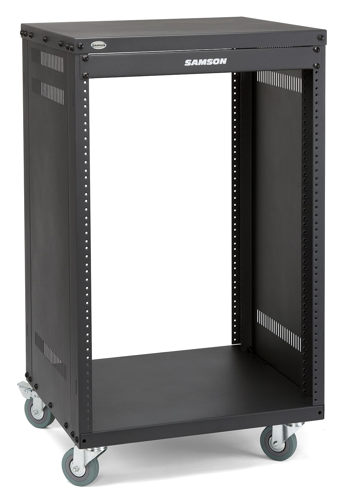
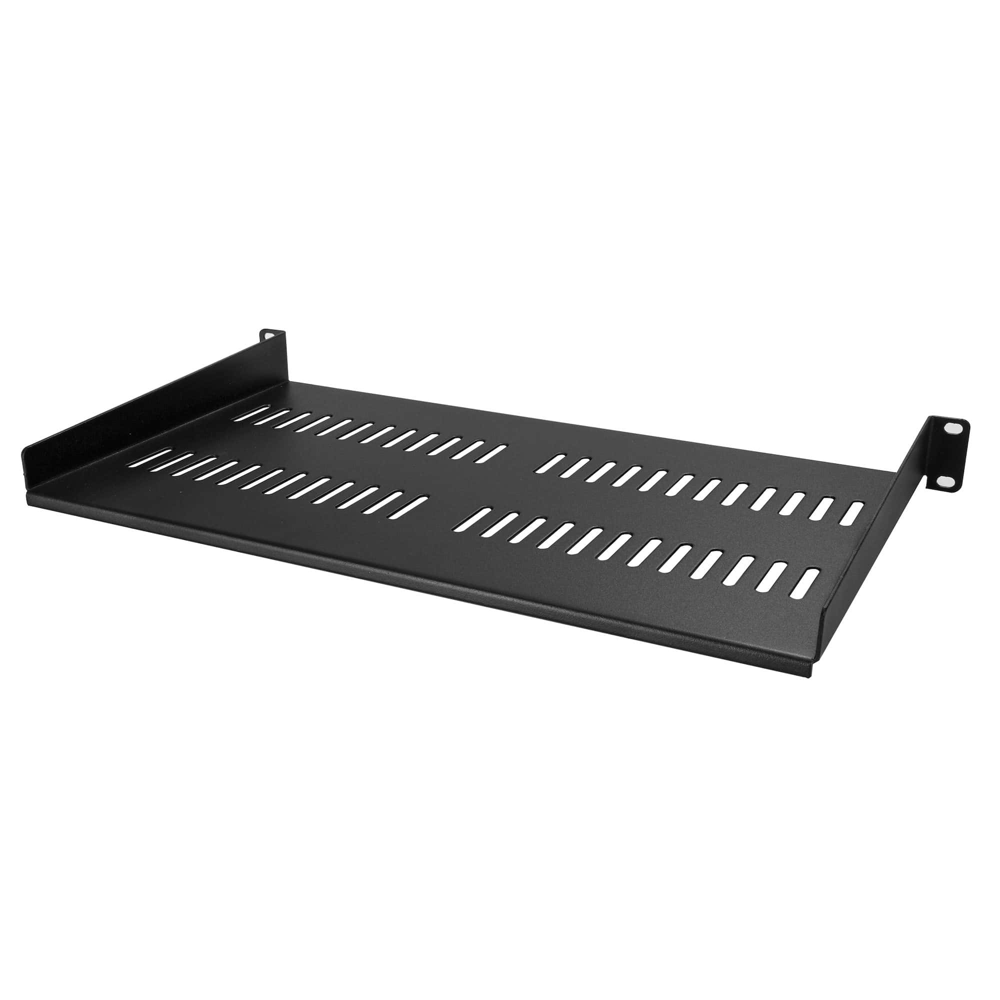
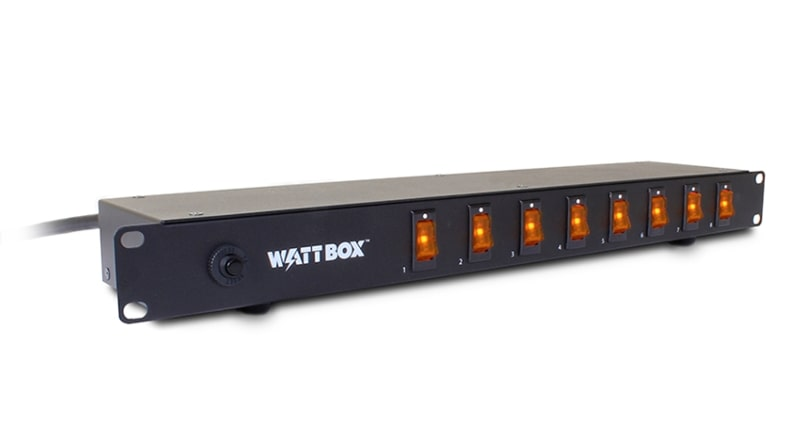
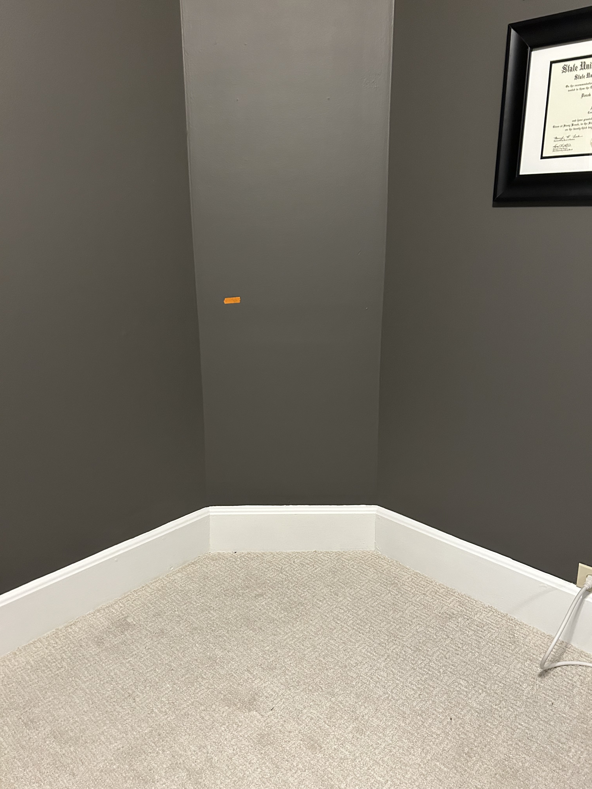

If you didn't know, [I used to speedrun *Banjo-Tooie* on Nintendo 64](https://www.youtube.com/playlist?list=PLlL2rIIeW_RXCcrdz-y8bmKXfvGPO9iU9). I don't anymore, but I still regularly tune in to friends' speedrunning streams on Twitch, because I enjoy watching them and hanging out with those friends I made in the speedrunning community.

But, more than speedrunning, I just love *Banjo-Tooie*. And more than that, I just love old video games. Mostly the ones that I played growing up (*Banjo-Tooie* is one example), but really, even if I play an older game for the first time during my adult life (i.e. one that I missed out on when I was younger), I find myself enjoying it significantly more than newer games. Lately, I find it very hard to get into *new* games. I miss the simplicity of older games — not necessarily the simplicity of the games, but of the technology and the ritual around playing them.

Older consoles (like NES, SNES, and N64 for example) are so much more elegant than their modern-day counterparts. When I was a kid, if I wanted to play a game, there wasn't much thinking — I'd walk over to the TV, turn it on, and hit the console's power button, and I'd be playing the game within 30 seconds. Nowadays, you have additional variables to consider before you get to the point where you're playing a game: wireless controller pairing, making sure you're on the right TV input for one of your various devices, navigating a *menu* after you boot up your console, and sometimes, *connecting to the internet*. It's too much these days. Even if I'm able to play a modern game nowadays, something makes it feel different (at least when I'm on my PC), and I think it has to do with the *internet* lurking in the background. It's always there, even if you're not using it — you could get a friend's message, some kind of update notification, or even be compelled to Alt-Tab into your browser to *look something up* (which by the way, if it's because you're stuck in a game, is cheating).

Maybe it's just me, to be honest, but I get overwhelmed from all this. I miss the days where I was able to just sit down and play a game, and most importantly, easily get lost in it. The distractions of today are too powerful, and sometimes I need to make a concentrated effort to mitigate them. That's where the topic of today's blog post comes in: my plans for my soon-to-be retro gaming setup (with a few modern twists — good modern twists!).

I guess I should give this project a codename... OK, 'Project Sanctuary'. I'm not telling you why I chose that, and I bet you can't figure it out either. And don't laugh at it.

# Consoles and games

My plan, right now, is to put these consoles in the setup:

- Nintendo (NES)
- Super Nintendo*
- Nintendo 64
- GameCube (and GameBoy Player for GameBoy games)
- Wii
- PlayStation 2 (maybe PSOne* as well)
- maybe Sega Genesis*

The consoles which I put an asterisk after are ones that I've never owned (and currently don't own). They also have a lot of games I've never played! With Super Nintendo, for example, I have played a lot of its well-known and well-regarded games. And a lot of my favorites are on there. I just never got one as a kid. We had a NES, and then skipped right to N64. But Genesis? I know next to nothing about, tbh. It has a blue hedgehog, I can tell you that.

So, the point is, I want to have the ability to play a lot of my favorites, but I'm also excited about playing some classics I've missed out on.

When it comes to games, I do enjoy owning physical copies, especially of games I love. (And no, this doesn't conflict with my being a minimalist or anything I said in [that blog post](https://derekandersen.net/blog/minimalism)!)

And there are some games I'm missing from my collection that I need to get a hold of. But, if I wanted to own every single game I like, or worse, every single game I wanted to play... well, yeah, I think you get where this is going: they can be expensive.

# EverDrives? Unofficial hardware?

If you don't know what an EverDrive is, it's a special flash cartridge made for a particular console that uses an SD card internally to store game ROMs on, which can then be played by the console natively, as if you were using a real cartridge. Is it legal? I don't know, tbh. Anyway, I currently own EverDrives for N64 and GBA. Again, EverDrives are supposed to save money, but if I wanted an EverDrive for every single console, I'd be spending a lot of money.

So, to start, I'm just not going to do that. I'm going to utilize a mix of playing my actual cartridges, using my EverDrives when possible, and (spoiler) *maybe even using some unofficial console replacements* (i.e. small computers running emulator software, like [RetroArch](https://www.retroarch.com/) or something). But I can't say too much about all this, because I'm actually not sure what exactly I'll do yet. I'll have to update you in a future post. But what I do know is, if I were to use an emulator PC as part of this setup, it would *only* be for those 8- and 16-bit game consoles which emulate basically flawlessly. Fake hardware obviously isn't the point of this setup, so I'd have to be very intentional when implementing some emulator-based solution like that.

# The original plan and its evolution

My original idea for this project was centered around the setup being contained in a "cart" of some sort. It might have had wheels, or something, and it would have used a computer monitor for the display rather than a TV (because the idea was that I'd sit closer to it). And the wheels would let me... roll it around? (More realistically, it would allow me to move the whole setup to another room if I wanted to.)

The cart idea has since been scrapped. I settled on a more traditional TV stand-type piece of furniture that would stay in one place. This has the added benefit of being generally wider and able to accomodate more consoles/gadgets down the line.

After some deliberation, I decided that I would mount the TV on the wall above the TV stand. I was going to just place it on top using its included stand, but this way I can use the top of the stand for other things, like speakers, and my Nintendo Switch dock for example.

Then came the whole internal struggle and decision-making process surrounding *which particular TV I should buy*. There are way too many variables to consider. I quickly became overwhelmed when I started looking into models, display types, resolutions, refresh rates, special features, sizes, and most importantly, prices. 

Well, I was leaning toward going with a budget option recommended by [rtings.com](https://www.rtings.com) (a trustworthy and meticulous display review website) with a 7.6/10 in the video game metric. Specifically, I was interested in low input lag and response time. But then, I changed my mind about my "mount a relatively large (for the room) TV on the wall" idea. So, for now, I'm skipping the TV purchase. TVs are pretty affordable nowadays, but do you have any idea how expensive they can get if you want them to check all your boxes? Ideally, I wanted an OLED display, and I wanted a 120 Hz refresh rate. Well, that wasn't happening after I saw the prices.

So, guess what? In an unexpected plot twist, the cart idea is back! I had you fooled, didn't I?

For the time being, the TV role for this cart is going to be filled by an old 1080p ASUS monitor of mine (a really good one, for the that time I bought it, which was in like 2014). It is small, but it has 1ms of advertised input lag, so it should feel like a real CRT in that regard. See, I'm using a computer monitor after all — fooled you again.

But I do plan to upgrade this to a small (32") OLED TV down the line. They're just so expensive, so it's not a priority for this project right now.

# The return of the cart

Now that I've fooled you twice over, I'll get back on track with my explanation of the actual plan for the project (which *is* in fact that I am going with the aforementioned cart idea, although there are some technicalities, and it's not *really* a cart, but it *will* have wheels).

I will cut to the chase: I decided to use a **server rack** as the skeleton for this project. I went through a few iterations of this general idea, such as: wire shelving units, metal AV carts, and other similar AV-focused shelf/cabinet things. A server rack started to make a lot of sense to me, for reasons I will soon explain. Also, throughout my extensive research, I haven't seen anybody else use one for this purpose. So, that's pretty cool, being that I'm a hipster.

If you're familiar with server racks, you'll know that they are meant to accomodate heavy slide-in networking or audio equipment, which are secured via screws from the front. As as example, here's a photo of the actual rack I'll be using:

The holes down each side are where the network or audio equipment would get secured. But, in my case, since it's a retro game rack, I won't be mounting traditional equipment in it; I'll be using it to house my consoles and other relevant AV equipment. "But, Derek, how will you do that? Retro game consoles aren't meant for server racks!", you might say.

Thankfully, I considered that, and I've come up with an ingenious solution to the problem: shelves.

Yeah. They make shelves for these things. Like this:

See?

So, this rack idea is pretty cool, for a few reasons:

- it's sturdy (these are meant to support hundreds of pounds)
- it's modular (I can add shelves one-by-one, move them around, etc.)
- it's narrow (it will fit well in the corner of my room that I've designated for this project)
- it's good for airflow, so the consoles can breathe during operation
- it's easily movable and serviceable (because of the wheels and the open design — I can spin it around and access cables when I need to)

And there's another aspect to its utility that I haven't mentioned yet. Several things that I need (or might need in the future) are made in rack-mount form. Specifically, one thing I plan to buy is some kind of power distribution unit that will occupy one space in the rack. A lot of manufacturers make these for racks. I also had the idea to use one that has individual per-outlet switches on the front (so that each thing plugged into it — the consoles — can be turned on and off separately).

Something like this:

Isn't that cool? I'm excited. The utility for this kind of thing comes from the fact that it can save power (cutting power to a console when it's not in use) and maybe even prolong the life of the power supplies in each console.

Similarly, I plan to use a composite video switching device somewhere in this rack. A few (but not all) of the consoles I plan to use will use composite video. At this stage, I'm not really interested in modding consoles to enhance their display output. So NES, SNES, and maybe another older console will use composite, at least for a while. Keeping them both connected 24/7 will mean I need to use a switcher, so I can press a button to switch which one is connected to the display, rather than physically unplug one and plug in another.

# Using a modern display, and some words on resolution

That brings me to a point I've not yet addressed, which is rather important to this setup. To enable the use of a modern display (i.e. a flat panel display rather than a CRT), I will be using a line doubler (upscaler) called a RetroTINK. The RetroTINK 2X Pro, to be specific. Essentially, it doubles the lines in the signal from a 240p-outputting console (which is most of these old ones) into 480p, which is the minimum that most modern displays still recognize and support. The problem is that if you were to supply 240p to a modern display directly (if the display had the necessary inputs), it would use its internal upscaler to do the conversion. The reason this is a problem is because, well, it does this job poorly; modern display just aren't designed with these old resolutions in mind. So, the chips that do the processing of the 240p signal don't do as good a job as the RetroTINK does.

How, specifically, the RetroTINK handles the processing is not something I'm equipped to explain. But Mike Chi (the creator of RetroTINK) seems to know what he's doing; if you're interested in the technology, there's plenty of information online from enthusiasts of this kind of signal processing (and retro games in general).

The result is what matters to me, and to be clear, that result is a 480p output supplied over a digital format (HDMI-like) in virtually no time (latency-free, like a CRT).

And, yes, there are better versions of the RetroTINK — ones which can handle other types of inputs and can even 5X the input resolution to 1200p, for more clarity. But they are expensive! The 2X Pro is $140 as it is; since it won't be used for many consoles, and it's the bare minimum required to get a "modern" signal, it's what I will go with for now. But in the future, I would like to upgrade.

The 2X Pro can handle composite, S-Video, and component video inputs. So, for me, that's NES, SNES, (maybe Genesis), and N64. At least. And actually, the RetroTINK is *not* the solution I will be using to modernize the output of each of the consoles I mentioned in the outset. GameCube, for instance, is able to output a digital signal natively, and there are some relatively affordable solutions to convert that straight to HDMI. But, I'll talk more about these kinds of specifics when I actually add more consoles, in a future blog post.

# Where's it gonna go?

I suppose I should show you the planned site for this rack. I have this cool corner wall in my office room, and like I mentioned earlier, the rack dimensions will actually allow it to fit on this wall. (The monitor will sit on top of the rack.)

I like that it'll be in the corner. It's cozy. And that piece of orange tape is a marker for the height that the rack will be at.

# Next steps

I've already gotten started on parts procurement for this project. Here are the things I need (some of which I've already purchased) for v1 of Project Sanctuary (stop laughing).

- RetroTINK 2X Pro (purchased)
- equipment rack (purchased)
- shelves, maybe 2 to start
- high quality shielded N64 S-Video cable (purchased)
- power distribution unit w/ individual switches
- speakers

I'm going to look around at local thrift stores soon for some nice vintage/retro speakers. I see old audio equipment at thrift stores often.

Here are some future things I want to add to the setup, with no real concrete timeline:

- a nice CRT or PVM (as a secondary, optional display, maybe closer to the floor for sitting-on-the-floor gaming)
- a separate shelf unit to hold my physical games
- a Super Nintendo
- a Sega Genesis
- a nice OLED TV as the main display

# Summing up

To bring this blog post to a close, I will reiterate the *point* of this project. It's to enjoy games and kinda space out. I need that in my life lately. I get stressed too easily. And there are bunch of older games I want to re-play and some I want to play for the first time.

I also don't really have a place I can go to where I can just relax, that isn't a communal room. Yes, I have this office from which I'm currently writing this at my PC, but like I mentioned in the outset, I kinda get overwhelmed with *the internet* sometimes. I would like somewhere to sit and play games without being *connected*.

Now, that being said... I will let you in on a secret: I might stream on Twitch again at some point in the future. Whether it will be speedrunning, I'm not sure. It might just be casual gaming and hanging out. But for that reason, I am planning on integrating streaming "capabilities" into the rack. (Really, that just means my powered composite/S-Video splitter will be somewhere on it, and it will be relatively easy to capture a game feed on my PC, which will be nearby. And a facecam.)

More to come on Project Sanctuary (please stop) in the near future.