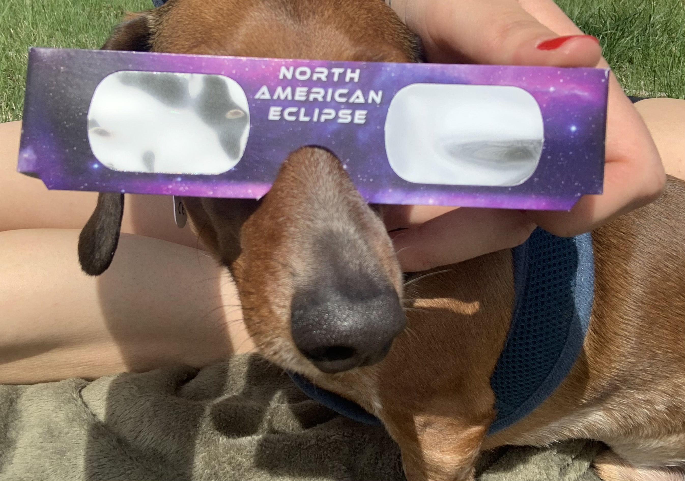

Today was the April 2024 total solar eclipse. A solar eclipse is when the moon passes between the sun and the Earth. This one was a total solar eclipse, meaning the entirety of the sun's intense light was obscured by the moon.

So why am I writing about it? Well, it was pretty cool. While total solar eclipses occur about every two years, they only recur in the same place once every 360 to 410 years. And to get the full experience, you'd need to be in the "path of totality" — the area from which you can observe the full eclipsing of the sun.

And we were in the path of totality for this one, here in Indiana.

 During the time leading up to totality, you can view the partial eclipse through special glasses (otherwise you'd burn your retinas, or something). But once totality occurs, you can look at it without glasses. Everything outside gets dark, kind of like dusk or twilight, but in a slightly different way that I'm not sure how to explain. But the sky remains blueish. And then in the sky you can see the eclipse. It was really cool to see.

It was a fun experience. My wife and dog and I were outside for the time leading up to totality, and then during totality we watched everything get dark, and then we saw the eclipse. Cool, right? The neighbors were outside watching it, too, and even a co-worker I have in Canada stopped to go outside and watch it. I thought it was interesting how it kinda felt like the world stopped for a few minutes.

I'm glad we happen to live in the path of totality, because otherwise, I'd never know what I was missing. And it was definitely a worthwhile experience, hence my same-day writing about it.

That's one for the books.