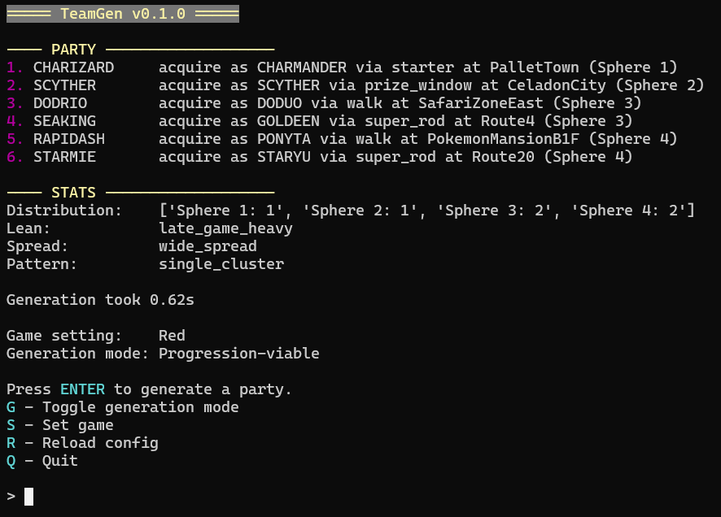

After roughly two months of work, I have released the initial version (v0.1.0) of the Pokémon team generator project I've been working on. When I wrote my [first post about it](/blog/pokemon-team-generator), I hadn't yet decided on a name — but as you can see, I went with [_TeamGen_](https://github.com/Dechrissen/teamgen) by popular demand (like two people I know independently said they liked that one).

If you're missing context about the tool, here's a reminder, taken from the first post:

> The goal is to have the tool generate a party for you (specific to the game you're playing), and then for you to attempt completing the game with that prescribed party. Of course, you won't be able to acquire the entire party at the start of the game — you'll have to play as normal, catching each subsequent party member along the way. The goal for the player is to _only_ use those 6 Pokémon in his or her playthrough, and to use that final assembled party in defeating the Pokémon League. The team generator can be seen as a tool for adding an extra challenge.

Two months is a bit long when I think about it, but then I remember that the bulk of the time was spent in the beginning, using max brain power and struggling to figure out the best way to structure the game data and encode game progression. So maybe two months is pretty reasonable.

# Features

Happy to announce that the tool can successfully generate the names of six Pokémon. _crickets_

...and some other stuff!

In the `PARTY` section at the top, each party member is listed along with its acquisition data (this can be toggled off).

In the `STATS` section below it, there is an analyis of the location data of the entire party:

- **Distribution**: How many Pokémon appear in each Sphere (the broad chunks of game progression)
- **Lean**: A semantic tag encoding the general trend in the distribution
- **Spread**: A semantic tag encoding how far apart all six members are
- **Pattern**: A semantic tag encoding some pattern that the distribution follows, if there is one

As of now, vanilla Red and Blue Versions are fully supported, along with my romhack, [Solus RGB](/solus). I will soon add support for Yellow Version, followed by Gen 2 (assuming the planning and implementation go well).

The tool also supports a fair amount of configuration options for fine-tuning the output. If you download the tool, the default settings in the config file are what I consider the "recommended settings" (parties generated from these settings should fit most people's criteria for a general challenge run). But for some more restricted generation, the config options are helpful. For example:

- Ensure the team is "balanced" (acquisition-wise) across the game's progression
- Ensure a random starter Pokémon is included
- Require a certain degree of HM coverage
- Disallow legendary Pokémon from being included
- Set an upper/lower limit on each member's base stat total
- Force a particular type for all members
- Disallow particular acquisition methods (Good Rod, in-game trade, etc.)
- And more!

The tool is currently only available in a CLI UI version. You have the option to [install via command line](https://github.com/Dechrissen/teamgen?tab=readme-ov-file#installation) (prereqs: Python and `pip`) or if you're on Windows, [download the prebuilt executable](https://github.com/Dechrissen/teamgen/releases/latest) and run it, which will open a dedicated terminal window.

# Challenge runs

The most basic usage of _TeamGen_ is generating a team, and imposing that team on yourself as a restriction in-game (i.e. trying to beat the game with _only_ that team).

Something else _TeamGen_ can be used for is multiplayer challenges races — generate a team with a friend or a group of friends, and race to be the fastest among all players to beat the game with that team. This can be done synchronously, but also async (in the async case, just compare in-game time at the end).

I think a fun way to do these multiplayer races would be to devise a _very restrictive_ set of config options before generating the team. For instance:

- Exclude starter
- Disallow duplicate species
- Ensure all members share a single type
- Set an upper limit on BST (base stat total)

This might make for a very unreasonable team that will be difficult to finish the game with — fun!

# Future additions

I have a lot of plans for this project, both in the short term and in the long term.

My priority is to get Gen 2 support added as soon as possible, and after that, Gen 3 support (but not as urgently).

And ultimately, I'd like for this tool to have a GUI option to be run locally, as an alternative to the CLI UI (but I want the CLI UI to always be supported). There's also potential for a web app route, so it can be hosted online and more easily accessible to those who don't want to download or install.

# Wrapping up

If you'd like to try the tool, you can get it [here](https://github.com/Dechrissen/teamgen). I would love to hear what you think about it in the [Solus Discord](https://discord.gg/YTxu5uM7r6).

And if you like it, I would really appreciate a star on the GitHub repository. [Donations](/support) to support _TeamGen_ also appreciated!

Until next time.