I'm keeping my promise and writing this entry about my alarm system project (I started writing this post just two days after that promise!). It might be a long one, considering the amount of steps I foresee having to complete before it's finished and working. But I'm doin' it!

But before we get there, I also promised I'd talk a bit more about the system I went with, and the reasons why.

# The system I went with

As you might have seen in the description, I chose the DSC PowerSeries PC1616. This is an old system; I'm reasonably sure it released in 2011 (this is the only date I can find that seems right, and it's in the user manual).

Now, you might ask: "Why would you want such an old system? Hasn't alarm system technology advanced since then? What are you, a Luddite?"

Well, it turns out that this technology has a lot of good engineering behind it. That engineering and design has resulted in a technology that is elegantly simple. DSC and Honeywell are the two big contenders in home security system manufacture, and it turns out that in the age of cloud-managed hardware and software, security system manufacturers have jumped on that bandwagon too. Everything is locked behind a paywall nowadays. Using a well-thought-out system like the PC1616 is a nice escape from that kind of grifting that technology companies have taken to. It gives you back some control. It's also a nice route to go for the DIY approach.

So being that it's relatively old, and it's also not something you can easily get through a manufacturer since they're typically made for wholesaling to security companies like ADT, I bought mine used on eBay. I paid about $200 (the seller included some extra sensors I might not use, in which case I can sell to make back some money).

# The order of things

Here's what I need to do to get to the point where the system is installed and working.

1. Test the system to make sure it works
2. Mount plywood somewhere in my basement, and mount the main system panel on it
3. Install a new electrical outlet in the area where the main panel will go (since I don't have one close enough)
4. Drill a hole in the wall where the keypad will go, and fish 4-conductor alarm wire down into the basement from the hole
5. Mount the keypad on the wall
6. Install sensors (in my case, two wireless door sensors for the front and back doors)
7. Figure out where to install the siren, and run wire for that
8. Connect all the necessary wiring and power it up

# The (out of order) installation process

So, #1: I tested the system, and it works. At first, I wasn't able to reset the "master code," which is the code usually given to the homeowner. I attempted to reset the system using the "installer code", which by default is 5555 -- but it wasn't. I thought I was in a bad spot, since these systems can actually be programmed to disallow the factory reset procedure (which is a good thing, but can be problematic for someone buying secondhand). Luckily, factory reset was not disabled, so I was able to perform the reset. It involed jumping 2 of the connection points on the main board and power cycling the system a few times. Violà! It's now reset, and I have the ability to set my own installer code. :) I am the installer, after all.

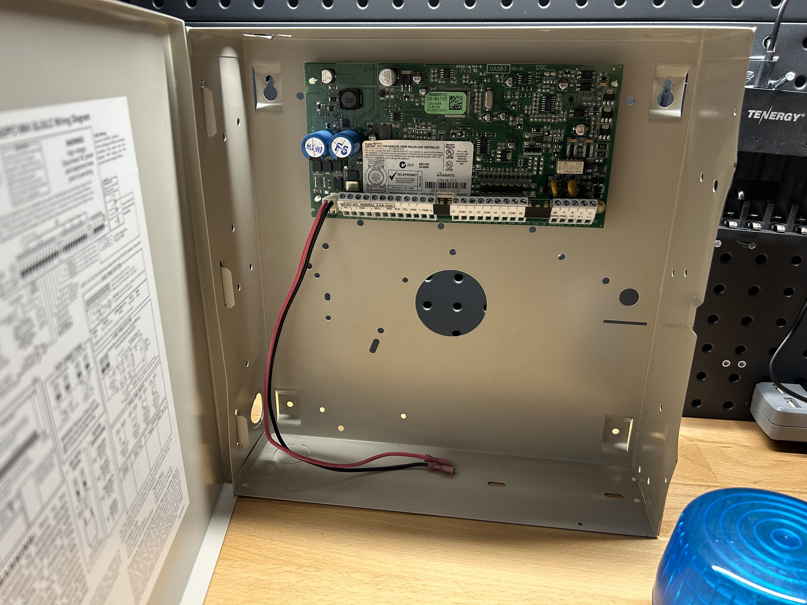
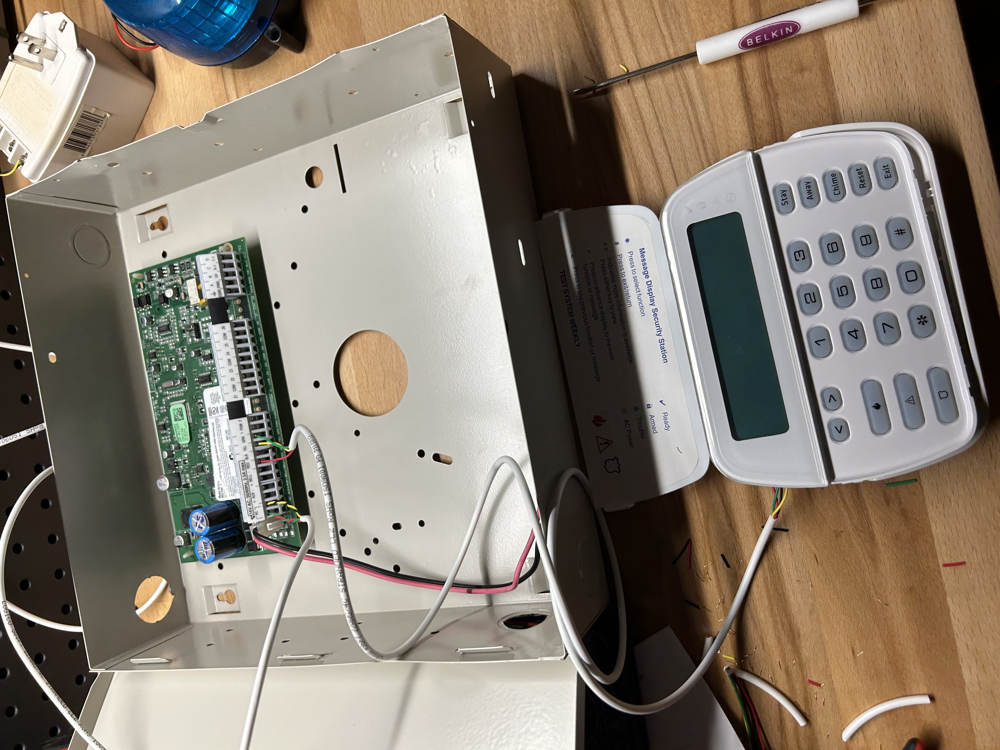

Next, I skipped to #4: fishing the 4-conductor wire down into the basement from the front entryway (where the main keypad will be). I anticipated that this would be a frustrating task, and it kinda was. I started by drilling the hole in the wall where the keypad will be, between two studs. That part went fine, and in fact I was relieved to learn that the wall was in fact hollow (there were no surprises, such as a bunch of vertical studs down the wall which would have gotten in the way).

I tied a little metal nut to the end of a string, anchored it to a coat hook nearby, and threw it in the hole. I decided to choose a spot above a pre-existing outlet, mostly because it was directly above a perfectly convenient spot to drill up through from the basement. But as a bonus, I could remove the outlet faceplate to see where the string was hanging down in the space between the outlet box. (If you do something like this, just make sure that the outlet's breaker is off. Also, I am not an electrician, and this is not advice. Proceed at your own risk. And all that.)

Like I said, it was a little frustrating to get the nut to fall into the hole I drilled in the basement, and subsequently to pull the alarm wire through after I had my pull-string. But it wasn't all bad news, because I eventually got it through, after a lot of cursing.

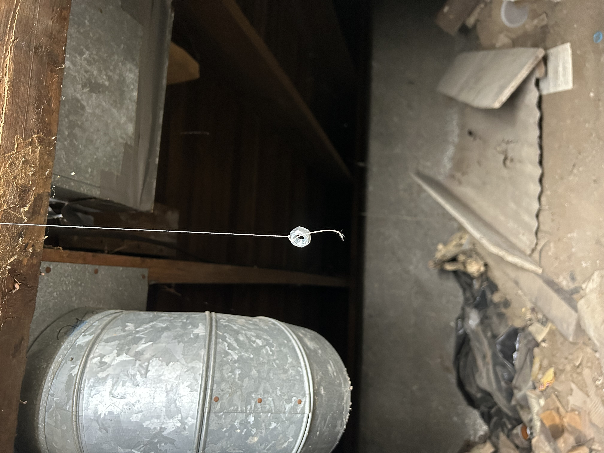
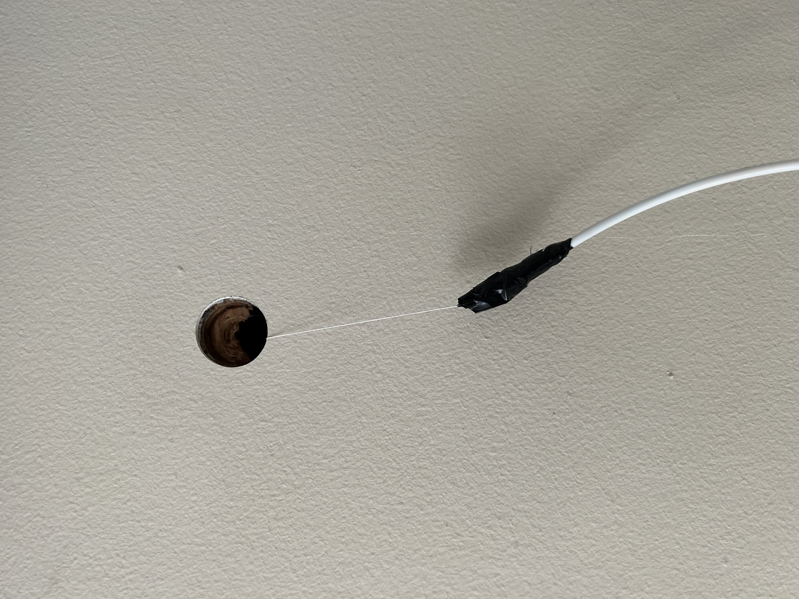

Then I just had to run the wire along the basement ceiling, over to the location where the panel will be installed (using some datacom/low voltage wire staples).

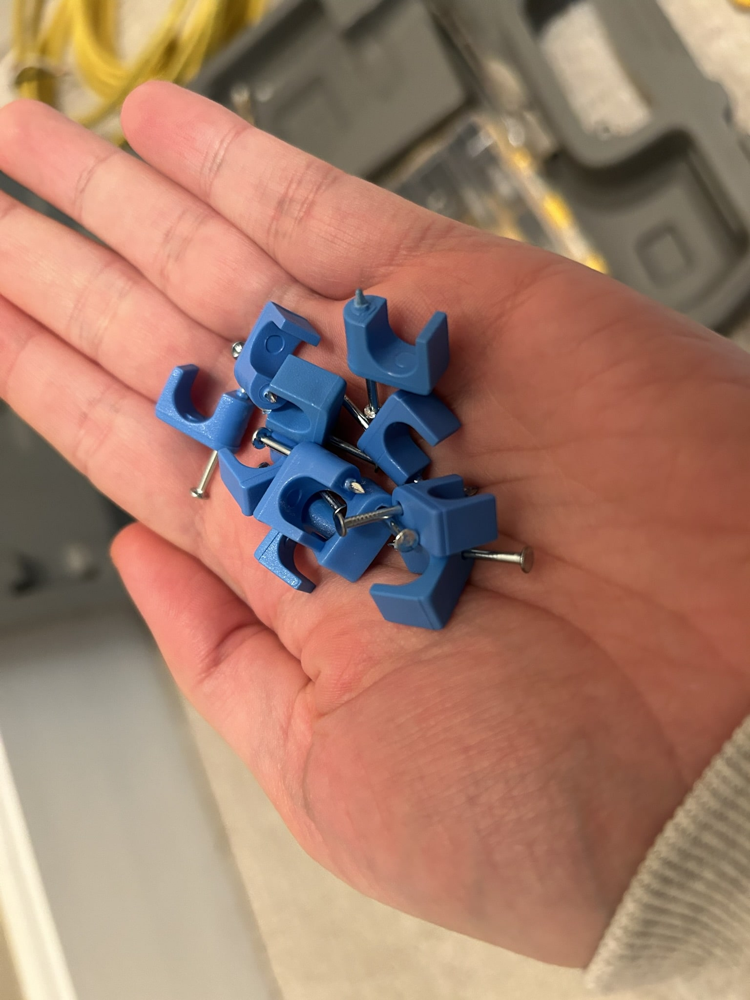
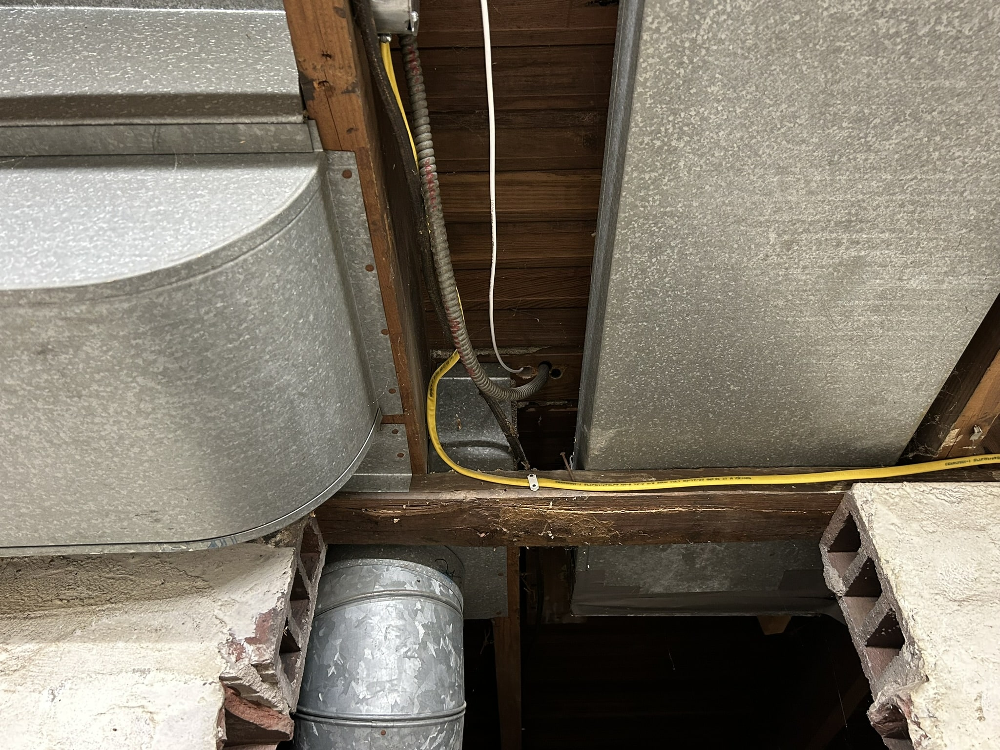

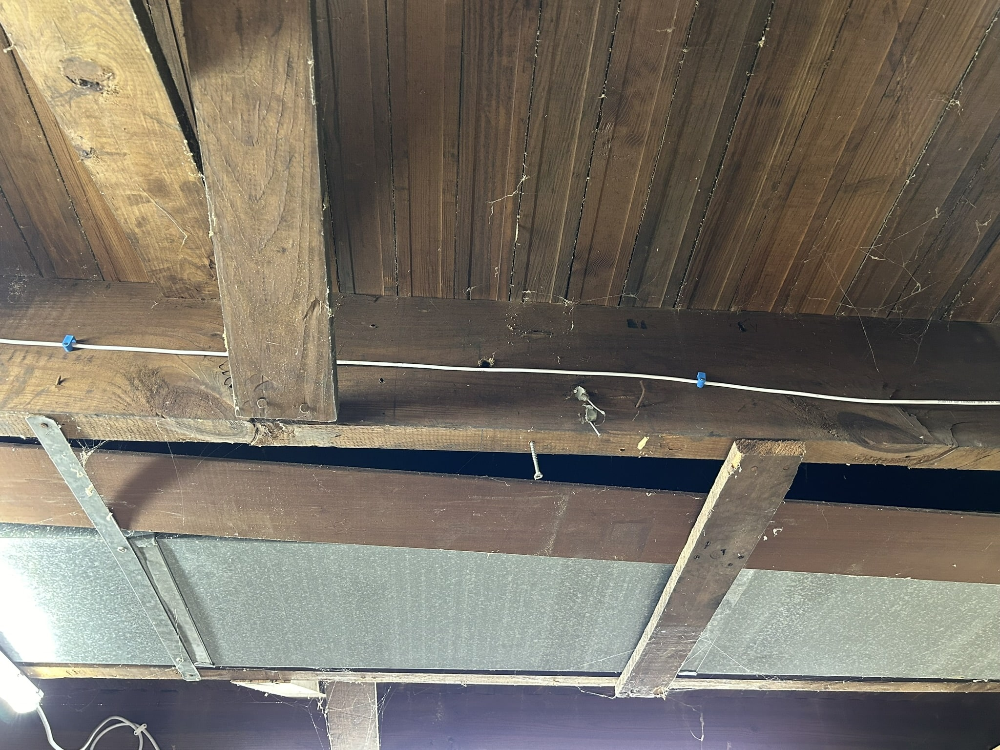

After this, I moved to #3: installing a new outlet in the basement. I decided to put it on a new circuit, since I might add other outlets down there in the future. So I bought some things at the hardware store.

- 20-amp breaker ($7)
- 12/2 Romex wire with ground ($40, but used half the wire)
- 20-amp GFCI outlet (black, $17)
- new work box and faceplate (grey, $1.50)

The black and grey look pretty nice together.

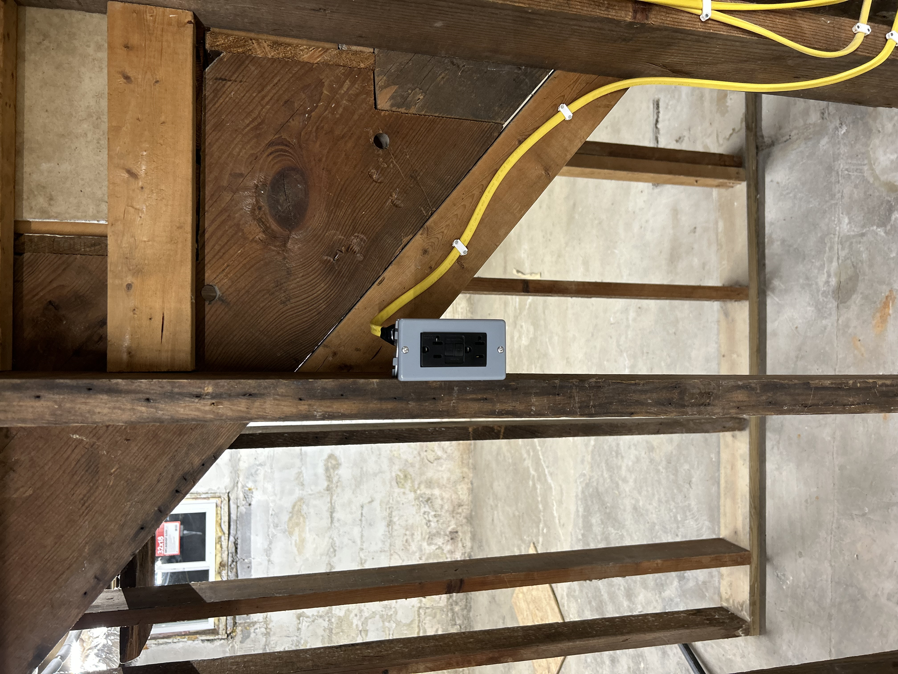

Since this outlet is a GFCI, I can add more in the circuit from this one in the future. If the first outlet in the circuit is a GFCI, then all of the outlets downstream from that one will also be ground fault protected.

The outlet install went well. This was my first time actually doing some meaningful work in my electrical panel after watching electricians and tutorials for a while. It's nice to know I can do this if I ever need to add something. (And I won't need to pay an electrician; a small job like this would cost around $200, and I did it for less than $50. Also, I'm not an electrician, so don't listen to me.)

So, now that the outlet is installed, I can move on to step #2: wood. The main system panel needs somewhere to live, so I'm going to mount it to a dedicated plywood board. My basement is concrete blocks on the exterior, so I couldn't mount it to one of those walls easily. Instead, I opted to mount a roughly half-inch-thick plywood board to the exposed studs below the basement stairs. This is also where I installed my outlet, as you can tell from the above photos.

I had some leftover plywood from a previous project, so I took a board ouside and measured out a 30-inch mark for the width, so it would fit across a three-stud gap (two gaps, if that makes sense... see photo). Anyway, I fired up the saw and soon had my mounting board. At first, I was going to paint it white, but after sanding it I thought the grain looked kinda nice -- so I kept it plain.

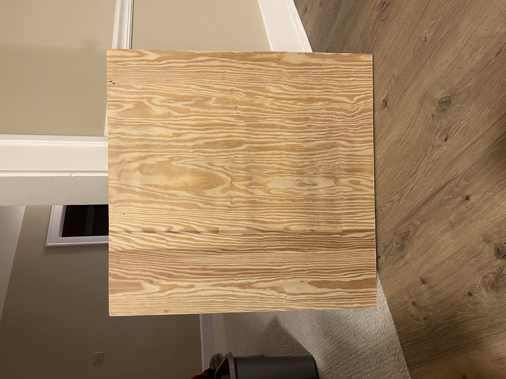

And six construction screws later...

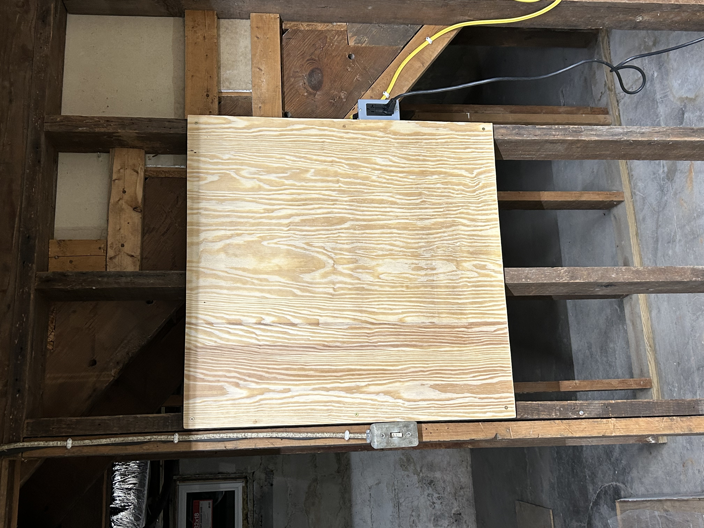

She's hung.

Now, this provides me with some real estate to mount two things: the PC1616 panel, and a surge protector. I figure it's good to provide the circuit board with surge protection, too. With that plus the GFCI outlet, I won't worry too much. Plus, I could use other outlets on the surge protector in a pinch when I'm down there and need to vacuum, or something.

The surge protector I went with is, uh, this one:

Criteria: I wanted one with a metal body, and Tripp Lite is a good brand. It was the cheapest one I could find that satisfied both of those criteria. That's really it. Although, a bonus is that it happens to match the 90s-style tan color of the security system cabinet pretty well.

Next up is #7 on the list: running the wire for the indoor siren, and installing that. I figured out that the location which would allow for the easiest wire run is above the door to the basement. So, the first thing I did was drill the hole for the wire to feed through. Then, I traced the siren's backplate to create a template for the mounting holes, wired it, and mounted it.

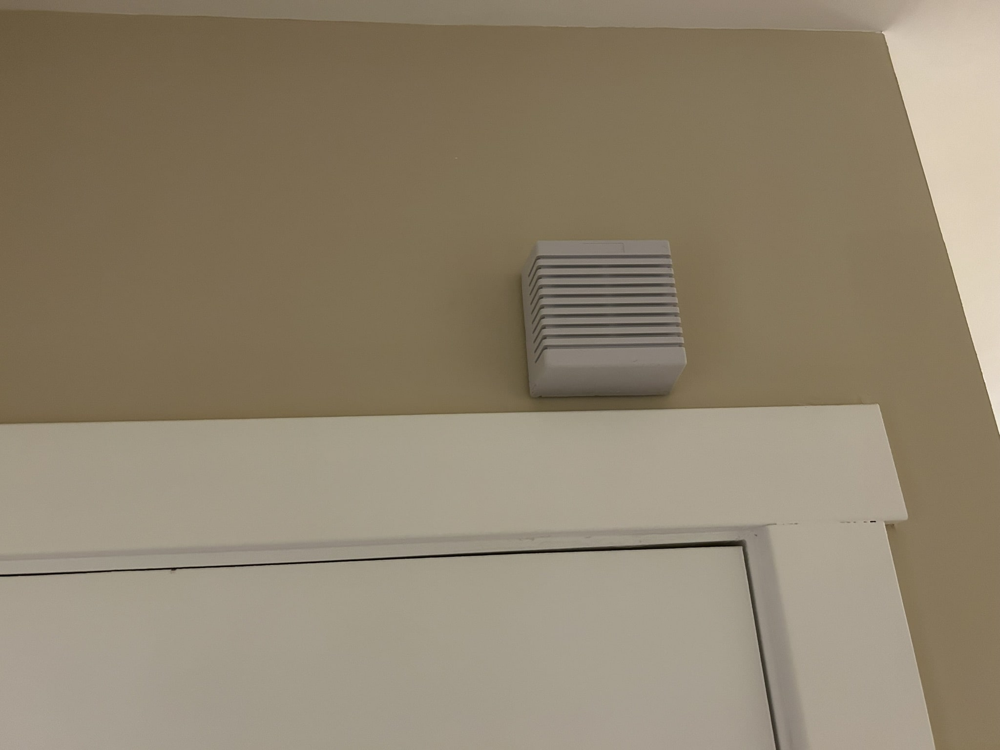

Then, down at the plywood in the basement, I tethered one end of the wire to the wood for temporary anchoring. Then I ran the wire up the basement stairs and through the rear of the siren's backplate hole. (I am omitting some extra drilling and cable-routing I did, because it's not so important, but the end result is a direct wire run from the siren to the panel.)

If you recall, earlier, I had fished the wire down into the basement for the keypad, but I didn't actually wire the keypad and mount it (#5 on the list) until this point. Here are some pictures of that:

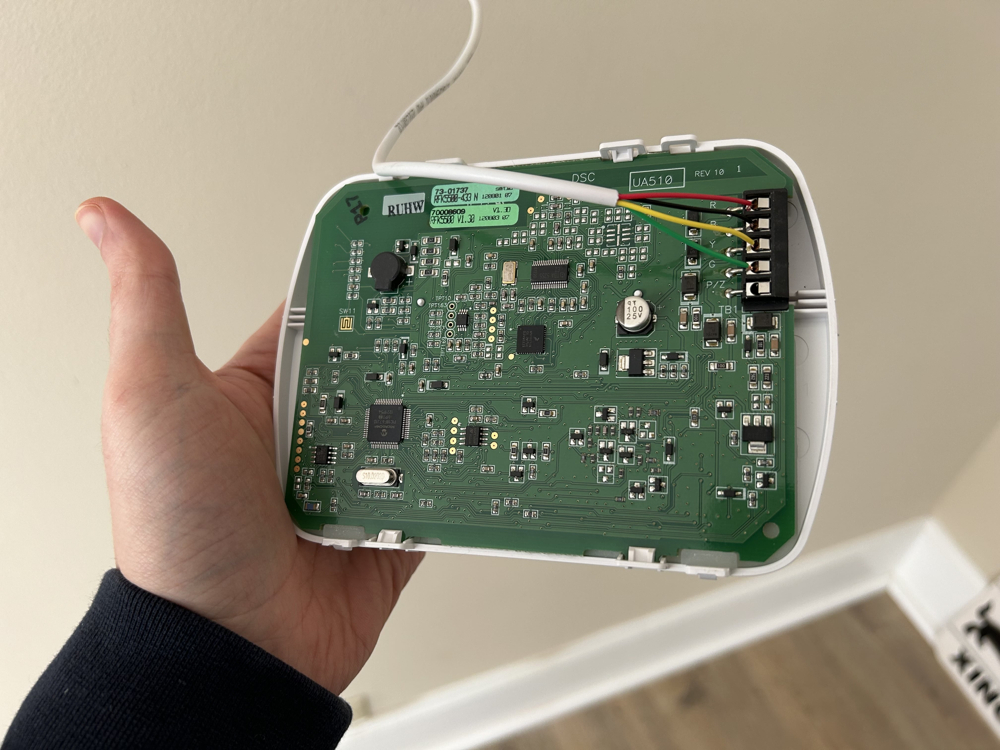

The keypad wiring is simple -- just match each wire color to the labeled screw terminals on the board (R, B, Y, G).

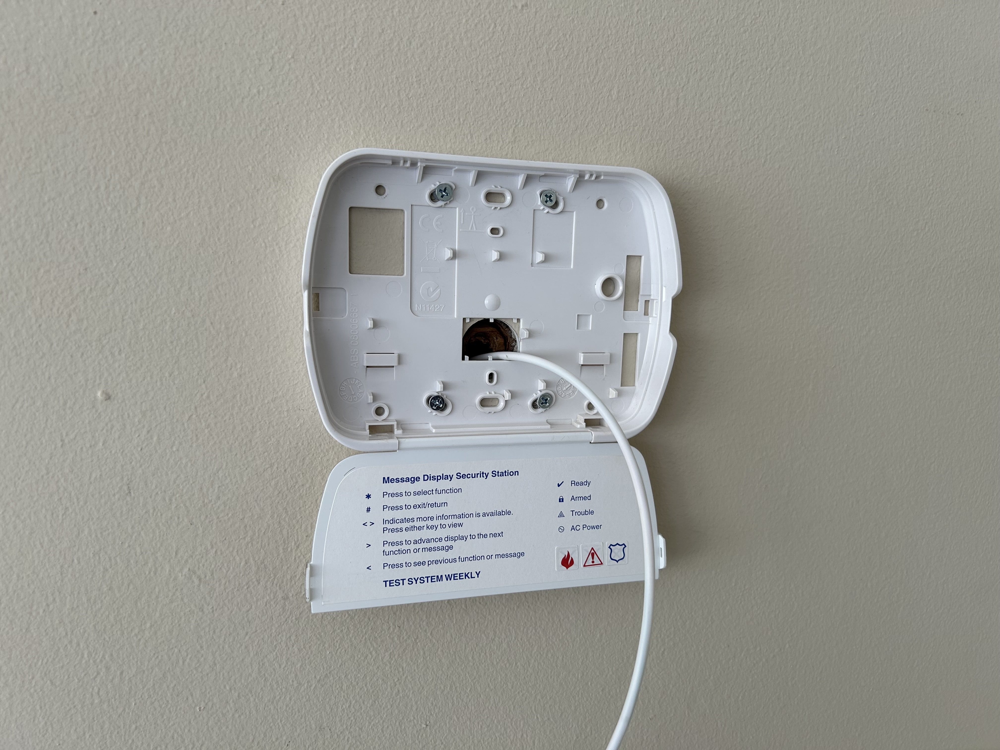
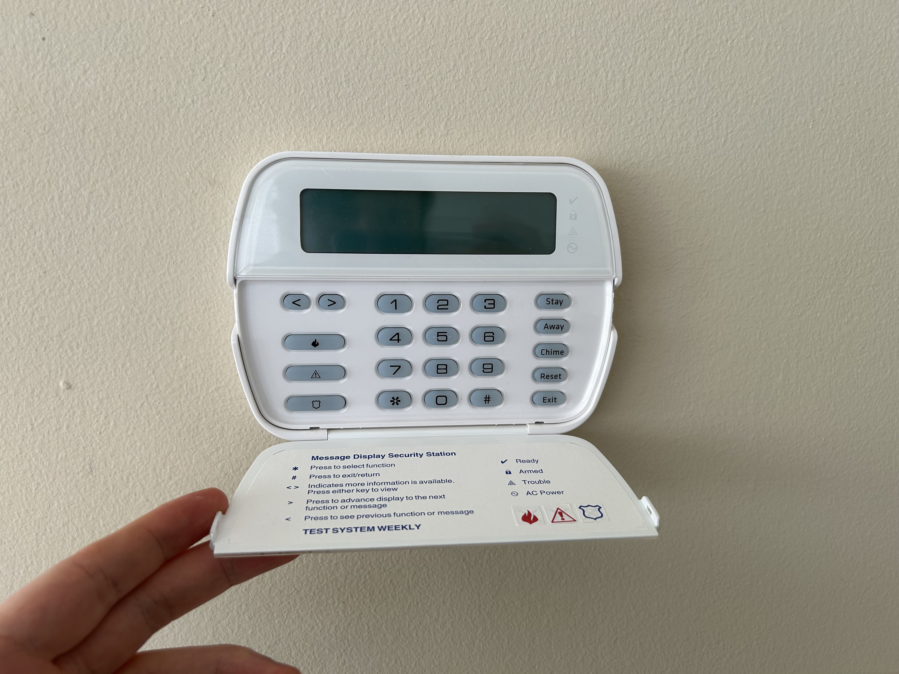

Alright, now we're pretty far along, and the infrastructure is all there. The next step is #6: to actually mount the two door sensors to the doors themselves. I'm using wireless sensors, which is why, as you might have noticed, my task list from above lacks any mention of running wire for the door sensors. This is purely a convenience thing. Hard-wired door sensors, or sensors of any kind for that matter, are much preferred. I might change them out in the future.

Anyway, there is some variance in the height of the door versus the height of the trim around it; I will need to create some kind of mounting platform so the sensor and the magnet can be aligned. I bought some scrap wood at a local hardware store and sawed off some little blocks so that I could mount the magnet half of each door sensor to a wood block, and the wood block to the door. That's probably confusing. Pictures will help to illustrate all this. (I painted the blocks white to match the doors/sensors.)

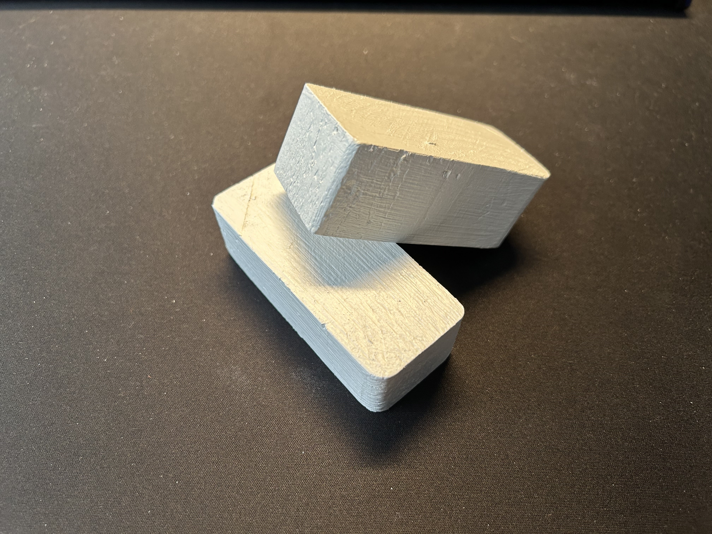

Here's the front door:

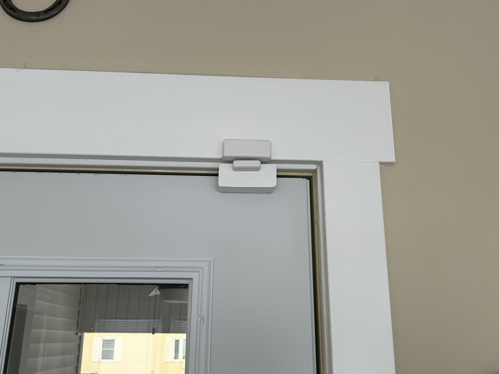

And the back door:

It's not the nicest looking thing in the world, but it works.

On to #8: connecting all the wiring (to the main board) and powering it up. This step also includes actually mounting the cabinet to the plywood from earlier, and doing a bit of cable management. I needed a new battery as well, since the one that the seller included does not reach its peak voltage anymore. In order for the system to be happy (i.e. not throw an error), it needs to see that the connected battery is outputting 12.5V minimum; mine was not reaching that after being connected (and charging) for a full day, so I needed to order a replacement. I recycled the old one at Best Buy.

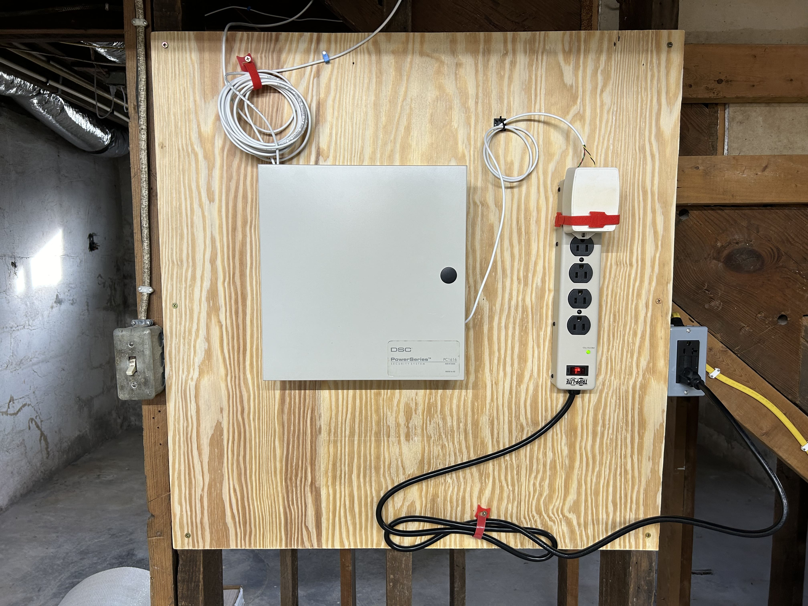

# Total cost

I thought it would be intertesting to total up the cost of all the individual components that made up this project. I have been thinking recently that I want to do this going forward, for other relatively large-scale projects, just for my own information (and yours, too). And it might be nice to have a log of the entirety of the projects I've done, including the associated expense.

I already mentioned the cost for a couple of things for this project, but I will reiterate them here for the final calculation:

- DSC PowerSeries PC1616 bundle ... $215
- electrical outlet materials ... $45
- 22-gauge 4-conductor alarm wire ... $34
- WS4945 wireless door/window sensors (2) ... $59
- replacement 12V 7Ah battery ... $20
- surge protector ... $37
- wood, miscellaneous materials ... $10

**Total: $420**

Yeah, it was moderately expensive. But compare that to the amount of money you'd be paying a company like ADT monthly (something like $40) and it starts to sound a lot more favorable to do it yourself. And like I said, I can still sell some of the unused sensors from eBay to make some of the money back. 

# All done

So, with all that done, the alarm system install is finished! From this point, I do still need to set up the zones so that the two sensors trigger the siren while the system is armed. And I'm sure there will be a bit of fine-tuning over the next couple days, including setting my desired master code, setting additional user codes, renaming the zones in the system, and possibly configuring the two key fob controllers that the eBay seller included. But, I will end this blog post here, since it's already been quite long. I hope it's been enjoyable and/or educational. In the future, I have plans to integrate this system into HomeAssistant (which I have yet to set up). That will enable a *lot* of cool additional functionality. Stay tuned.
