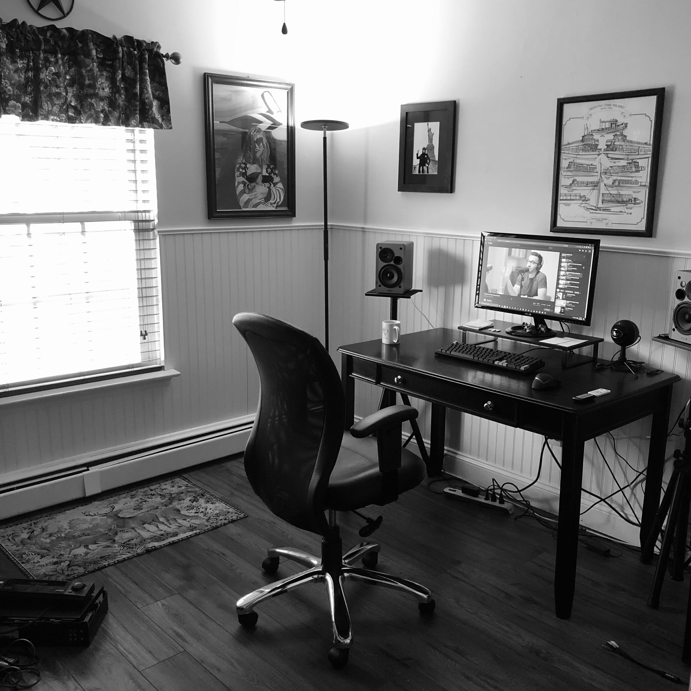
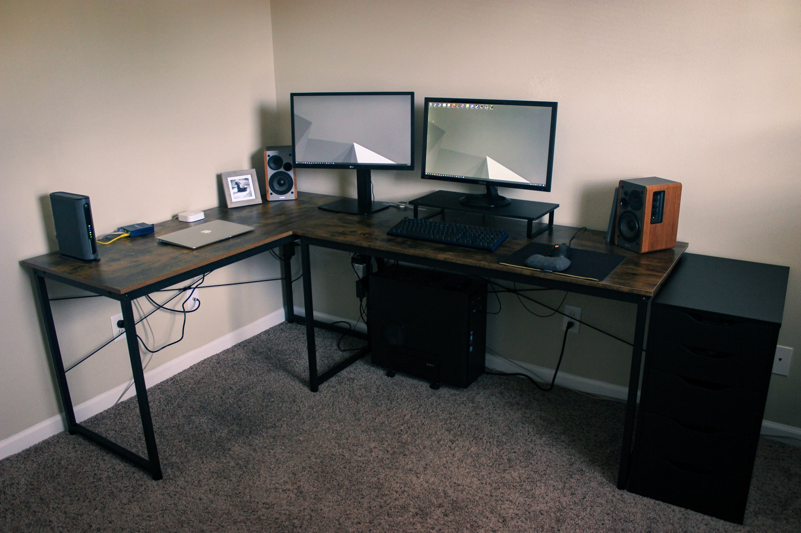
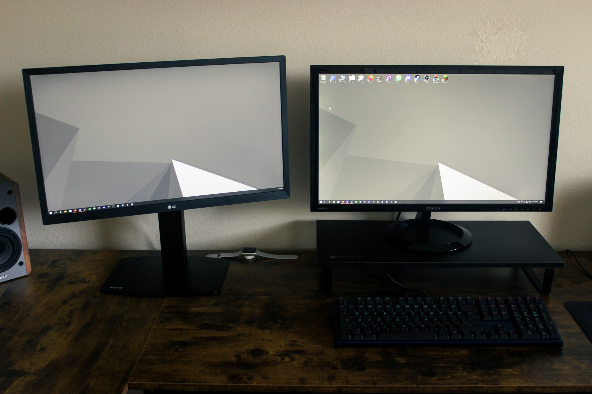
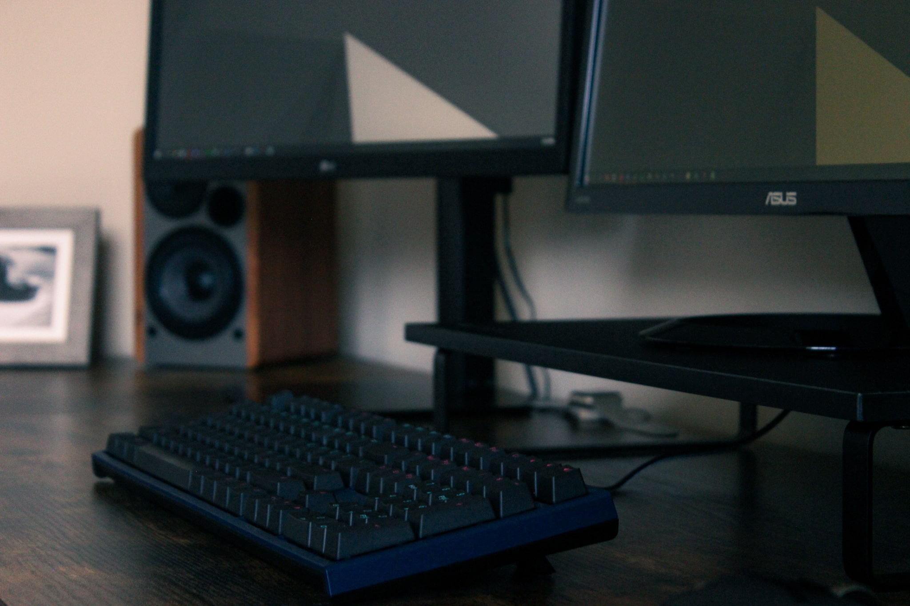
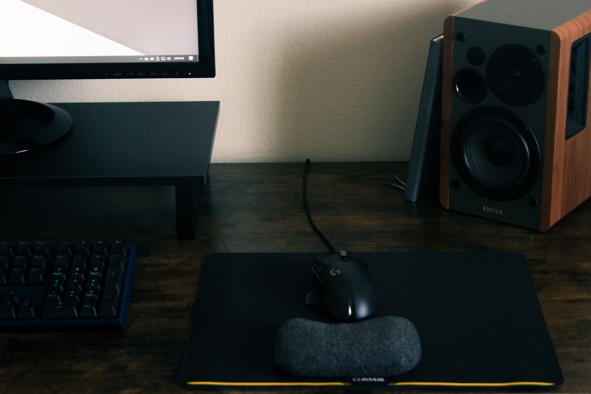
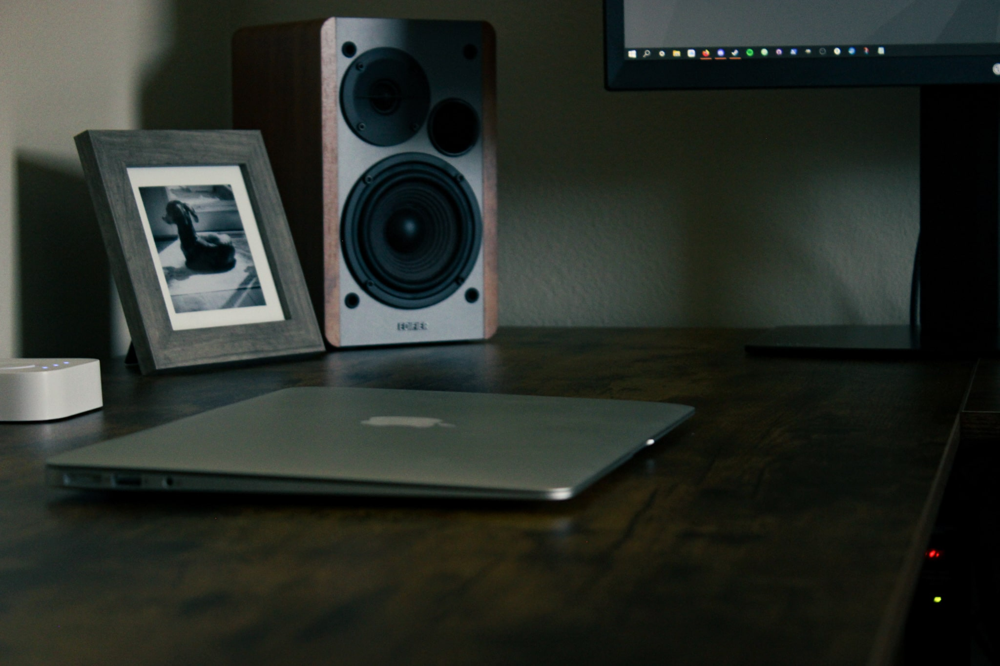

I recently moved, and one of the things I’ve been spending most of my free time on is fine-tuning my desk setup. I’ve made a lot of progress on it in the short time that I’ve been here, and even though I wouldn’t say it’s perfect, I’m pretty happy with it thus far.

Since I know this setup is going to be the first of many, especially considering I’m planning on moving again in six months, I wanted to document this setup in blog form. I think it’ll be nice to eternalize it so I can look back, but also to get my thoughts out and written down, to help me understand what I like about it, and maybe give *you* some ideas along the way. Maybe I’ll even do this kind of blog post every time I redo my setup or make some major changes to it.

Let’s get started.

### Problems with the old setup

First of all, I think it’ll help to create a nice “before and after” effect if I describe the issues I had with my previous setup in my last home. Don’t get me wrong, it wasn’t terrible. But it was limited in a lot of ways, and overall just didn’t have the right *flow*.

The first issue is the desk itself. Simply: it’s not a computer desk; it’s a “student desk”. It’s meant for a laptop and maybe some notebooks to take notes. It just wasn’t wide enough (I could not comfortably fit a second monitor), and the height was a little awkward at times. Not to mention the style. Once upon a time, I liked it, but that was almost 10 years ago. Tastes change.

And the second problem (mentioned above) is the lack of a second monitor. This is not an inherent problem, but I dealt with using a single monitor for such a long time, and with the kind of things I do, it really helps to be able to have information up on another screen: a video, documentation for coding, even a music playlist. Whatever it might be. Bottom line, I’d wanted another monitor for a few years, but my desk size prevented it.

Problem number three: the lack of lighting. I had one lamp in that room. It was a great lamp (I took it with me and I do still use it in my new office) but it wasn’t able to handle lighting more than one corner of the room, really. That room had no overhead lighting, so at nighttime, I could barely see my keyboard. In fact, aside from the desk itself, I could barely see anything in that room at nighttime, so doing any kind of project or non-computer-based work in that office after dark was out of the question.

Problem number four: the cable management (or lack thereof). This one is pretty simple. There was no system in place for making sure the various cables were a) nicely organized and b) actually out of the way of my legs.

Obviously, during the planning and creation of my new setup, I made sure to keep all of these things in mind to ensure they were dealt with.

### The new setup

I’ll go through all of the items in the new setup (furniture, tech, and other accessories) and talk a bit about each one: why I chose it, the purpose it’s meant to serve, and whether I’m happy with my choice.

#### The furniture

I'll start with the core piece: the desk. To be clear, my main criterion in a new desk was simply one that had more desktop real estate than my old one. Truthfully, the desk I ended up choosing is nothing fancy, but it suits my needs for now, as someone who is not in a permanent residence and doesn't have a whole lot of money to spend on a nicer, ideal, top-of-the-line desk (which, by the way, would be a motorized sit/stand desk with a memory bank for height adjustments).

The desk I chose is the Cubiker 55-inch computer desk from Amazon ($90). In fact, initially I bought one of them, and I liked it so much that a week later I ordered a second, and I've arranged them into an L-shaped orientation. Essentially, I wanted one of the arms of the L to be my main setup for my personal PC, and the other (shorter) arm to be the spot where I put temporary things, like my MacBook, notepad, or water bottle, and soon my work laptop when I start working from home.

The desktop is made of a board coated with [melamine resin,](https://en.wikipedia.org/wiki/Melamine) which is a laminate-like durable thermosetting plastic. Basically, it's smooth, protective, and easily wipeable, and it's made to look like a dark-stained wood, in my case. There is some controversy as far as health concerns, but it's mainly for melamine-based dinnerware, because consuming it could be toxic. Anyway, in my opinion, it's great for a temporary intermediate desk (one step up from plain particle board, which is also toxic btw). By no means is this a desk I'll have for a lifetime. I'm looking forward to one day getting (or building) a nice solid-wood desk for a permanent setup when I can afford it.

The legs of the desk are steel, supported by two intersecting steel support beams in the back. Basically, very sturdy. It doesn't shake when I type on my keyboard, which is nice.

The next piece of furniture is my chair. I've always wanted a comfortable chair, and this one is definitely a step up from my last one (which I got for free), but like the desk, it's not the best chair money can buy, even though it was quite expensive. I ended up going with the NOUHAUS ErgoFlip computer chair, also from Amazon ($250). If I had to give this chair a score, I'd give it a 39 out of 50. Here's a breakdown of my score:

- Build quality: 8 / 10
- Comfort: 7 / 10
- Durability: 9 / 10
- Aesthetic: 9 / 10
- Price (for what you're getting): 6 / 10

My main issue with this chair is that, while it is *very* comfortable, the comfort you can achieve requires you to lean farther back than what seems reasonable for a computer chair, hence my Comfort score of 7, otherwise it would be a 10. The lumbar support is very good, and the mesh seat and back are very comfortable, but the back is angled too far back. So when I want to sit forward or more upright, I don't get the benefit of the lumbar support. It's almost like this chair was intentionally designed to be slept in. But, all in all, I'm not unhappy with the chair.

In the future, I plan to invest in a nice computer chair from Herman Miller. Very expensive, but from what I've heard from creators online and from watching (too many) desk setup videos, worth every penny.

The last item in the furniture category is the very popular ALEX drawer unit from IKEA (I learned this also from desk setup videos). It sits at the right end of my desk, has space for things to go on top, and houses two small and three large drawers. I really like it, despite it taking two hours to assemble. It's very minimal, which fits my style, and very straightforward. It's a rectangle box with smaller rectangles boxes inside. It works.

#### The tech

I made technology its own category because it's an important part of the desk setup to me. It excites me, and I enjoy planning out how to incorporate computers, peripherals, gadgets, gizmos, lights, power, etcetera. Keep in mind that there are some parts of the tech portion of this setup that are not in an ideal location (by my standards), but because I'm in an apartment now, I didn't want to bother with installing them in a more permanent location. Mainly I'm referring to all of my network gear: modem, Ethernet switch, printer, Philips Hue Bridge (all of which I'll discuss later). In an ideal world, all of this would be housed in some sort of rack or network closet. But, that's a project for the future, one which I will undoubtedly write a blog entry about!

It seems appropriate to start with my main PC. I built it in 2014-ish, so I've been rocking this computer for at least seven years now, and it's still going strong. It's on my To-Do list to build a new PC entirely at some point in the near future (probably after I move again), but this one isn't going anywhere. At that point, I'd convert this one into some sort of secondary computer or more likely a NAS (network-attached storage) file server.

Here are the specs (peripherals included) in case you're interested:

- CPU: Intel Core i5-4570 CPU @ 3.20GHz
- RAM: 8 GB DDR3
- GPU: NVIDIA GeForce GTX 760
- OS: Windows 10 Home 64-bit
- System drive: Samsung 860 EVO 500 GB SSD
- Storage drive: Seagate Barracuda 2 TB HDD
- Monitor 1: ASUS VX248H 1080p @ 60Hz
- Monitor 2: LG 24ML44B @ 60Hz
- Speakers: Edifier R1280T 2.0 42 Watt studio monitors
- Keyboard: Ducky One 2 with Cherry MX Red switches
- Mouse: Logitech G502 wired

I've been very happy with this computer. Over the years, I've upgraded some components (like drives), added some expansions (like extra USB 3.0 ports), switched out my peripherals, but this list is where it stands currently. Actually, the second monitor is a very recent addition, and the added screen real estate has been a huge benefit. As far as performance, it's been solid. Granted, the GPU is getting a little outdated now, and I could do with more RAM, but for my purposes I haven't been bottlenecked too much. The games I play have all run well, but there are certainly some modern games that I wouldn't be able to run comfortably. But, this is not a problem for me, as I mainly play indie games that don't require much in the way of performance, stream YouTube videos, and write code in Atom (my text editor of choice).

There are some things that I'd like to start doing in the near future though, and an upgraded workstation will certainly help. Specifically, video editing, game development, and more demanding games are all real possibilities.

As far as the peripherals go, I'll say a quick word about each of them.

The speakers: I'm no audiophile, but they sound quite good to me. They can surely be upgraded in the future. The ASUS monitor: I've had it for as long as I've had the PC, and I love it. It has a 1ms response time, and honestly, I got it to play Mario Kart 8 on Wii U with no input lag. Please don't laugh. The LG monitor: this was my girlfriend's old monitor, and she gave it to me when she got a new one. Since it has a VESA mount point on the back, I bought a VIVO monitor stand from Amazon, so I could raise the height. The keyboard: I got this about a year ago, and I've been very happy with it. In fact, it's one of my favorite things I own. The build quality is so solid, and the Cherry MX Red switches are nice and smooth. I would easily recommend Ducky keyboards if you're interested in going mechanical. The mouse: this was a recommendation from a friend. I like it. It's basic and suits my needs, has a customizable weight, and a touch of RGB without being excessive. I previously had a wireless Logitech gaming mouse, but I grew sick of changing batteries, and the performance was degrading.

Next, I have my 2017 MacBook Air, which usually sits on the smaller arm of the desk while not in use (and frankly I've used this less and less since I completed my Master's program earlier this year). It's a great laptop, and since I got it (with a student discount) a few years ago during undergrad, I've used it for things like browsing, attending lectures, email, coding, writing, video calls, etcetera. The future is uncertain for this laptop. I may end up letting it go, creating a docking setup for it, or even replacing it with a Mac Mini down the line.

On to the networking equipment.

For my connection to the internet, I have a 2-in-1 modem/wireless router combo from Motorola. Truth be told, I really dislike Wi-Fi and avoid it whenever possible, but it’s nice to have it in an all-in-one device when you’re living in an apartment and don’t want to have an additional device when possible. Ethernet is far superior in every way (when it’s feasible). It’s faster, more reliable, and it *just works*. No need to mess with SSIDs and disconnection issues. Just plug it in. Personally, I use our Wi-Fi connection for my cell phone and my laptop whenever I’m not close enough to connect it to the modem via Ethernet. Everything else is wired.

As a way to add more Ethernet ports to the network, I use a 4-port NETGEAR GS105 gigabit switch. In total, I have 7 available ports, 5 of which are occupied:

- my computer,
- my girlfriend's computer,
- networked printer,
- Roku,
- Philips Hue Bridge.

All of those devices are in our shared office, with the one exception being the Roku, which is in the living room. For that, I made an extra-long Ethernet cable to provide internet, because like I said, I like to avoid Wi-Fi whenever possible.

The Philips Hue Bridge is a recent addition to the setup. I'd been wanting to get into smart home / [IoT stuff](https://en.wikipedia.org/wiki/Internet_of_things) for a while now, and I thought moving into this new apartment would be a good opportunity to start. So far, I have the Roku and a Philips Hue light strip behind our TV set to a scene in Apple HomeKit. So I can say things like, "Hey Siri, theatre on" or "Hey Siri, set the TV light to orange." It's neat, and I've been having fun with that simple functionality. However, setting up a Philips Hue ecosystem for a single light strip would be kinda overkill. I plan on adding more Hue lights to our apartment soon, one of which will be a Hue bulb for my desk setup. I'd also like to add some sensors in the hallway and configure them to turn on some lights at nighttime for when we get up to use the bathroom, or get a glass of water. There's a lot of possibilities for smart home setups that I'm excited to try eventually: security cameras, fans, music, thermostats, robot vacuums.

One thing that is *not* currently connected to my network, but soon will be, is my Raspberry Pi configured as a NAS for backups. Currently, I'm just using an external HDD for Windows backups, but I've always wanted a proper networked storage solution for every computer on our network. That's a project that's pretty high on my list, so stay tuned for some updates.

Last but not least: power and cable management. For power access, I have two surge protectors mounted to two desk legs in the corner of the L. They're zip-tied to the legs, because a) I like zip ties, and b) it's not permanent, like screw-mounting them underneath would be (although I much prefer this option for future setups). Every cable in this setup is hidden away in Yecaye under-desk cable raceways from Amazon ($20 for 6). They're plastic, but they're actually better than I thought they'd be. I went with these because of the ease of mounting (they come with adhesive tape that sticks to the melamine quite well). So I mounted a few underneath the desks, and virtually no cables are visible after tucking them away in the raceways.

One last part of this cable management system, and probably the last piece in the tech category, is my Apple Watch charger sitting at the back of my desk, behind my monitor. This way, I can pop the watch on its charger out of the way, and its wire remains hidden.

#### Lighting and other little things

As a major upgrade to my previous setup, this room actually *has* a light. In the ceiling. Amazing. But actually, I haven't been using it much, as I have a nice standing lamp with three color temperature settings and a bulit-in dimmer with a remote. There's also a window that provides a lot of daylight, so it's not an issue in the daytime. Like I mentioned earlier though, I plan to expand my smart lighting system to this desk setup, with one or maybe two bulbs which I can control synchronously via HomeKit.

I have a metal desktop PC stand by VIVO from Amazon ($20) that I use to raise my PC a bit off the carpet. The verdict: it does in fact raise my PC up.

I use a mouse wrist rest by IMAK that I've had for a few years. It's not the most ergonomic, as it's just a sack of beads and it doesn't quite do anything to keep your hand at the right height, but it provides a barrier between my wrist and the hard desk.

Because my main monitor lacks a VESA mount point on the back, it's sitting on a simple monitor riser by Satechi from Amazon ($30). I've had it for years, and it's a good product, but aesthetically I don't think it fits anymore. I plan to upgrade this to a nicer wooden one at some point.

Without further ado, here's some pictures of the new setup.

Overall, I'm quite happy with the new setup. But it isn't perfect. Specifically, I don't think the *flow* is optimal. My secondary monitor is to my left, which doesn't seem to make much sense, and the positioning is a little awkward, so it doesn't feel like the two monitors really work together to create one large screen. Maybe it'd be worth investing in an ultrawide monitor in the future to solve this.

Until next time.
