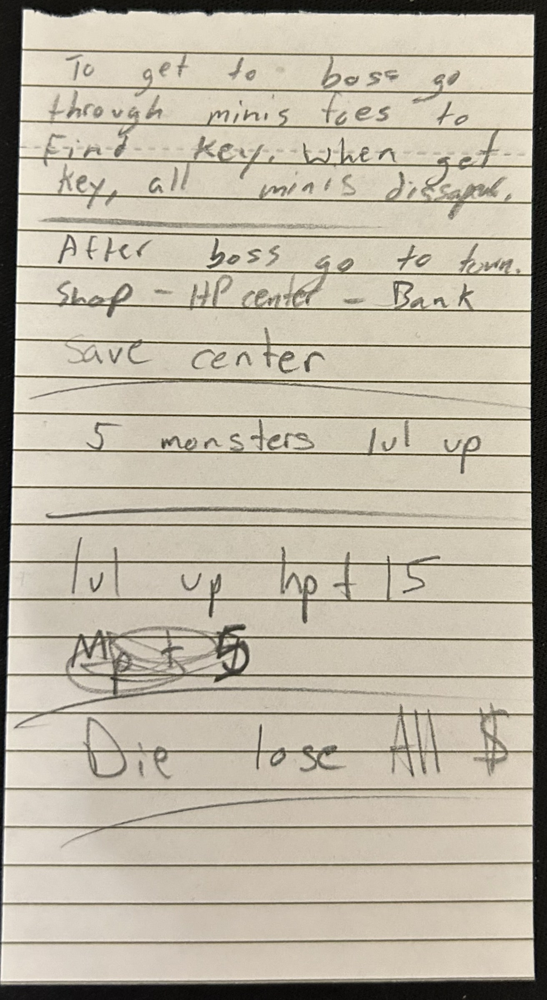
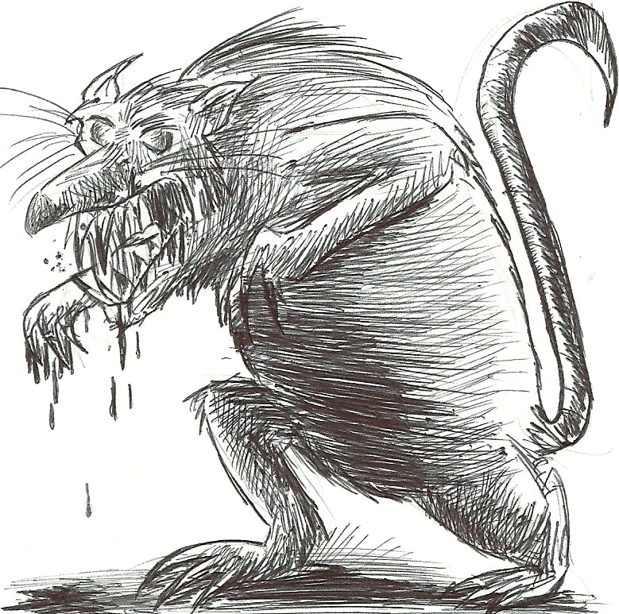

Lately, I've been struggling with figuring out what I want to do with my life. It's nearing three years that I have been working in the same position at the same company. I don't enjoy it. It's getting to the point where the tedium and workload are beginning to feel like they're not worthwhile, because my pay doesn't reflect the amount of work I'm doing (nor how long I've been with the company). Needless to say, I don't feel very valued at this job.

There have been times when my outlook was better over the past three years, but at a certain point, it becomes hard to stay in a positive headspace. It's just a lot of compounding negativity. But during those low times which have been getting more common, I tend to think about other things I might be doing with my time: web development, something else in NLU, electrician work, something with cars perhaps (I don't know much about cars, but the interest is there). But anyway, those are some of the more common thoughts that come to mind. But they all have something in common, and it's that they are regarded as "stable" or "reliable" career-wise. They wouldn't raise many eyebrows if you told people you did one of them for a living.

I'm sure I'd be on a better path if I pursued any one of those (and actually recently I've been doing an online course for web development, so maybe I am on the right track). But I also think it would be worth considering another element in making the decision to change career paths: what has been constant in my life for as long as I can remember? Well, an obvious one is playing games. But I can't (and wouldn't even want to if I could) play games for a living. You might say a logical alternative to "playing games" is "making games". So do game development! And I don't think that's an unfair conclusion to come to, but I would say that just because you enjoy playing games, it doesn't necessarily entail that you'd enjoy creating them. There is a different mentality involved, or a different skillset, or a different _something_. I'm not even saying "you gotta have what it takes to make games!" -- I'm just saying playing them and creating them are two different things. And that's fine.

At this point you might say, "Derek, what makes _you_ think you know anything about the intricacies of game development? You don't even make games!" And to that, I'd say: I do, actually. _pushes up glasses_ Well, I did. I used to make games all the time throughout my childhood and early adolescence. Not video games, but tabletop games. And lately I've been thinking more about that reality. It's hitting me: "Wow, I really used to make a lot of games, didn't I?" And that's why I wanted to write this post. I want to go through some (or all) of those games, and talk a bit about each of them. The point is two-fold:

1. to consolidate all my old game projects into one place and share them with you;
2. to hopefully kick myself into gear and get back into the game development mindset I once had.

# Games

## Unnamed piece of paper game

I'm listing this one first because it might be the earliest example I have. On a small piece of notepad paper, I wrote some rules for a game. They're not very detailed, but clearly I had an idea in my mind.

- To get to boss go through minis foes to find key. When get key, all minis disappear.
- After boss go to town.
- Shop - HP Center - Bank - Save Center
- 5 monsters to lvl up
- Lvl up HP +15 MP +5
- Die lose all $

Get it?

## Unnamed multi-level box game

When I was very young, perhaps some time after the piece of paper game (but I'm not sure), I made a board game using an empty cardboard box for the board. This one was cool. The box was upside down, so the bottom of the box was face up with the board on it. And there was a mechanic that allowed the player pieces to fall down below via trap doors in the board (partial cut-outs that hinged on one side). I don't remember much more than that, but I remember having fun making it. My dad helped me. More on that later.

## Sicachuwama

Don't bother trying to pronounce it. This is a game my friend Evan and I made together, and I actually remember quite a bit about the rules and mechanics. It was simple, but fun.

- Board is linear (a curvy path) 
- Spaces on the board were solid colors that repeated in a pattern (something like red, blue, green, yellow, red, blue, green, yellow, ...)
- There is a deck of Color Cards that each had a color on one side (corresponding to the 4 colors of the board)
- Before the game starts, a Key item is randomly placed somewhere along the board
- There is a Treasure Chest item placed somewhere on the board (I can't quite remember where, whether it's at the final spot or at the end of a branching path which is randomly attached to a space on the board at the start of the game)
- Each player (2 maximum, I think) have a game piece that starts at one end of the board
- Players take turns, drawing cards from the Color Card deck. The color on the card drawn signifies which space you move to (the next space of that color)
- The goal of the game is to land on the space with the Key, and then take it to the space with the Treasure Chest. Then you win.

There are some things that are unclear in my memory, such as where the Treasure Chest gets placed, and how a player can steal the Key from the other player.

## Dumbfire

This one is one of the larger ones, in that its "production" went on for the longest time out of all of these projects. This one was also made as a collaboration with my friend Evan, and it's mostly a blatant ripoff of Yu-Gi-Oh! (since we liked and played that game at the time).

This game was interesting because it gave me the chance to create a lot of new cards (since I just had to cut the paper to size and write the card text). I guess this gave me a lot of practice creating card interactions, even if they were quite specific and not always widely-applicable within the game.

Dumbfire had two "spinoffs" that came a bit later. The first one was called "Dumbfire Spells" which was a simple back-and-forth game in which two players cast spells at each other to deplete each other's HP. It was too simple, really. A lot of "deal X damage to your opponent" or "get a shield which lasts for X turns" and not much else.

The next spinoff was "Cube Wars" which, as far as I can remember, was quite similar to Dumbfire Spells, but the cards were smaller and instead of dealing damage to each other, you wanted to deal damage to your opponent's "Cube". The Cube was some sort of avatar card which represented you. So, pretty much the same thing as Dumbfire Spells.

## Lore 

Lore was my attempt at a larger dungeon crawling tabletop game. I created a lot of notes and blueprints for this game, but I don't think it ever got to the point of being finished or even close to playable. It was just too big and ambiguous an idea in my head, so I wasn't able to pare it down to something coherent. But, I remember being quite excited about it. I had a friend of mine, Dan, create some prototype artwork for it as a test. I'll include an example below.

The name "Lore" was inspired by the idea that there was going to be a lot of mythical creatures to fight in the game. The genre was classically fantasy, featuring warriors, mages, etc. fighting against fantastical monsters in a dungeon.

# Back to the point

There are some more games that I'm not going to list. Some of them are not worth mentioning (because they're too similar to something else on the list) but some of them I'd actually prefer to just keep unmentioned for now. The reason for that is because, for two games in particular I can think of, I want to try to convert them into video games. They are fleshed-out enough to be in a state that I'd consider ready, and not so simple in gameplay that they would be painfully boring to play. Another (which I did mention earlier) is Sicachuwama. My plan is to treat that game as a practice project
in converting a tabletop game into a video game (but it is a little too simple to be fun, so I wanted to mention it in this post instead).

## Dad

I said I would touch more on this point before the end of the post. My dad had helped me when I was making that multi-level cardboard box game when I was little. It is also worth mentioning that he was someone who was generally creative (which I think I can say about myself) and in particular, also aspired to make board/card games at some point. I don't remember many details, but I know he was working on one at some point before I was born. 

That's probably why he helped me come up with ideas and create the assets for that game. I remember that he was generally encouraging when I was making games or expressed my interest in it. So that's cool.

## So now what?

One of the points of this article, as I mentioned in the intro, is to hopefully kick myself into gear and make games again, but in a new medium (video games). Does the fact that I made games when I was young, and continue to express my interest in it today, mean that I need to go into game development as a career? No. I mean probably not. I'm definitely lost in life, but I don't know that I need this to be more than a hobby. I think at the very least I _need_ to get back into it in some capacity so I can give my adult brain a chance to create games again. Maybe I need to flex that particular gamedev muscle.