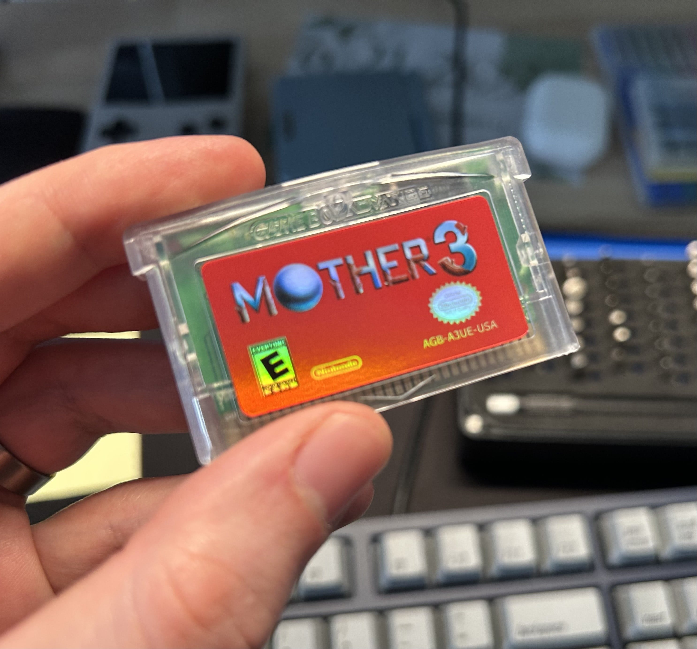
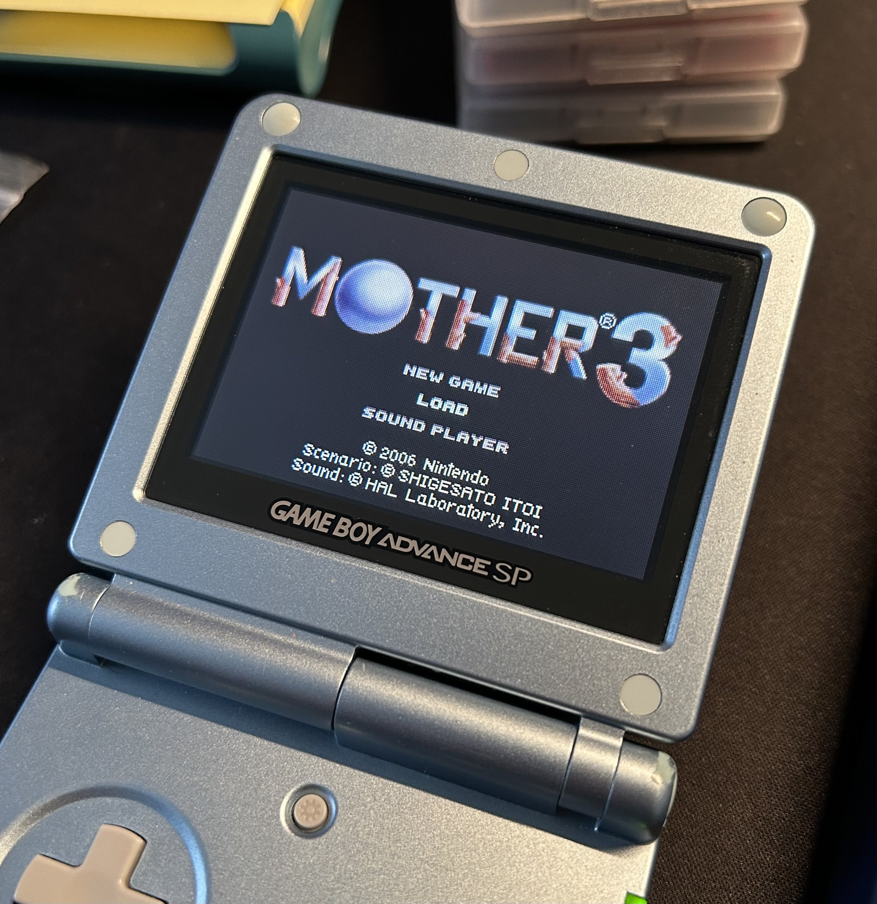

Mother is one of my favorite video game franchises (along with Pokémon, Banjo-Kazooie, Metroid, and Pikmin, in case you were curious). I've played all three in the series, but as you may know, Mother 3 never had an official English release. A few years ago (probably as many as 10 at this point — wow) I purchased an unofficial cartridge which contained the fan-translated English ROM of the game from a seller on Etsy. And that's how I played through it, on my Game Boy Player on my TV.

I plan to replay the game some time soon, since it's been a while. So recently I looked at my cartridge and realized the quality of the label and cartridge shell wasn't very high. The printing on the label is not very crisp, and the shell's markings don't match OEM shells very well. I also think I remember that the cartridge size was a little off versus OEM, because it didn't sit flush in my Game Boy SP.

So, I decided I'd give the cartridge a makeover. I could have purchased a nicer quality board from insideGadgets (the company that makes the ones I've been using for my [other flash cart projects](https://www.derekandersen.net/blog/pokemon-forever-cartridges)) and start from scratch, but I figured since the game works, I'll keep the board and just make it look nicer on the outside.

I might have described my philosophy when it comes to unofficial cartridges in the past, but I'll do it again here. When it comes to unofficial or reproduction cartridges, I like to stick to using either a differently-colored shell, or a different label finish (compared to original). A combination of both also works. But the point is, if the game is _not_ already a romhack/homebrew game (which would naturally have a unique title and label), then there should be some indication that the cartridge is not original just from looking at it. That philosophy serves two purposes I guess: one is that it makes them easier to identify among other original cartridges in my collection, and the other is that it prevents confusion should I ever offload any of them to other people, and they end up selling them, or something. The existence of fake Pokémon cartridges on the market for example (ones which look so close to the originals these days) is a shame and makes it more difficult to track down originals.

So in the case of this Mother 3 cartridge, I decided to use a clear cartridge shell from insideGadgets, and a holographic reproduction label from a seller on Etsy. The label's colors and finish look very good. I think the finished product looks great; I may use a similar approach in the future if I make another unofficial cartridge like this.

