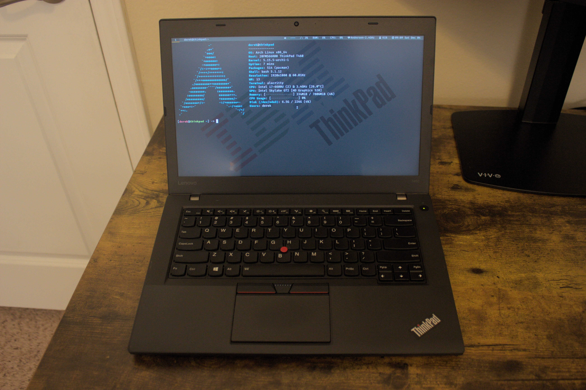
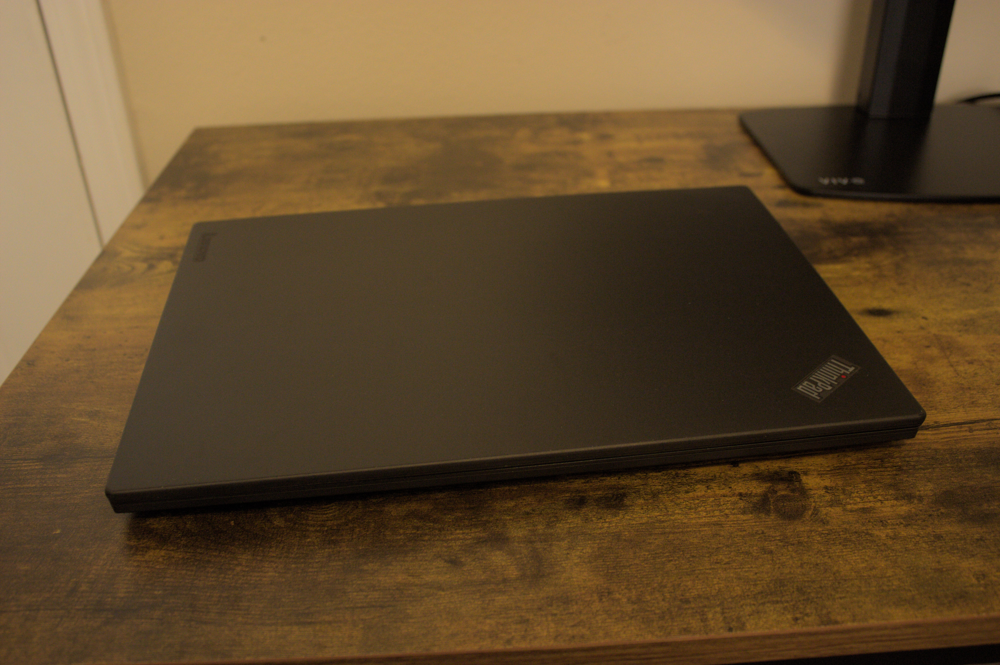
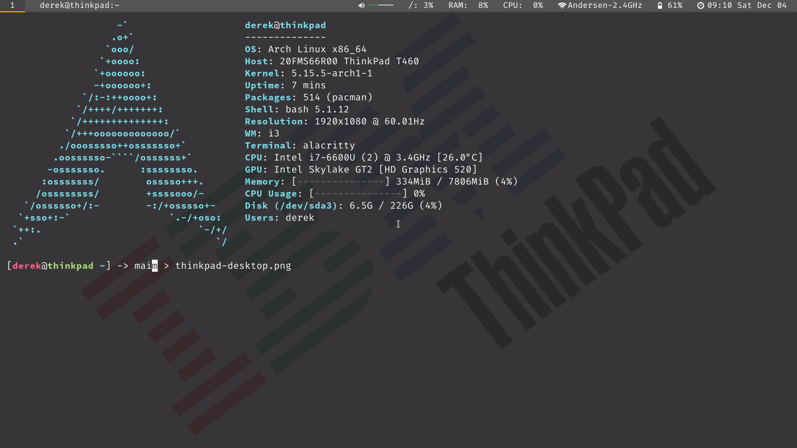

I'm sitting here on the couch writing this on my ThinkPad T460. It's a laptop from 2016. I paid about $250 USD for it on eBay a couple of weeks ago.

Why did I do that? Well, actually, my mission was to get one in order to sit here on the couch and work on projects (like this blog). Look! Mission accomplished, because that's exactly what I'm doing.

Here are some photos.

But, why a five-year-old ThinkPad of all things? Well the main reasons were that I wanted something relatively cheap, reliable, durable, upgradeable, serviceable, and something with proven support for Linux. This bad boy ticks all those boxes.

# Cheap

Old ThinkPads have a very high availability on the secondhand market. This is because they're commonly bought in bulk, on-lease, by businesses or schools, and then sold by vendors on sites like eBay when the time comes for the organization to upgrade them, like, a year later. They're always going to be around for a reasonable amount of money. That was important to me, because I didn't want something that I absolutely loved, but it cost several thousand dollars, didn't feel sustainable, or I couldn't rely on the company being around for another two years. This also allows me to think of the laptop as more of a tool, and less of a shiny indulgent waste of money.

# Reliable & durable

For reasons similar to the last, they're reliable machines. That's why these organizations like businesses invest in them. They're made of carbon fiber, so they might get a little dinged up and scratched, but they're not going to shatter or crack. They can be given to a monkey and he won't be able to hurt it. I hope that doesn't sound like I'm likening office workers to monkeys.

They're not only reliable in a physical sense though. From my research, it seems like they last a long time and they do what they're supposed to.

# Upgradeable & serviceable

Unlike a lot of newer laptops, the ThinkPads from 2018 and earlier are all generally *very* serviceable. Nearly all of their components can be replaced, and you can find a lot of these parts on eBay. Not only circuitry and silicon, either. Keyboard, screen, bezel, trackpad, battery. All of it. Most of it.

With this also comes the ability to upgrade important things like RAM. Most of these ThinkPads, except for the *s*-models that are designed to be ultrabooks (very slim), have 2 SODIMM slots for 2 RAM modules.

# Linux support

Lenovo is one of those manufacturers who actually likes and tries to support Linux. Like Dell, they sell some of their machines directly to the consumer with a Linux distro (Ubuntu I think) as a regular option. So many people seem to like ThinkPads as Linux laptops, because most of the time, everything just works. Personally, I didn't have any issues when it came to drivers for stuff like the trackpad. (To be clear, I didn't need any special drivers, that was just an example.)

This last reason ties in with one of the things I'm trying to do lately, which in a couple words, is "get better with Linux." I've been using it daily at work now, [I built a dedicated Linux desktop](https://derekandersen.net/blog/pc-build-2021) recently, and I'm trying to learn more about how it works on a lower level (i.e. not only from an end user's perspective).

So on this laptop, I decided to install Arch Linux. It's a Linux distro that is notoriously "difficult" to learn. But really, if you follow a tutorial for the installation, it's not bad at all. Then it just becomes a matter of being face-to-face with a barebones system on which you can do anything you want. That's one of the advantages for me. It's a very minimalistic approach: add software you want to use, and *only* software you want to use. It really forces you to think about what you want from your machine. No bloat, no nonsense, just opportunity. So far, I've been having a *lot* of fun setting up my Arch install. Here's a screenshot of my "desktop" (which is just my terminal with 95% opacity so you can see my wallpaper). 

If you're interested in the specs of my particular ThinkPad, here they are:

- 6th Gen dual-core Intel Core i7 6600U @ 3.4GHz
- 8GB RAM (I think it's DDR3)
- Intel HD 520 graphics
- 256GB SSD
- 14" 1920x1080 FHD IPS display
- Ethernet / Wi-Fi / Bluetooth / HDMI out / USB 3.0

Pretty basic specs. It has all the essentials and a fairly good CPU (I don't think this model ships with a quad-core CPU, but the *P*-series does). The screen is really nice though.

So far, I'm very happy with the laptop. I wanted a laptop to use on the couch, or take with me somewhere, for project work, web browsing, email, YouTube, music, etc. This one is more than capable. I can picture a future where I get another one, to be quite honest. It would be an *X*-series, which is the far more portable 12" version with similar specs. In fact, initially, I couldn't decide between a *T*-series or an *X*-series for a while. I eventually settled on the 14" model because of the larger screen and keyboard, but I don't think I'd mind the smaller one, especially for traveling.

Thanks for reading.
