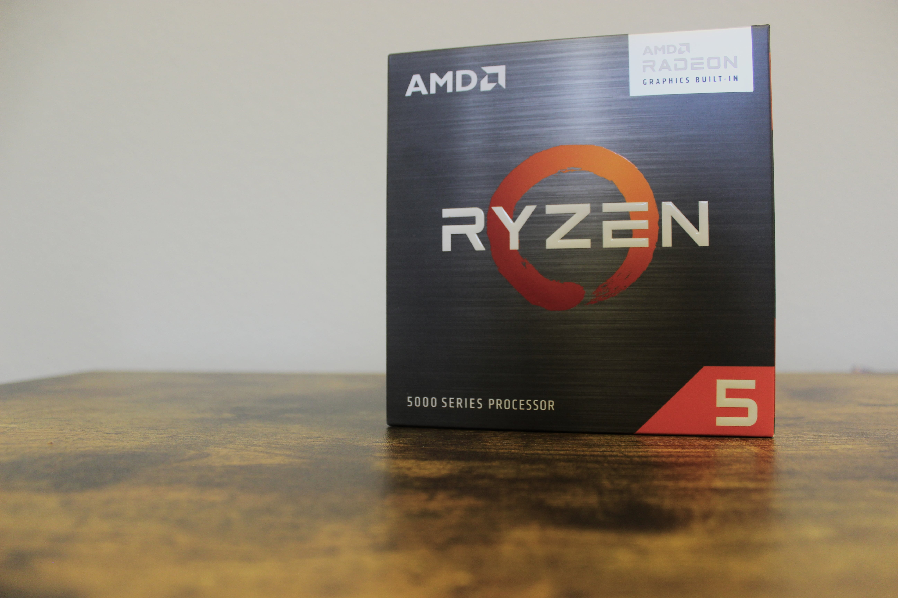
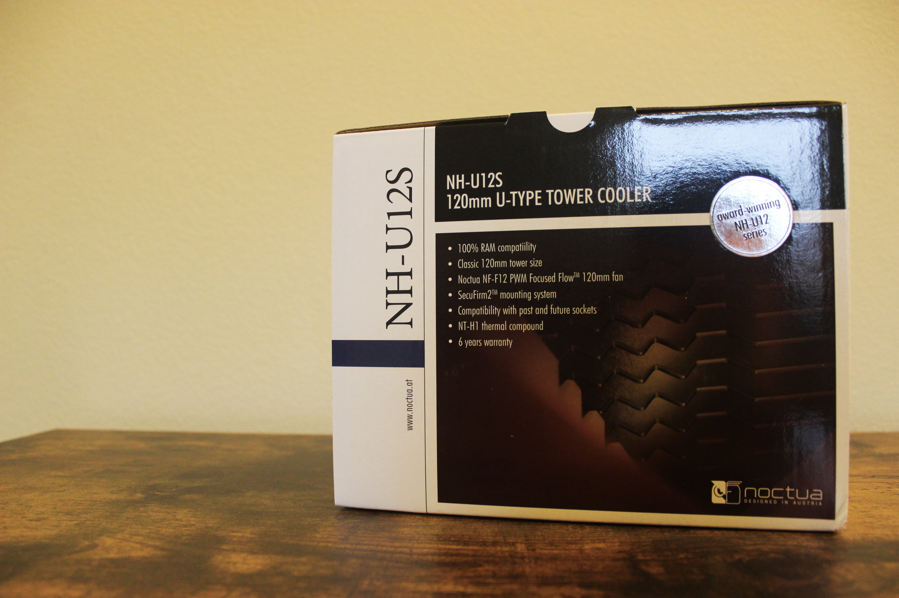
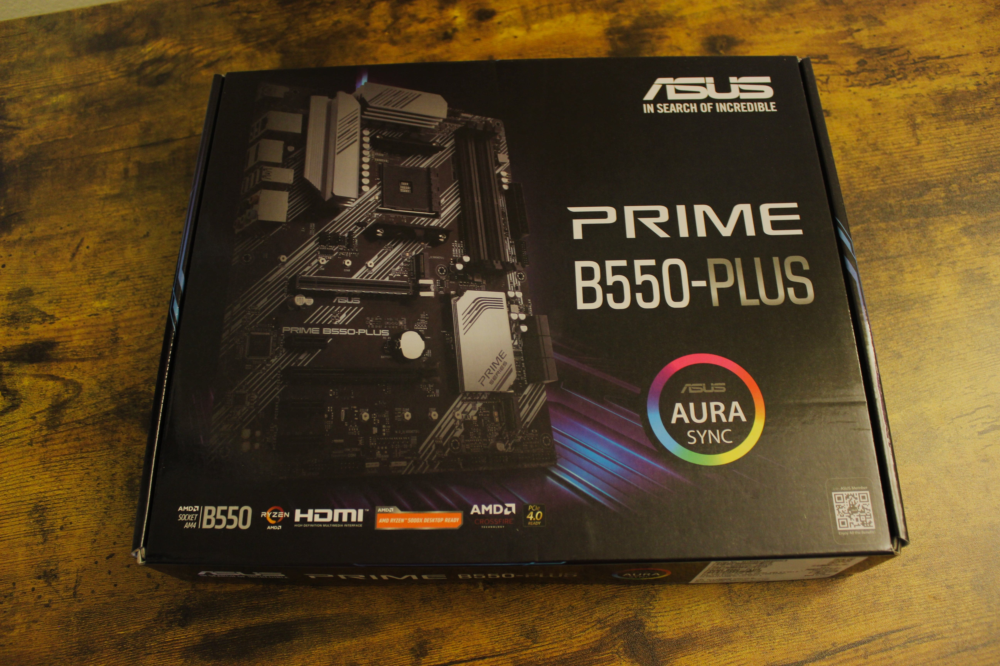
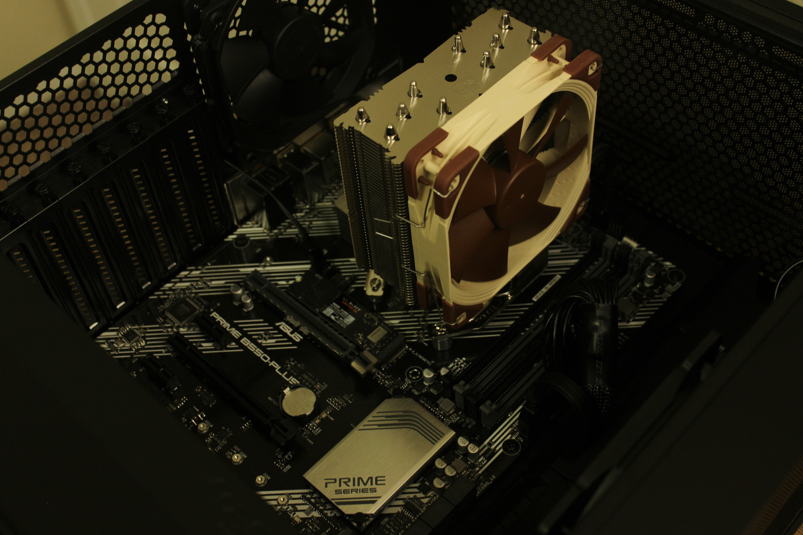
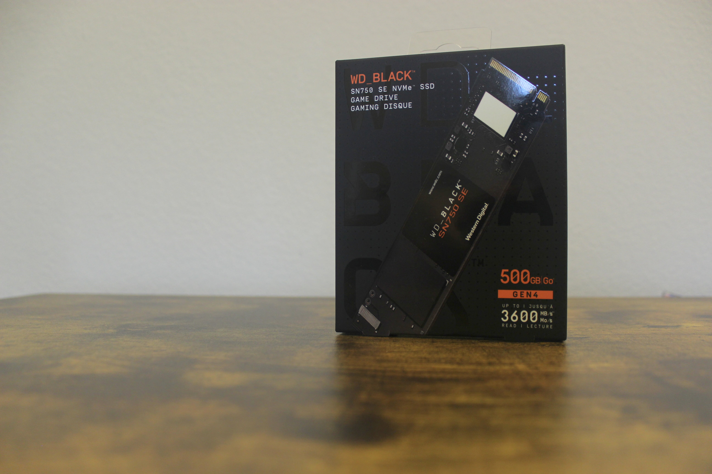
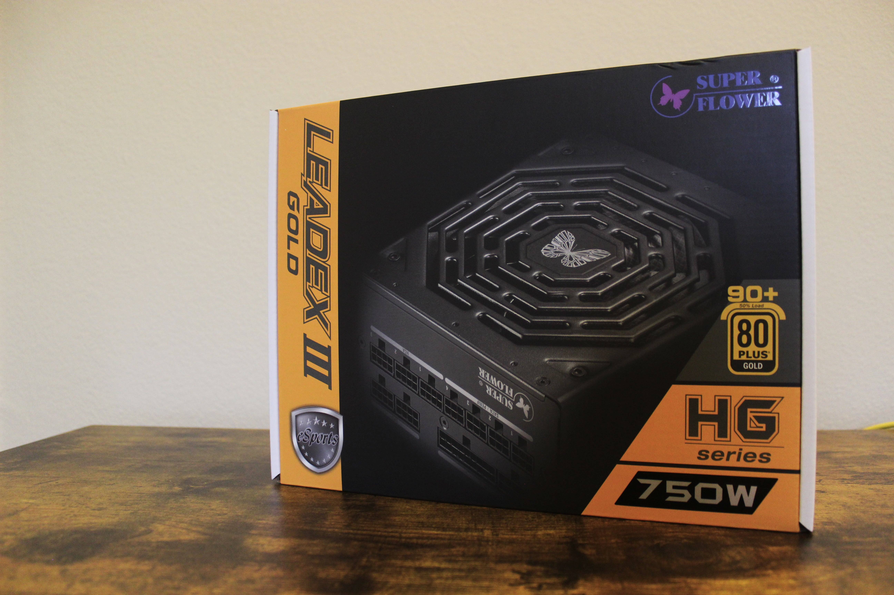
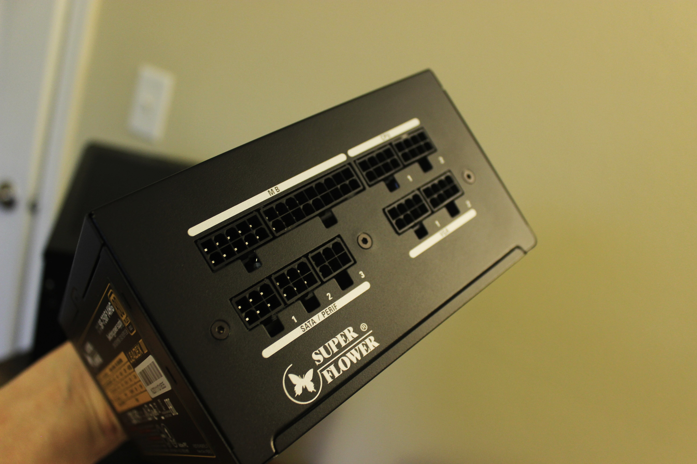
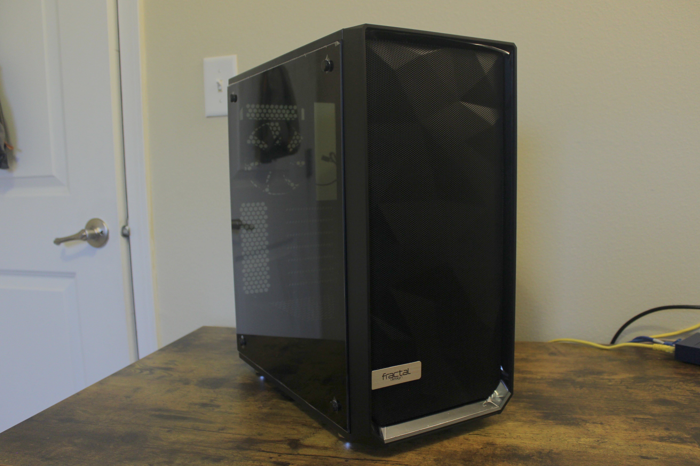
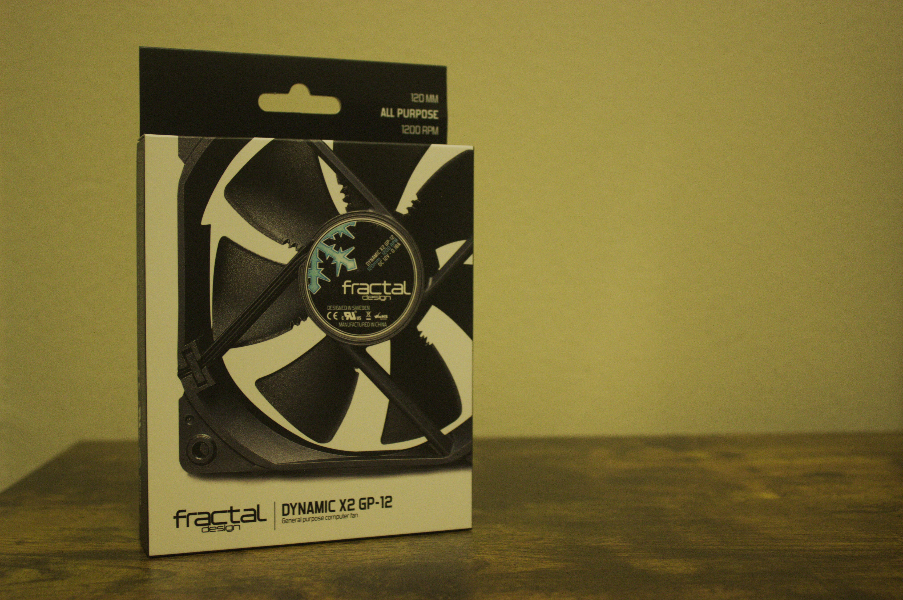

My current PC, a Windows machine that I use for gaming, programming, writing, and other general daily tasks, has served me well. I built it back in 2014, my first year of college. In my last blog entry, I listed its specs (peripherals included), which I will paste here again for your convenience:

- CPU: Intel Core i5-4570 CPU @ 3.20GHz
- RAM: 8 GB DDR3
- GPU: NVIDIA GeForce GTX 760
- OS: Windows 10 Home 64-bit
- System drive: Samsung 860 EVO 500 GB SSD
- Storage drive: Seagate Barracuda 2 TB HDD
- Monitor: ASUS VX248H 1080p @ 60Hz
- Speakers: Edifier R1280T 2.0 42 Watt studio monitors
- Keyboard: Ducky One 2 with Cherry MX Red switches
- Mouse: Logitech G502 wired

For my purposes, I've been very happy with this machine, and I've been able to make some small upgrades throughout its life to enhance my experience, like extra USB 3.0 expansions, upgrading drives to solid state, getting new peripherals, etcetera. In fact, I also ordered another 8GB kit of DDR3 RAM to increase it to 16GB, finally. I don't know how I got by with 8GB for 7 years.

A few months ago, I tried dual booting Windows and Linux on this machine, and it ended up being a huge hassle. Turns out, the `grub` bootloader for Ubuntu ended up killing the Windows bootloader, and I wasn't able to get back into my Windows install, which obviously defeats the purpose of dual booting. So I told myself I'd never deal with the headache of dual booting again.

That's where the subject of this blog entry begins. I'd been wanting to build a new PC for a long time now, and my newly acquired income is what pushed me to finally do it (even though we're in the midst of a GPU shortage at the time of my writing this). I opted to exclude a GPU this time around, in favor of a Ryzen CPU with integrated Radeon graphics. The new build is not meant for gaming, and so I felt leaving out a graphics card was the best thing to do, with the added bonus of not needing to dish out triple the cost of the PC itself to buy one.

But then you might be thinking, "Derek, why are you building a new computer that can't handle gaming, if you consider yourself a gamer? Why not just keep your old one?" And that's a good question. Well... I am keeping my old one. That'll remain my gaming PC. It's true that this may seem like a waste of money being that I *really* don't need a new PC right now, but I *can* point to a few reasons why I might benefit from this new build.

1. After almost 10 years, doing a new build means I can reap the benefits of fancy new hardware, which I'll get into later.
2. After that failed attempt at dual booting, this will give me a chance to incorporate Linux into my daily life more easily, since my goal with this new build is to make it my daily driver.
3. Expandability. Being that the hardware is more up-to-date, it means that there's a higher likelihood that I can take advantage of any kind of new technology or hardware that comes out.
4. I will get more experience building PCs (this will be my 3rd time doing a build from scratch). I enjoy it!

Item number 2 is probably the most important for me right now. I've been very interested for a long time in switching over to a Linux distro as my main OS, which is why I tried dual booting in the first place. I've tried a few, and I'm fairly comfortable with terminal-based use of Linux (especially since I use it daily at work now), but I've never had the opportunity to use a Linux desktop for more than a few days at a time. I feel that having a PC that I use solely for Linux will be a nice way to force it upon myself. The idea is to use some sort of [KVM switch](https://en.wikipedia.org/wiki/KVM_switch) with both of my PCs, so that I can use all the same peripherals between both PCs, since I won't ever be using both at the same time.

### The build

Now let's get into the new build. I'll go piece by piece, starting with the most important: the CPU.

#### The CPU

For my CPU, I chose an AMD Ryzen 5 5600G. The important bit here: the 'G' -- this means *integrated graphics*, which was essential for this build because A) I don't *need* the high-performance graphics of an expensive dedicated card, B) this machine is not meant for gaming per se, and C) even if I wanted a dedicated card that could handle high-end games, I'd be out of luck unless I was willing to pay an arm and a leg considering the current shortage.

#### The CPU cooler

I'd never opted for a dedicated CPU cooler before this build, but I decided to because I chose a CPU with integrated graphics, so I figured it deserves a proper cooling system, instead of that dinky little stock cooler. So I went with Noctua, as I've heard really great things about their products recently. The NH-U12S 120mm tower cooler, to be specific. This thing is massive, but really well-built and seemingly performs very well. Checking right now, my CPU temperature seems to be 26°C. Oh, and not to mention, the fan on the cooler is so quiet, which is a big plus for me. I really don't like noisy computers.

#### The motherboard

I went with an ATX board because typically, they're cheaper than their smaller mATX or ITX cousins. I had considered going for a small board given the more compact case I chose, but in the end I figured slightly cheaper would be better because it would fit in the case anyway, and it might offer more ports than its smaller counterpart. The board I chose is the ASUS Prime B550-Plus. Really, the main reasons were A) I trust ASUS, as I've used them for motherboards in the past, and B) it had all the I/O I needed. Specifically: USB-C (I wanted it just to have the option), Ethernet, HDMI as well as DisplayPort (meaning I can take advantage of dual displays without the need for a PCIe graphics card), and a PCIe Gen 4 NVMe drive slot. It's also a nice looking board without all that flashy gamer RGB and ridiculously oversized heatsinks.

#### The RAM

I told myself I'd never get less than 16GB of RAM again, because I want the performance, and because there's no reason not to (RAM is very affordable these days, at least until DDR5 comes out, which is bascially right now). But finally I can take advantage of the speeds of DDR4 (my last build had DDR3). So I went with 16GB (2x8GB) of dual-channel Crucial Ballistix DDR4 3600MHz. This is like three times the speed of the memory in my last PC. Dang.

Unfortunately I forgot to take a picture of the RAM modules. They're just black though.

#### The drives

I have two storage drives in this computer, one of which is a 500GB Western Digital Black SN750 NVMe SSD. This is something I was particularly excited about, since I built my last PC way before these NVMe drives existed, and my motherboard didn't support them. Now I get to take advantage of their *insanely* fast speeds! (This one is an unbelievable 3600 MB/s read over PCIe Gen 4.0 (which I am in fact taking advantage of)! Versus the 500 MB/s or so of a traditional SATA SSD, this is a massive upgrade. I went with 500GB because they quickly get really expensive, but also, I don't need a crazy amount of storage. If I ever do, my inevitable NAS project (coming some time soon!) will take care of it. 

There's also one of my old 120GB Samsung EVO SATA SSDs in here too, as some kind of secondary drive whose purpose is vague, that I will likely never even use. Whatever! SATA is out,  NVMe is in (for boot drives at least).

#### The power supply

I don't know much about power supplies to be honest, I definitely can't speak to the specifics of how they work and stuff. But there were a few little requirements I had, I guess: first of all, it had to be fully modular, and second, it had to be fairly powerful in terms of wattage.

I wanted full modularity because I am big on proper cable management, and let's just say the full spectrum of cables you could ever need, all permanently soldered into a huge brick that goes into your case, it doesn't exactly help you tidy up the inside of your PC. So yeah, now I just use 3: motherboard power, CPU power, and SATA power for that one useless SATA SSD. Nice and clean.

And then I wanted fairly high power output basically just for future-proofing. I didn't want to eventually get a beefy graphics card with high power consumption, and not be able to properly power it with a weak PSU. That, and it doesn't hurt to go overboard on the power output.

All this being said, I went with a Super Flower Leadex III Gold 750W. This is a brand I hadn't ever heard of before researching for components for this build, but I'm really happy with it. It basically had zero bad reviews, fully modular, and a good power output for my purposes. Nice build quality too. I would absolutely go with Super Flower for all my future power supply needs. It even has a physical rocker switch for fan speed on the back. Neat.

#### The case

The case! Can't build a computer without one. I am pretty picky in general, so when it comes to aesthetics, it takes me a while to decide and to balance looks with features I actually want. In this case, the features I wanted were:

- More compact than a full-sized tower
- Good airflow (There seems to be an issue with case manufacturers--there's a lot of cases on the market that seem to have terrible airflow.)
- Good build quality (obviously)
- Inoffensive aesthetics
- Glass side panel (Eh, it's my one flashy choice for this build, let me have it. At least I don't have RGB.)
- Excellent cable management options, including tether points for zip ties and cable routing holes
- Removable dust filters

Boy does this case deliver! I went with the Fractal Design Meshify C (the C means 'compact'; they also have full-sized options).  This case hits all of those criteria, and I couldn't be happier with it. Versus my old PC, the cable management is a *home-run*, as I imagine the kids say. And not only does it have removable dust filters, it has three of them! Big ones! One on the top, one in front (which is where my intake fans are), and one on the bottom (for the PSU intake). This is my first Fractal Design case, and I can guarantee it will not be my last. 
Also, the tempered glass side panel is dark-tinted glass (not fully transparent), so it creates a nice subtle view of the internals. Not *too* flashy. ;)

#### The fans

Last but not least, the fans. My setup is pretty simple here: I have 3 Fractal Design Dynamic X2 GP-12 120mm fans. Two in the front for intakes, and one in the back for exhaust. This is the stock fan for this case. It came with 2, and I liked it enough in terms of noise level, so I bought a 3rd and added it to the front. I may get a 4th for some top exhaust.

The way my fans are installed creates a front-to-back airflow, with the Noctua CPU cooler acting as a passthrough in the middle, which hopefully helps with the CPU cooling. It seems like it does.

### The finished product

Like I said, the purpose of this PC is to be a Linux machine that I use for everything other than gaming. So, it's my new *daily driver* of sorts. I installed Ubuntu because it's very user-friendly. I'm thinking about trying a more lightweight Arch-based distro in the near future, because the minimalist inside me told me to. I may load that up in a VM to try it out.

In terms of performance, it's been great! No issues so far, moving and loading any type of file is super fast from this NVMe drive. I've had no issues with graphics thus far either. I tested one game (Old School RuneScape via RuneLite) and it ran great. Granted though, it's RuneScape. I plan to test some other Steam games soon, even though that's not the real purpose of this machine.

#### Parts list & specs

For the purpose of eternalizing a parts list for this build that I can quickly refer to if I need to, here's that:

- CPU: AMD Ryzen 5 5600G with Radeon Graphics (6-core) @ 3.9GHz
- RAM: 16 GB Crucial Ballistix DDR4 @ 3600Mhz
- GPU: AMD Radeon integrated graphics
- Motherboard: ASUS Prime B550-Plus ATX
- Power supply: Super Flower Leadex III Gold 750W
- CPU cooler: Noctua NH-U12S 120mm single tower
- Case: Fractal Design Meshify C
- OS: Ubuntu Linux 20.04.3 LTS
- System drive: Western Digital Black 500 GB NVMe PCIe Gen 4.0 M.2 SSD
- Storage drive: Samsung EVO 120 GB SATA SSD 

By the way, I put a nonzero amount of effort into taking photos for this post. I hope to improve my photography and photo editing in the future, just for fun. Did I do OK?
