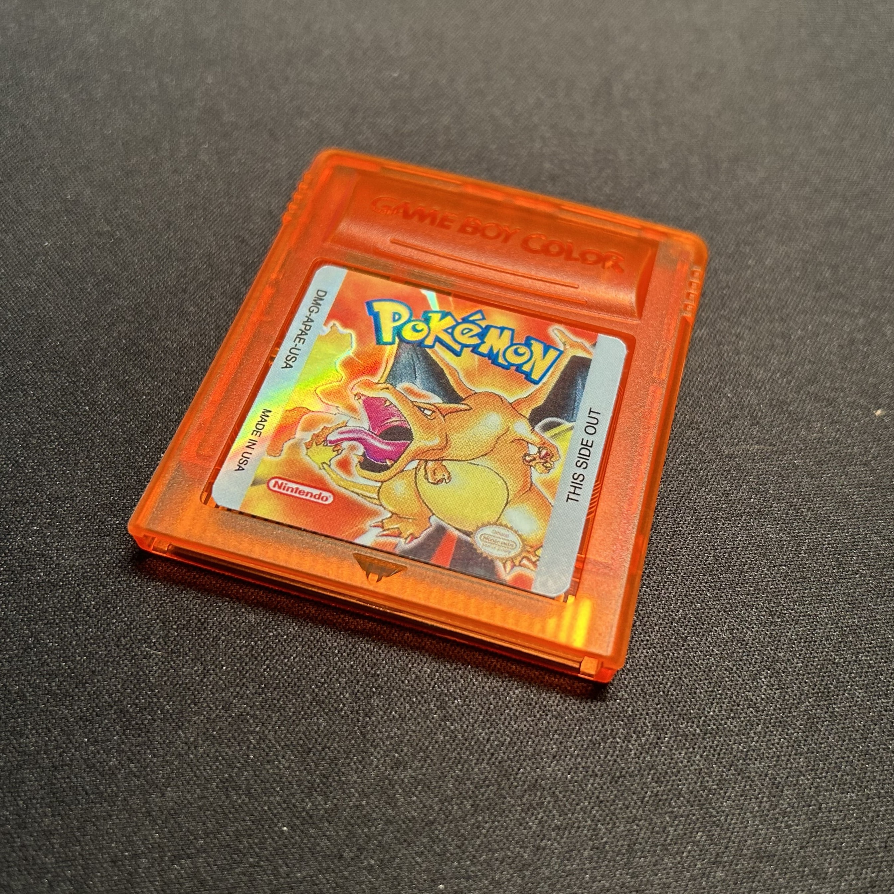
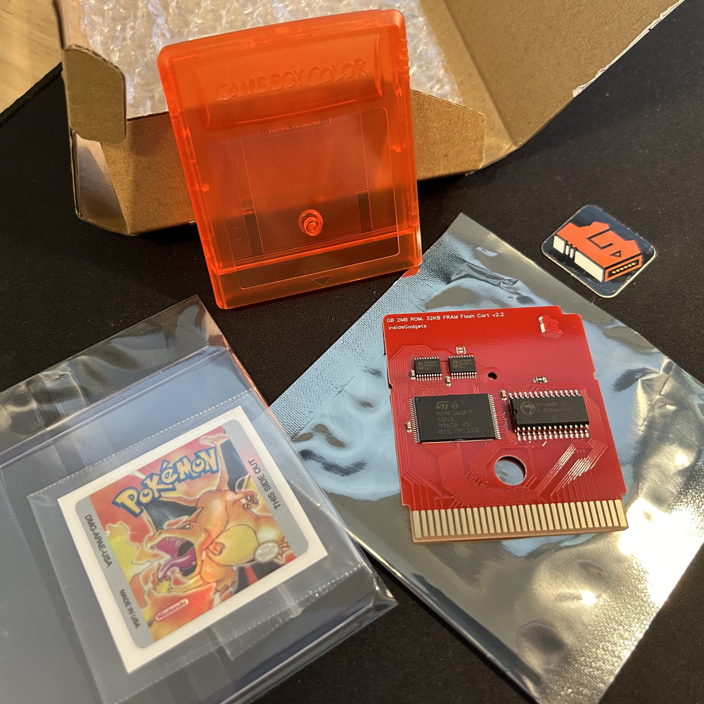
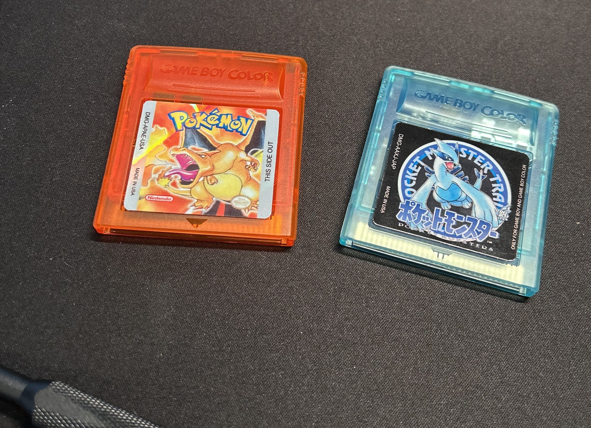

### The cartridges

If you read [my last blog post](https://www.derekandersen.net/blog/gbc-mod), you should be familiar with the Lugia-inspired FRAM Game Boy cartridge I put together for Gen 2 Pokémon games. That cartridge was from InsideGadgets, and it was their 2MB / 32KB FRAM MBC3 cartridge with RTC. Importantly, that cartridge has RTC support, i.e. it allows for full support of the Gen 2 Pokémon games which use a real time clock mechanic. It also uses FRAM saving, which is a type of saving that doesn't rely on a battery (like the original cartridges' SRAM did). This way, saving is much more reliable and theoretically should work forever. (Yes, the cartridge does still use a replaceable battery for RTC though; unfortunately this can't be avoided.)

That cartridge has been working flawlessly for my current Pokémon Gold playthrough. And so with my Gen 2 cartridge needs met, next I wanted to cover Gen 1. In the picture at the start of this post is my recently-completed Gen 1 forever cartridge. It's also from InsideGadgets, except this one is their 2MB / 32KB FRAM cartridge without RTC. Since Gen 1 Pokémon games do not use a real time clock mechanic, it's not a necessary feature, so the cartridge is a little cheaper. It still has the benefit of FRAM saving, though.

I opted for a red PCB and an orange-red translucent cartridge shell. The custom label is from the same vendor on Etsy whom I purchased the Japanese Lugia one from. They're good quality, from what I can tell.

Part of my philosophy for these flash carts (or any unofficial/reproduction cart) is that I believe the shells and/or labels should not be identical to the originals -- they should have some flair to indicate that the carts are aftermarket, such as a differently-colored shell or a special/holographic label, or both.

And with that, my Gen 1 and 2 "forever cartridges" are complete. In fact, the same treatment can be done for Gen 3, and that is something I will do eventually. But for now, I'm happy with these. Here's a nice picture of them sitting next to each other like nice siblings do.

Beautiful!

### A related bit of news

As I said earlier in this post, I'm currently in the middle of a Gen 2 (Pokémon Gold) playthrough. After I'm done, I plan to start a new Gen 1 playthrough on the new cartridge. But not just any Gen 1 playthrough!

Something else I briefly alluded to in [my last blog post](https://www.derekandersen.net/blog/gbc-mod) was my intention to create a Gen 1 romhack. A couple weeks ago, in fact, I started on that project.

For many years, I've had some vague ideas about how I might "improve" (I use this word very carefully; I'll explain soon) the Gen 1 experience. Here are some general ideas I had for such a pursuit:

- make all Pokémon obtainable in one version
- mitigate the obstacles of gameplay that are introduced by needing a real-life friend to trade with (e.g. for evolution and for acquisition of version exclusive Pokémon)
- ease the inconvenience of HMs by either: making them useable without teaching them to a Pokémon, or making them not take up a Pokémon's normal move slots
- fix some actual bugs (e.g. Focus Energy not working as intended, Exp. All not working as intended, etc.)

As you might be able to glean, it's not that much in terms of actual changes to the vanilla games. I wanted to improve the games without changing so much that the games cease to be Gen 1 altogether. This is why I made a point of mentioning that I used the word "improve" carefully. I've seen many efforts in the Gen 1 romhacking scene which aim to change _many_ things: modifying Pokémon stats, modifying the battle system fundamentals, adding Pokémon from later generations, changing the evolution methods for certain Pokémon. This is far too much, imo.

I've noticed that there exists a common sentiment among Pokémon fans today, which is something along the lines of "Gen 1 sucks, so why would I play it unless it was edited to be in alignment with all the systems I know and love, which were introduced in the later games?" And this bothers me. My response to it is: Don't play Gen 1 at all, if you don't like it or if you didn't grow up playing it. This is not a gatekeeper's message, it's just an honest one. Fire Red and Leaf Green exist, after all. Those are more modernized versions of Red, Blue, and Green, so maybe those would be a better fit for those individuals.

So my goal in making my romhack is to deal with those "real" issues (yes, it's subjective) that Gen 1 has, in order to satisfy those people who actually enjoy Gen 1 for what it is (myself included).

#### How I'm making the romhack

You might be curious as to how I'm actually going about creating the romhack. I'm certainly not a "pro romhacker" nor do I wish to be considered one, so I don't have all the skills that some people do (and it's definitely impressive what some people are able to pull off mechanically in their Gen 1 hacks).

The hack is based upon the Pokémon Reverse Engineering Team's [disassembly of Pokémon Red and Blue](https://github.com/pret/pokered). It's publicly available on their GitHub page for anyone to fork and modify. It's very cool. And for the record, I knew nothing of assembly programming, but with a little investigative skill, you're able to figure out what to change in the source code to get the desired change in the ROM.

I'm calling my romhack "Pokémon Solus Red" (or Blue, or Green... I'm not sure yet). Why "Solus"? Well, it sounds cool. But also, its definition is relevant:

"By oneself; alone. Used as a stage direction to a male character."

The first part of this definition fits my philosophy of attempting to make the game more focused on solo play (i.e. you can obtain all the Pokémon by yourself and you can evolve Pokémon in-game without the need for link cable trading). The second part of the definition is also relevant, since the main character, Red, is male.

If you want to check it out, it's at [this link](https://github.com/Dechrissen/poke-solus-rgb).

I expect to finish it within the next few weeks. I've made a lot of progress already. In a future blog post, I'll write up a more complete explanation of the hack. And maybe I'll even have a fancy trailer to showcase.

Until next time.
