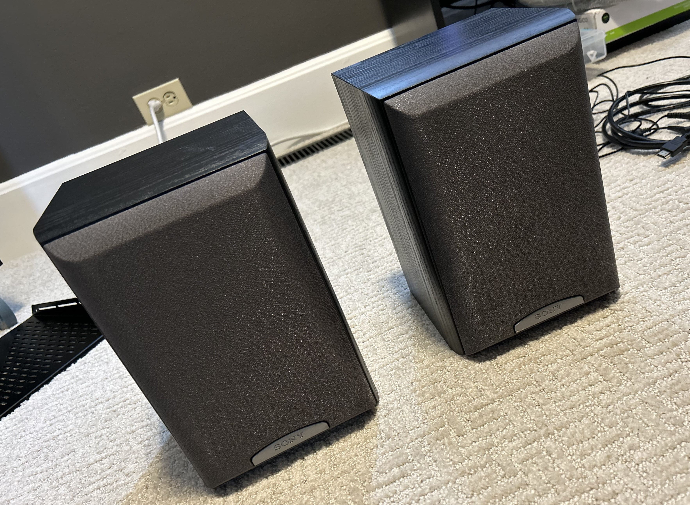
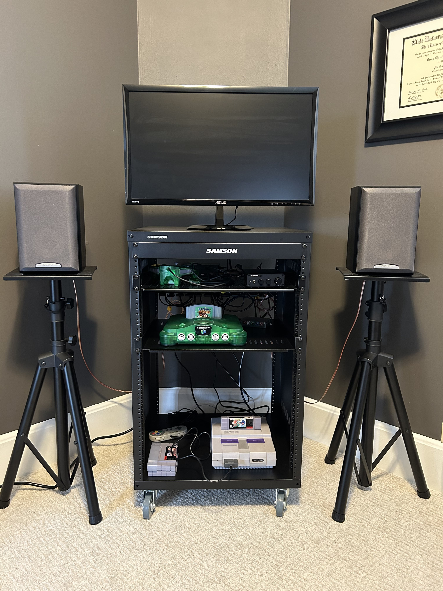
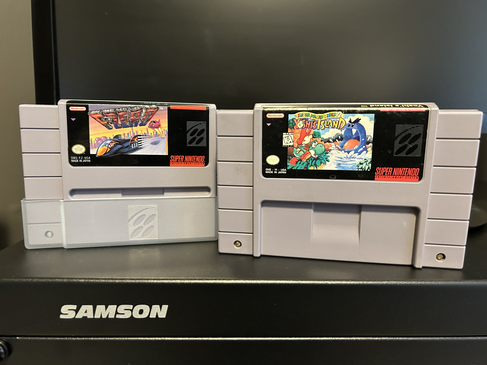

It's been about six weeks since I started my retro game setup project, so I wanted to write a follow-up post to my previous one. In that post, I introduced my ideas and plans for the retro game cart (formerly _Project Sanctuary_).  

Since then, I have been accumulating some more components (and a couple games, which I'll talk about later) and working on piecing it all together. In this post, I'll go through everything I've done so far while talking a bit about what I plan to do going forward. 

# Audio

I debated for a bit about the audio solution for this project. My initial idea was to use an AV receiver from the 90s or early 2000s, since it would have the proper RCA inputs, an internal amp, and I could use a remote to adjust the volume from a few feet away if necessary. But, I was also considering using a dedicated modern stereo (2-channel) amp, like those used for bookshelf/computer speakers. Both of these options were around the same cost-wise (the market price for used 90s AVRs being around $75). 

But, ultimately, I decided on the modern option. The reason for this was _mostly_ that I preferred not to use older audio equipment if I could help it, since it's possible for those components to die, have swollen capacitors, or have other issues that I didn't want to learn how to fix. 

So, the modern amp is very simple, as it only takes one input (stereo audio via RCA) and outputs to 2 speaker channels via banana jacks. I bought some 16 AWG speaker wire and banana plug connectors and made my own speaker cables. That brings me to the speakers: I found a used pair of Sony SS-MB150H bookshelf speakers (8Ω) on eBay. They are from some time in the last decade (or two) I believe, but anyway, they seemed to get pretty good reviews on some audio sites. 

The sound quality with this setup is good enough for me.

# Video

The video solution uses a RetroTINK 2X Pro to convert the analog video signals to digital, which is then fed directly into my old ASUS VX248 monitor via HDMI cable. I am using this monitor because it's what I had lying around, and the response time is very low (which is why I bought it years ago, as it was meant for gaming).

This setup works great so far. The only issue I have is a monitor-related one: it's pretty dim, and with dark areas in certain games, I can tell. This (probably) also has to do with the fact that it's not a CRT or an OLED display, so its black levels are not as deep as they could be compared to those two display types. Those deep blacks would probably help with the contrast.

As far as input lag and pixel response time goes, it is virtually indistinguishable from a CRT (and I was using one in this same setup before the RetroTINK arrived, so I had the CRT experience fresh in my mind). So far, the RT is serving its purpose well.

# Rack

The rack I decided on is the Samson SRK16 universal equipment rack. It's meant for audio and/or networking equipment, but I'm using it with rack-mountable shelves to hold my equipment. Once these shelves are mounted, they are surprisingly sturdy, even though the weight of each console is nothing crazy. (Don't worry, an actual photo of the setup will be shown in the following section.)

The rack has been filling its role pretty well. Admittedly, it _doesn't_ quite feel ideal to me now that it's been set up for a while. I still like it and the purpose it serves, but:

- it's _definitely_ too small to accommodate all of the consoles I ultimately plan to put in it;
- cable management is difficult to make neat-looking due to its generally open design (you can see right through to the back, and I am not using rack-mountable equipment that would typically conceal wires).

So, while I like it for the most part in its current state, I have come to the conclusion that once I retrieve my other game consoles from my mom's house, I will need to add a traditional TV console to this setup. It can hold all the consoles, and a normal-sized TV on top. Then, this rack can sit off to the side and house all of the necessary A/V equipment that powers the setup, along with miscellaneous things like controller input capture devices, perhaps a small PC for emulation, my RCA splitter for streaming, etcetera. (I could also possibly repurpose or dual-purpose the rack; I have been wanting to convert my home server tower PC into a rack-mounted one. So I will see what happens!)

# Layout

Let me give you a quick rundown of the current setup, from top to bottom.

**Top**: My old ASUS VX248 monitor.

**Top shelf**: Audio amp (and an N64 controller).

**Second shelf from the top**: Nintendo 64, and RetroTINK 2X Pro in the back.

**Bottom shelf**: Super Nintendo (and games and a controller).

**Under the bottom shelf**: The surge protector that powers the rack (not pictured, but for those curious surge protector nerds I went with a Tripp Lite TLP808B).

**On the left and right**: Old speaker stands that I had (which will not be used in this setup once I incorporate the aforementioned traditional TV console) holding the Sony SS-MB150H speakers.

There is also a rack-mounted cable management "tray" thing on the backside. It has some loops for routing cables through. You can see them in the back behind the N64. It's fully made of plastic, so I was a bit skeptical, but it's actually a pretty nice product.

# Super Nintendo, and other acquisitions

I did buy a Super Nintendo since the last blog post. I bought it from someone on eBay. It's very clean cosmetically, except I think the seller purposely excluded one particular angle in his photo shoot; there is some slight yellowing (which can happen to Super Nintendo consoles) in one small spot. It's a shame people have to be deceitful like that. For the record and since you asked, when I sell things on eBay, I take pictures at every angle for the item I'm selling, and I explicitly disclose any damage or oddities in the description! And that affects my pricing decision! OK, end rant.

The Super Nintendo works. As is turns out, there are different revisions of the Super Nintendo. Without going too in-depth, there is one revision that is more desirable, referred to as the "1CHIP" model — it consolidates a few chips on the board into one chip, hence the name, and in doing so, inadvertently fixes some potential video output issues. The 1CHIP models also apparently output generally sharper video across the board.

Mine is not a 1CHIP.

But, it's okay. As far as I can tell, that only starts to really matter when you mod these consoles to output RGB, and for now I'm sticking with S-Video. And so far, I haven't noticed any major issues (I think certain games are more susceptible to video issues on non-1CHIPs than others). Time will tell.

If you read my last post, you'll know that I did not have a Super Nintendo previously, and it was on my list of things I wanted to acquire. Naturally, I also didn't have any games for the system. So I picked up a couple (from a local retro game store and eBay). Notably, F-Zero and Yoshi's Island.

# The experience

The big question: "How has the experience of using Dechrissen's Retro Game Rack, Formerly Project Sanctuary - revision 1 (hereafter DRGRFPSr1) been?"

The big answer: "Good!"

It works, mostly, as intended. It _does_ satisfy my requirement outlined in the previous post that it should be easy. Easy to sit down and just play something and have fun. It _does not_ meet my expectations for being a future-proof solution for accommodating all of my consoles. I could have figured this out by doing some measuring beforehand, tbh, but oh well — live and learn.

But for now, the point is that I've been able to play some games (I've been playing Banjo-Tooie and Yoshi's Island) and _just have fun_. I can see the potential. Hopefully without sounding too much like someone who is never satisfied, I will say this: once I get a proper TV console, this setup will be a lot better. I will be able to incorporate all of my game consoles, and eventually a larger TV. But, for now, I can safely say DRGRFPSr1 is a success.

I think this project is going to fuel an ongoing series of posts on this blog. I don't intend to stop at Part 2, as I have some plans for this setup in the near future, and some more for the farther-off future. I hope you come along for the journey. Otherwise I'm writing this for nothing.