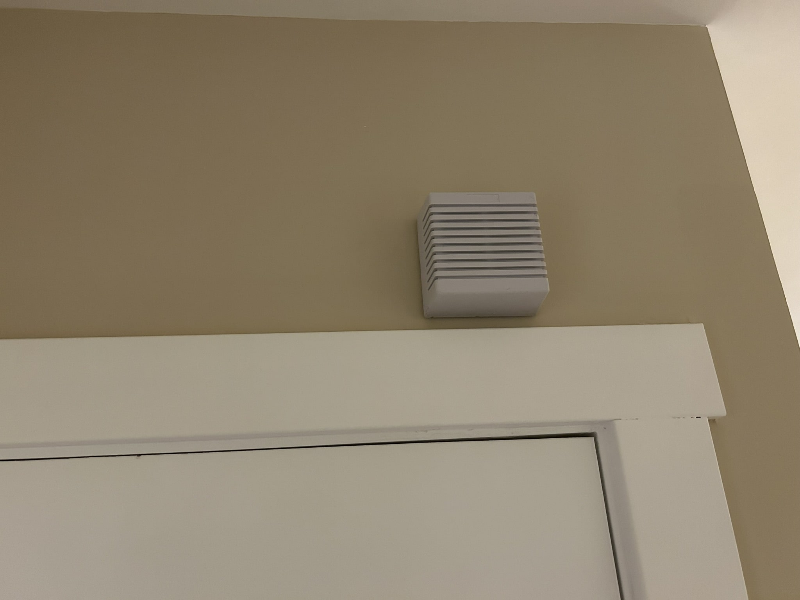

I'm keeping my promise and writing this entry about my security system project (I started this post just two days later!). It might be a long one, considering the amount of steps I foresee having to complete before it's finished and working. But I'm doin' it!

But before we get there, I also promised I'd talk a bit more about the system I went with, and the reasons why.

## The system I went with

As you might have seen in the description, I chose the DSC PowerSeries PC1616. This is an old system; I'm reasonably sure it released in 2011 (this is the only date I can find that seems right, and it's from the user manual).

Now, you might ask: Why would you want such an old system? Hasn't alarm system technology advanced since then? What are you, a Luddite?

Well, it turns out, this technology has a lot of good engineering behind it. That engineering and design has resulted in a technology that is elegantly simple. DSC and Honeywell are the two big contenders in home security system manufacture, and it turns out that in the age of cloud-managed hardware and software, security system manufacturers have jumped on that bandwagon too. Everything is locked behind a paywall nowadays. Using a well-thought-out system like the PC1616 is a nice escape from that kind of grifting that technology companies have taken to. It gives you back some control. It's also a nice route to go for the DIY approach.

So being that it's relatively old, and it's also not something you can easily get through a manufacturer since they're typically made for wholesaling to security companies like ADT, I bought mine used on eBay. About $200 (the seller included some extra sensors I might not use, in which case I can sell to make back some money).

## Order of events

Here's what I need to do to get to the point where the system is installed and working.

1. Test the system to make sure it works
2. Mount plywood somewhere in my basement, and mount the main system panel on it
3. Install a new power outlet in the area where the main panel will go (since I don't have one close enough)
4. Drill a hole in the wall where the keypad will go
5. Fish 4-conductor alarm wire down into the basement from the hole above (hoping this part goes smoothly)
6. Install sensors (in my case, I'm starting with two wireless door sensors for the front and back doors)
7. Figure out where to install the siren, and run wire for that, probably
8. Connect all the necessary wiring and power it up

So, #1: I tested the system, and it works. At first, I wasn't able to reset the "master code," which is the code usually given to the homeowner. I attempted to reset the system using the "installer code", which by default is 5555 -- but it wasn't. I thought I was in a bad spot, since these systems can actually be programmed to disallow the factory reset procedure (which is a good thing, but can be annoying for someone buying secondhand). Luckily, factory reset was not disabled, so I was able to perform the reset. It involed jumping 2 of the connection points on the main board and power cycling a few times. Violà! It's now reset, and I have the ability to set my own installer code. :) I am the installer, after all.

Next, I skipped to #5: fishing the 4-conductor wire down into the basement from the front entryway (where the main keypad will be). I anticipated that this would be a frustrating task, and it kinda was. I started by drilling the hole in the wall where the keypad will be, between two studs. That part went fine, and in fact I was relieved to learn that the wall was in fact hollow (there were no surprises, like a bunch of vertical studs down the wall which would have gotten in the way).

I tied a little metal nut to the end of a string, anchored it to a coat hook nearby, and threw it in the hole. I decided to choose a spot above a pre-existing outlet, mostly because it was directly above a perfectly convenient spot to drill up through from the basement. But as a bonus, I could remove the outlet faceplate to see where the string was hanging down in the space between the outlet box (if you do this, just make sure that the outlet's breaker is off).

Like I said, it was a little frustrating to get the nut to fall into the hole I drilled in the basement, and subsequently to pull the alarm wire through after I had my pull string. But it wasn't all bad news, because I eventually got it through. :) Then I just had to run the wire along the basement ceiling, over to the location where the panel will be installed (using some datacom/low voltage wire staples).

TODO: datacom staples pic / and pic of wire running along basement ceiling

After this, I moved to #3: installing a new outlet in the basement. I decided to put it on a new circuit, since I might add other outlets down there in the future. So I bought some things at the hardware store.

- 20-amp breaker ($7)
- 12/2 Romex wire with ground ($40, but used half the wire)
- 20-amp GFCI outlet (black, $17)
- new work box and faceplate (grey, $1.50)

The black and grey look pretty nice together.

Since this outlet is a GFCI, I can add more in the circuit from this one in the future. If the first outlet in the circuit is a GFCI, then all of the outlets downstream from that one are also ground fault protected.

The outlet install went well. This was my first time actually doing some meaningful work in my electrical panel after watching electricians and tutorials for a while. It's nice to know I can do this if I ever need to add something (and won't need to pay an electrician; a small job like this would cost around $200, and I did it for less than $50).

So, now that the outlet is installed, I can move on to step #2: wood. The main system panel needs somewhere to live, so I'm going to mount it to a dedicated plywood board. My basement is concrete blocks on the exterior, so I couldn't mount it to one of those walls easily. Instead, I opted to mount a roughly half-inch-thick plywood board to the exposed studs below the basement stairs. This is also where I installed my outlet, as you can tell from the above photos.

I had some leftover plywood from a previous project, so I took a board ouside and measured out a 30-inch mark for the width, so it would fit across a three-stud gap (two gaps, if that makes sense... see photo). Anyway, I fired up the saw and soon I had my mounting board. At first, I was going to paint it white, but after sanding it I thought the grain looked kinda nice -- so I kept it plain.

And six construction screws later...

She's hung.

Now, this provides me with some real estate to mount two things: the PC1616 panel, and a surge protector. I figure it's good to provide the circuit board with surge protection, too. With that plus the GFCI outlet, I won't worry too much. Plus, I could use other outlets on the surge protector in a pinch when I'm down there and need to vacuum, or something.

The surge protector I went with is, uh, this one:

I wanted one with a metal body, Tripp Lite is a good brand, and it was the cheapest one I could find that satisfied both of those criteria. That's really it. Although, a bonus is that it happens to match the 90s-style tan color of the security system cabinet pretty well.

Next up is #7 on the list: running the wire for the indoor siren, and installing that. I figured out that the location which would allow for the easiest wire run is above the door to the basement. So, the first thing I did was drill the hole for the wire to feed through. Then, I traced the siren's backplate to create a template for the mounting holes, wired it, and mounted it.

Then, down at the plywood in the basement, I tethered one end of the wire to the wood for temporary anchoring. Then I ran the wire up the basement stairs and through the rear of the siren's backplate hole. (I am omitting some extra drilling and cable-routing I did, because it's not so important, but the end result is a direct wire run from the siren to the panel.)

Alright, now we're pretty far along, and the infrastructure is all there. The next step is to actually mount the two door sensors to the doors themselves. I'm using wireless sensors, which is why, as you might have noticed, my task list from above lacks any mention of running wire for the door sensors. This is purely a conveience thing. Hard-wired door sensors, or senesor of any kind for that matter, are much preferred. I might change them out in the future.

Anyway, there is some variance in the height of the door versus the height of the trim around it; I will need to create some kind of mounting platform so the sensor and the magnet can be aligned.

TODO: insert pics of the door/trim difference and sensor example
