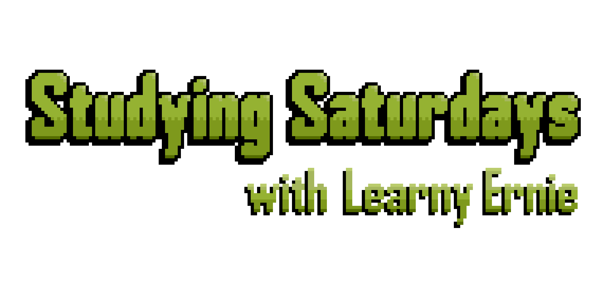
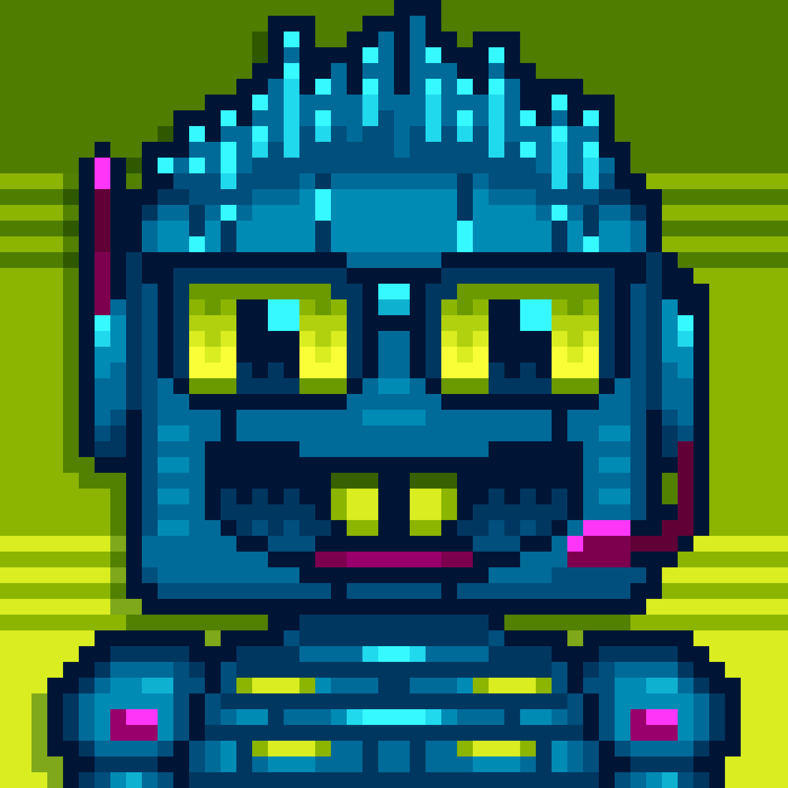

A couple weeks ago, I had an idea for a project: a weekly event in [my personal
Discord server](https://discord.gg/SB52VWvwRY) centered around **learning**. About three weeks later (including one
week in the middle during which I didn't do any work), it's done! It was debuted in my server this past Friday, and the first
event was the day after. I wanted to do a small write-up to discuss the details and the motivation for the project.

You can find the project on GitHub [here.](https://github.com/Dechrissen/learny-ernie)

### What is it?

It's called _Studying Saturdays_, and it's hosted by a bot named Learny Ernie. Those in my server who were interested were able to assign the `@Learner` role
to themselves. Having this role is what gives access to Ernie's weekly notifications (reminders that the event is about to start).
Every Saturday at 11:00 AM EST, Ernie will select a random topic from a list of
pre-defined topics and present it as a prompt to those who have opted in to the event. The goal is simply to learn a bit
about this topic. It's not a competition among participants; if anything, it's more collaborative, as you'll see a bit later.

### How does the "gameplay" work?

The event is divided into three main 'phases':

1. Studying phase (20 min)
2. Writing phase (10 min)
3. Discussion phase (up to 30 min)

After Ernie prompts the group with a topic, the participants are given 20 minutes for research. They must learn as much as they can about it in the
allotted time, with no restrictions on sources used.

After the Studying phase ends, Ernie alerts the group, and allots 10 minutes for the Writing phase. During this time, each participant should write a
_short_ paragraph summarizing their learning. This is obviously not graded or evaluated, it's just to encourage organized thinking about the topic.

The final phase is the Discussion phase, during which participants can read each other's paragraphs and discuss the topic, and exchange ideas and opinions.
The purpose of this phase is to "crystallize" the learning from the previous two phases.

Each person who participates in a given week's Studying Saturday event will be awarded one
Brain Point (BP — not to be confused with Battle Points from the Battle Frontier in Pokémon).
What do Brain Points do, you ask?

...

Nothing.

### The motivation

The idea was to create something that would encourage people (and me) to _want_ to learn new things, or if they already do want to learn new things,
then to prod them to at weekly intervals. Scheduling the events on the weekend perhaps means more people will be willing to join, since they may be less busy.
Another issue I had personally, was being overwhelmed with the idea of "learning." If it's a looming/intimidating thought that I "gotta start learning stuff one of these days," then I'd be less likely to follow through. With Studying Saturdays, it's a lot more approachable and there's less pressure.

To be clear about the studying "topics" in question here, there is a wide range of them, most of which were included based on feedback in a poll
that I distributed in my Discord server. Some examples of the areas of interest among those who responded to the poll:

- engineering
- computers and technology
- personal finance
- history
- climate change
- psychology

And within each of these broader areas, there are, as you can imagine, endless possibilities for specific topics that make the final list.

### Learny Ernie

So what does Learny Ernie do?

Well, really, he _is_ the project. He's a Discord bot that handles all of the user data, roles, schedules, announcements, and event orchestration (which essentially boils down to "telling participants when one phase ends and another begins").

Check it out, Ernie has his own profile picture. (I hired an artist on Fiverr to do this — I think it came out great.)

### The problem with the topics of study

An issue I still have (that I was able to mitigate by manually writing a small topic list for the debut) is that there is currently no system in place for collecting topics that is automated, efficient, customizable, etc. Right now, I had to do several web searches manually and browse for relevant topics based on the broader topic areas I collected in my poll.

On the other hand, I don't currently know how I'd solve this. I can't imagine there's an API out there for fetching random "topics of study." So perhaps I will just have to add a few more topics every once in a while to make sure enough are in the pool.

### Initial impressions and planned revisions

I'd say that the first run this past weekend was successful. A total of 4 people participated, including myself, and the feedback was along the lines of, "I enjoyed this because I never would have chosen to learn about this topic myself." And the discussion phase was productive — we all had different takeaways from our studying and were able to have a thought-provoking exchange. Nice.

I did get a few suggestions for future iterations, such as:

- make the broad areas of study rotate each week (e.g. history one week, science the next, etc.)
- archive each week's session in a separate channel, with links that point to the start of each session
- make the channel remain open post-discussion phase for a few extra hours (or all day) so that people who didn't get to attend can read through it

Overall, I'm happy with how it came out, and with how quickly I was able to get it done. I'm glad that it's finished, so I'm able to move on to my next project (and I _do_ have more planned, so stay tuned).

Until next time.
