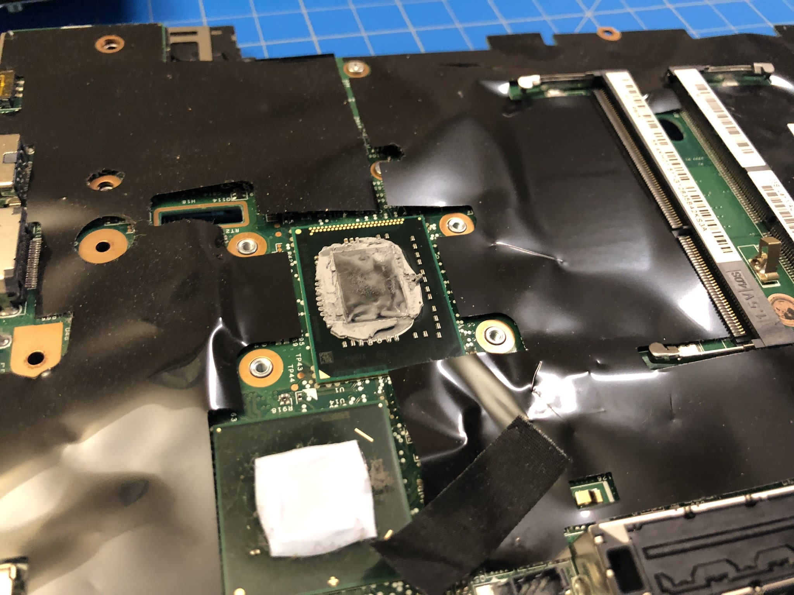

Well, I knew this would happen. I bought another ThinkPad. A ThinkPad X220, to be specific.

If you read the previous ThinkPad-related article of mine, you'd know that this is my second used ThinkPad. My first was a T460 which I bought a couple months ago. I certainly didn't need another, but I do have a separate usecase for this one, which I'll get into a bit later in the article.

### Background

The T460 I bought has been pretty good. It's a 14-inch relatively thin laptop. Compared to other, older ThinkPads, it forgoes some of their charm in favor of a more modernized look and feel. This is not necessarily a bad thing, but I did find myself wishing it had some of the older ThinkPad features.

So, I sought out an older ThinkPad that I could upgrade to some more modern specs while still keeping the features and charm
of the older ones. Specifically, I wanted the original-style keyboard (not the chiclet style the newer ThinkPads go for), and the ThinkLight (the tiny bulb that you can toggle on and off to illuminate the keyboard from above). I also wanted one that was smaller and a _bit_ more portable. So, I settled on the X220 from 2012 (ten years old at this point!).

Before I go more in detail about the X220, I want to address my thoughts and plans for the T460 going forward.

So yeah, the T460 is still a great laptop, but I do prefer the feel of the X220 for actually using it on my lap, or on the couch, or maybe even for taking places (soon). This X220 is the third computer I currently own, excluding non-traditional computers like Raspberry Pi. I have a Windows 11 desktop PC for gaming and daily usage, and these two ThinkPads both running Linux. Since the X220 is supposed to be more of a casual, moving around, traveling, writing, and light coding laptop, my plans for the T460 are a little more permanent. I plan to purchase one of Lenovo's docking stations for the T460 and set it up alongside my Windows PC. Then, using a KVM switch, I'll be able to switch between those two computers while using the same peripherals for each.

Moving on to the X220.

### The X220 as it was

I bought the X220 on eBay for $200. Here are the specs it had:

- Intel Core i5 2520M CPU @ 2.5 GHz
- 4GB DDR3 RAM @ 1333 MHz
- 120GB SSD
- 1366x768 TFT display

Cosmetically it was pretty good. Definitely used, as it has some signs of wear like light scratches and worn keys and trackpad. But I don't mind, because I planned on restoring it as best I could.

Here are some pictures.

### The plan

Unlike with the T460, this time, I wanted to upgrade some parts. This was for two reasons: 1) if I didn't, it might have been a less than ideal user experience, and 2) I wanted to do the project, because I like the tinkering.

So, in my mind, in order to get the laptop to a usable state, I had to do a few things. First, the battery held a full charge for about 10 minutes. This was expected, as a laptop battery is destined to degrade after 10 years of presumably improper charging. I was ready to purchase a replacement before I even tested it (and I did).

Second, the screen _needed_ to be replaced. This laptop originally came with either an IPS or non-IPS panel, and mine had the non-IPS. So I bought an IPS panel as well. I don't have a photo of the panel before installing it, but don't worry, it's just a black rectangle.

Then, though not critical, I wanted to replace the SSD with a better one. I happened to have an old 500GB Samsung EVO SSD from a previous build that I wasn't using. That was going in as well.

Finally, I needed to upgrade the RAM from 4GB. The maximum theoretically supported in the X220 is 16GB, so naturally I went with 16GB.

There are some less exciting things I did, like clean the CPU fan, replace the thermal compound on the CPU, and replace a bunch of screws and missing parts, like the hard drive bracket.

### The process

Surprisingly, this project went very smoothly. I was expecting more issues along the way, but the worst of it was probably accidentally breaking one of the plastic retention tabs on the screen bezel (no harm done, there's like 10 other tabs that still do the job). The rest of the teardown, cleaning, and upgrading went pretty well. Admittedly, the X220 is not the easiest to work with. The teardown requires some memorization of the order of parts you take out, because they all need to go back in in reverse order.

It was a valuable experience. I enjoyed taking apart the laptop I plan to use and upgrading it to my own standards. It feels good to know the inner workings of a piece of technology you use often. I think more people should consider using older hardware, if they can. There's an element of sustainability, because you're giving life to hardware that would sooner become e-waste if you hadn't put the effort into restoring it. A related and interesting topic is [the right to repair](https://www.repair.org/stand-up) -- check it out if you're interested in this kind of electronics tinkering.

### The result

Unfortunately I don't have pre-upgrade performance benchmarks to provide some kind of comparison. But what I can say is that after performing the upgrades, cleaning, re-pasting the CPU, and installing Linux, it performs wonderfully for my usecases. To be fair, my usecases are nothing intensive, but still -- great machine! I particularly love the size, form factor, keyboard, and ThinkLight. 

Here it is.

And here's the obligatory `neofetch` screenshot.

Thanks for reading.
